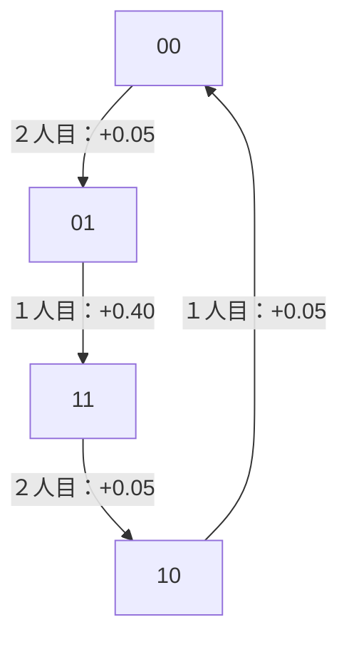

# 数学探索・第二弾：評価誤差と監査の多様性

作成日：2026 09 10 ／ 第1版・研究ノート

本ノートは、３候補の追加文献照合と、①評価誤差、②情報漏洩を伴う監査について行った数学的探索を記録する。一般の証明を記載し、別担当のAIによる独立監査と数値照合を実施した。Lean等による形式検証・人間の専門家による査読は未実施である。

**証明の成立と学術的新規性は別に扱う。今回の主要な式は証明を記録したが、新規性は確定していない。** 古典的なポテンシャルゲーム、差分制約、Fisher不等式、グラム行列の議論を用いている。「検索で見つからなかった」ことを「存在しない」とは解釈しない。

## 1. 今回の到達点

| ID | 命題・成果 | 数学的な状態 | 新規性の扱い |
|---|---|---|---|
| G01-A | 固定独立誤差／毎回変わる誤差が改善循環を作れる正確な境界 | 証明を記録 | 基本的な符号保存は既知。正確な循環半径の同一表現は未確認 |
| G01-B | 有界な共有誤差が改善循環を作れる必要十分条件 | 構成的証明・独立監査・LP照合 | 今回の第一候補。ただし差分制約の技法は既知 |
| G01-C | 任意の共有誤差に耐える相互作用の条件 | 証明を記録 | 古典的な完全ポテンシャル条件の直接的な系として扱う |
| G02-A | 任意の有限信号を伴う監査ゲームの最適値と達成条件 | 証明・独立監査・LP照合 | 基礎の漏洩モデルとペア確率による表現は既知。信号一般化を含む同一命題は未確認 |
| G02-B | 均一な個別監査率の下でのパターン数と性能損失、等号構造 | 証明・独立監査・等号例の検証 | 今回の第二候補。ランク・デザイン理論の応用に当たる可能性が高い |
| G03 | 平均・分散既知の頑健な２行動選択 | 簡単な補題と３次利得の解を記録 | 古典的モーメント問題の応用に近いため優先度を下げた |

## 2. 先行研究との切り分け

### 2.1 評価誤差と改善過程

[Candogan–Ozdaglar–Parrilo, Dynamics in Near-Potential Games](https://arxiv.org/abs/1107.4386) は、完全ポテンシャルゲームからの距離に応じて、改善過程が近似均衡集合へ到達すること等を扱う。近似均衡集合の中で循環することは排除されない。今回の問いは「どの有界誤差なら、厳密な改善循環そのものを作れるか」であり、目的量が異なる。

[Le Roux, On terminating improvement in two-player games](https://arxiv.org/abs/1409.6489) は、利得・結果の変更に対して有限改善性が保たれる構造を調べる。関連する先行研究であり、今回の有界な数値誤差・共有誤差の半径との照合対象である。

[Lakheshar–Rezagholi, A potentialization algorithm for games with applications to multi-agent learning in repeated games](https://arxiv.org/html/2602.18925v1) は、逸脱グラフの強連結成分等から代替報酬を構成する。今回の誤差に対する耐性半径とは異なる問いである。

[Gilles, Second-Order Potentials for Finite Games](https://arxiv.org/abs/2608.01967) は要旨を確認した。交差差分と共通利益成分によるゲーム分解を扱う。原論文を全面的に照合したという意味ではない。

完全ポテンシャルの閉路条件・２人の長方形条件はMonderer–Shapleyの古典的結果であり、上の一次研究でも参照されている。今回は原著全文の直接取得には至っていない。この既知条件自体に新規性を主張しない。

### 2.2 監査・情報漏洩

[Xu et al., Security Games with Information Leakage: Modeling and Computation](https://arxiv.org/html/1504.06058v2) の本文を確認した。１対象の監査有無を観察するモデル、観察対象を攻撃者が選ぶADIL、個別監査率だけでは不十分であること、ペア同時監査率による表現は既に扱われている。前の回答の４対象の例も、同論文の例と同じ仕組みであり、初等的な再構成として扱う。

同論文§3.1の「small support」は主に漏洩し得る対象集合の小ささを指す。他方、§4では監査パターンの少なさ・サンプリングも議論される。したがって「少数パターンに問題がある」という一般的発想も新しくない。

[Bannai–Bannai–Zhu, Relative t-designs in binary Hamming association scheme H(n,2)](https://arxiv.org/abs/1512.01726) は重み付きデザインとFisher型不等式を扱う。[Datta–Howard–Cochran, Geometry of the Welch Bounds](https://arxiv.org/abs/0909.0206) はグラム行列・ランク・等号条件とデザインの関係を扱う。今回の監査の支持数下界や性能上界の数学的技法は、これらに近い既知の技法である。

[Horsley, Generalising Fisher's inequality to coverings and packings](https://arxiv.org/abs/1409.0485) も、全ペアを少数ブロックで覆う問題の照合先となる。[Hubáček–Naor–Ullman, When Can Limited Randomness Be Used in Repeated Games?](https://arxiv.org/abs/1507.01191) は、少ない乱数という一般テーマが既に研究されていることを示すが、今回の単発監査とはモデルが異なる。

**今回の新規性調査は予備的である。** 関連する一次資料の本文または該当節を読み、上記の要旨のみの資料も区別した。引用・被引用文献の網羅調査、過去の学位論文・別用語による全探索は残る。

## 3. G01：改善が止まらなくなる誤差の境界

### 3.1 共通の定義

有限で空でない行動集合の直積を \(S=\prod_i S_i\) とする。異なる２状態 \(s,t\) が１人 \(i\) の行動だけ異なる場合に、一人変更辺 \(s\to t\) を置く。そのプレイヤーの利得増分を

\[
g(s,t)=u_i(t)-u_i(s)
\]

とする。更新は一人ずつ、利得が**厳密に**増える場合だけ行う。どの初期状態・どの選び方でも更新が有限回で止まる性質を有限改善性（FIP）と呼ぶ。有限状態では、これは厳密改善辺の有向閉路がないことと同値である。

「停止」は、その利得表についての純粋Nash均衡への到達を意味する。真の共通目的の最大化、混合戦略での学習収束、実際のAIの推論過程の保証とは区別する。

### 3.2 G01-A：独立に選べる固定誤差と変動誤差

元のゲームがFIPを持つと仮定する。各利得値に \(|e_i(s)|\le\varepsilon\) の誤差を許す。

**固定誤差。** \(C\) を、巡回的に連続する変更者が異なる単純な一人変更閉路に限る。このとき

\[
r_{\rm fixed}=\frac12\min_C\max_{e\in C}[-g(e)]_+,
\qquad [z]_+=\max(z,0)
\]

と置くと、ある固定誤差表が厳密改善閉路を作れることと \(\varepsilon>r_{\rm fixed}\) は同値である。空集合の最小値は \(+\infty\) とする。

証明：最短の改善閉路は単純であり、同じ人の連続した２変更は１変更に短縮できるため、上の形に限ってよい。その閉路では、各誤差変数 \(e_i(s)\) は高々１つの辺の条件にしか使われない。各辺の始点で \(-\varepsilon\)、終点で \(+\varepsilon\) を割り当てれば、その辺の増分は \(g(e)+2\varepsilon\) となる。全辺を厳密正にできる条件が上式である。元がFIPなので、どの閉路にも元の増分が非正の辺があり、境界の等号では循環できない。□

**判断のたびに変化する誤差。** この場合は

\[
r_{\rm changing}=\frac12\min_{\{s,t\}}|u_i(t)-u_i(s)|
\]

が正確な境界で、循環可能なのは \(\varepsilon>r_{\rm changing}\) のときに限る。境界以下では、厳密に得と見える変更は元から厳密改善である。境界を超えると、最も小さい利得差の１辺を、往路でも復路でも得に見せられる。同利得の辺があれば境界は０になる。

前の回答の例 \(u_1=u_2=Mx+\delta y\)、\(M>\delta>0\) では、固定誤差は \(M/2\)、変動誤差は \(\delta/2\) で正しかった。

### 3.3 G01-B：同じ固定誤差を共有する場合

ここから誤差の許し方を変更する。真の目的は全員共通の \(\Phi(s)\) であり、見かけの利得は

\[
U_i(s)=\Phi(s)+a_i h(s),\qquad a_i>0,\quad |h(s)|\le\varepsilon.
\]

誤差表 \(h\) は全員が共有し、時間を通じて固定される。ただし誤差への感度 \(a_i\) が違ってよい。これは前節の独立した誤差表より強い構造制約である。

単純な有向一人変更閉路 \(C\) の辺について

\[
c_e=-\frac{\Phi(t)-\Phi(s)}{a_i}
\]

と置く。\(C\) の空でない真の連続部分経路、すなわち長さ１以上 \(|C|-1\) 以下の巡回部分経路全体を考え、

\[
D(C)=\max\left(0,\ \max_P\sum_{e\in P}c_e\right)
\]

と定義する。閉路の最後から最初にまたがる経路も含む。

**命題 G01-B。** \(C\) を共有誤差によって厳密改善閉路にできる必要十分条件は

\[
\sum_{e\in C}c_e<0,
\qquad 2\varepsilon>D(C)
\]

である。したがって、何らかの閉路を作れる正確な境界は

\[
\boxed{\quad
r_{\rm shared}=\frac12\min_{C:\,\sum_Cc_e<0}D(C)
\quad}
\]

となり、循環可能なのは \(\varepsilon>r_{\rm shared}\) のときに限る。候補閉路がなければ \(+\infty\) とする。

**必要性の証明。** 辺を厳密改善にするには \(h(t)-h(s)>c_e\) が必要。閉路を一周して足せば \(0>\sum_Cc_e\) を得る。部分経路を足せば、両端の誤差差が高々 \(2\varepsilon\) なので、\(2\varepsilon>\sum_Pc_e\) を得る。適格閉路では \(\Phi\) が一定ではなく、一周すると元の値に戻るので下降辺も存在する。従って \(D(C)>0\) である。□

**十分性の構成的証明。** 条件が厳密なので、小さな \(\rho>0\) を選び、全辺を \(c_e+\rho\) に増やしても、一周の総和が負、すべての真の部分経路の和が \(2\varepsilon\) 未満になるようにできる。

各頂点 \(v\) に対して、環上の任意の頂点から \(v\) に至る有向経路の重みの最大値と０の大きい方を \(H(v)\) とする。一周が負なので、最適な経路は一周未満にできる。よって \(0\le H(v)<2\varepsilon\)。また経路を１辺延長することから

\[
H(t)\ge H(s)+c_e+\rho
\]

である。延長で一周になる場合、その一周の重みは負なので０がそれを上回る。\(h(v)=H(v)-\varepsilon\) とし、閉路外では例えば０とすれば、振幅制約を保ち、全辺で \(h(t)-h(s)>c_e\) になる。□

この証明は差分制約の既知の構成法に基づく。候補として残すのは、誤差モデルを固定した上での正確な境界とその比較である。式は有限だが、全単純閉路を列挙する計算法が大規模ゲームで効率的であるとは主張しない。

### 3.4 最小の具体例：共有していても循環する

\(\Phi(x,y)=xy\)、\(x,y\in\{0,1\}\)、感度を \(a,b>0\) とすると、

\[
r_{\rm shared}=
\begin{cases}
\infty,&a=b,\\
\dfrac1{2\max(a,b)},&a\ne b.
\end{cases}
\]

例えば \(b>a\) では、閉路 \(00\to01\to11\to10\to00\) の正規化増分は \(0,1/a,-1/b,0\)。総和は正で、\(c_e\) の部分経路の最大和は \(1/b\) だから上式を得る。逆の場合は向きを逆転する。\(a=b\) なら \(\Phi+a h\) がそのまま共通ポテンシャルである。

\(a=1,b=2,\varepsilon=0.3\) の具体的な誤差表は次のとおり。

| 状態 | 真の目的 \(\Phi\) | 共有誤差 \(h\) | \(U_1=\Phi+h\) | \(U_2=\Phi+2h\) |
|---|---:|---:|---:|---:|
| 00 | 0 | 0.275 | 0.275 | 0.55 |
| 01 | 0 | 0.300 | 0.300 | 0.60 |
| 11 | 1 | −0.300 | 0.700 | 0.40 |
| 10 | 0 | 0.225 | 0.225 | 0.45 |



全員が元の目的を共有し、同じ固定誤差を見ていても、すべての変更が本人にとって得な循環ができる。

ただしこれは、どれほど小さい改善でも実行する更新規則の結果である。感度が一致に近づくと、循環で確保できる改善量は小さくなる。この例で各変更の元の単位での見かけの利得増分を少なくとも \(\gamma\) と要求すれば、正規化増分の総和から

\[
\gamma\le\frac{|a-b|}{2(a+b)}
\]

が必要である。数学的な境界の不連続を、実務上の大きな不安定性の急増と同一視しない。

### 3.5 G01-C：共有誤差に対して常に止まる構造

振幅上限を固定せず、**すべての固定関数 \(h:S\to\mathbb R\)** に対してFIPを持つ必要十分条件は、すべての２人の長方形で

\[
\left(\frac1{a_i}-\frac1{a_j}\right)\Delta_{ij}\Phi=0
\]

が成立することである。\(\Delta_{ij}\Phi\) は、他の人の行動を固定した２人の２択長方形の交差差分である。

同値な説明は、感度 \(a_i\) が同じ人をひとつの群にしたとき、\(\Phi\) が群ごとの関数の和に分離すること。異なる感度群をまたぐ相互作用がなければ、任意の固定共有誤差に耐える。

証明：各人の利得を正数 \(a_i\) で割り、\(\Phi/a_i+h\) とする。\(\Phi/a_i\) の辺増分が完全ポテンシャル \(P\) の差分なら、\(P+h\) がポテンシャルとなる。逆に正規化辺増分の循環和が非零なら、正の向きを選び、その循環和を辺数で割った量を全辺の増分にするよう \(h\) の差を割り当てれば改善循環を作れる。閉路条件と長方形条件は古典的な完全ポテンシャル条件である。交差差分の消失と群ごとの加法分離の同値は、基準状態から座標差分を積み上げることで示せる。□

このため、前の \(Mx+\delta y\) という加法的な目的は、今回の共有誤差モデルでは感度が違っていても常に止まる。独立誤差モデルでの \(M/2\) という境界をここに転用してはいけない。

## 4. G02：弱い漏洩と監査パターン数

### 4.1 モデルと量化

\(n\ge3\)、\(2\le k<n\)。各回に正確に \(k\) 対象を監査する。監査側は \(k\) 要素部分集合 \(S\) の確率分布 \(w\) を公表する。攻撃側は実現した \(S\) を知らずに観察対象 \(i\) を１つ選び、その対象が監査されるかについて信号 \(Z\) を得て、その後に攻撃対象 \(j\) を選ぶ。\(j=i\) も許す。

監査側の利得は「攻撃した対象が監査対象に含まれる確率」。全対象の利得は同じで、監査対象に入った攻撃は確実に検出する。攻撃側はこの確率を最小化する。

有限信号の分布を、監査されないとき \(K_0\)、監査されるとき \(K_1\) とする。信号は観察対象の監査有無を条件として、それ以外の情報から独立とする。全変動距離を

\[
\tau=\frac12\sum_z|K_1(z)-K_0(z)|\in[0,1]
\]

と置く。\(\tau=0\) は情報なし、\(\tau=1\) は両状態を完全に区別できる信号である。ビット反転確率 \(\eta\in[0,1/2]\) なら \(\tau=1-2\eta\)。

\[
p=\frac{k}{n},\qquad
r_i=\Pr(i\in S),\qquad
q_{ij}=\Pr(i,j\in S),\qquad
\alpha=\frac{k(k-1)}{n(n-1)}.
\]

\(V(w)\) は監査側の分布を固定したときの最悪検出率、\(V^*=\max_w V(w)\) は支持数を制限しない最適値とする。

### 4.2 G02-A：信号の種類を全変動距離に還元する

**命題 G02-A。**

\[
\boxed{V^*=(1-\tau)p+\tau\alpha.}
\]

\(\tau>0\) のとき、最適であることと、全ペアで \(q_{ij}=\alpha\) であることは同値。このとき \(r_i=p\) も成立する。\(\tau=0\) では \(r_i=p\) だけで最適である。

また、個別監査率が均一な任意の分布 \(r_i=p\) では、

\[
\boxed{V(w)=(1-\tau)p+\tau\min_{i\ne j}q_{ij}.}
\]

**均一監査率での証明。** 観察対象 \(i\) と信号 \(z\) を固定し、\(a=K_0(z), b=K_1(z)\) とする。信号の確率を掛けた検出率は、\(i\) を攻撃すれば \(bp\)、別の \(j\) を攻撃すれば \(ap+(b-a)q_{ij}\) である。\(b\le a\) なら自己対象への攻撃が最小で、\(b>a\) なら \(q_{ij}\) が最小の別対象への攻撃が最小。全信号について足すと上式を得る。

**全体上界と等号条件の証明。** 順序付きペア \((i,j)\) に対し、\(i\) を観察し、\(b\le a\) では \(i\)、\(b>a\) では \(j\) を攻撃する特定の方策を考える。

\[
A=\sum_{b\le a}b,\quad B=\sum_{b>a}a,\quad A+B=1-\tau
\]

とすると、この方策の検出率は

\[
F_{ij}=A r_i+B r_j+\tau q_{ij}.
\]

攻撃側はこの方策を選べるため \(V(w)\le F_{ij}\)。両方向を平均すれば

\[
V(w)\le G_{ij}=\frac{1-\tau}{2}(r_i+r_j)+\tau q_{ij}.
\]

全ペアの平均は、\(\sum_i r_i=k\)、\(\sum_{i<j}q_{ij}=k(k-1)/2\) より、ちょうど \((1-\tau)p+\tau\alpha\)。一様な \(k\) 要素抽出がこの値を達成する。

最適値を達成するなら全 \(G_{ij}\) がこの平均と等しい。\(a_0=(1-\tau)/2\) と置き、\(j\ne i\) について足すと

\[
[a_0(n-2)+\tau(k-1)]r_i+a_0k=(n-1)V^*.
\]

角括弧は正なので \(r_i=p\)。さらに \(\tau>0\) なら全 \(q_{ij}=\alpha\) となる。逆向きは均一監査率の式から明らか。□

全変動距離だけで決まるのは、この対象が対称なゲームの最適値、および均一な個別監査率の戦略の値である。任意の非均一戦略の値まで \(\tau\) だけで決まるとは主張しない。

### 4.3 ごく弱い漏洩と厳密最適の支持数

全ペアを等しく覆う分布は重み付き２デザインである。\(X\) を監査対象の０・１ベクトルとすると、最適な２次モーメント行列は

\[
Q=\mathbb E[XX^\mathsf T]=(p-\alpha)I+\alpha J.
\]

\(p-\alpha>0\) なので \(Q\) は正定値でランク \(n\)。一方、正の確率で使う監査パターンが \(m\) 個なら

\[
Q=\sum_{s=1}^m w_s x_s x_s^\mathsf T
\]

のランクは高々 \(m\)。したがって \(\tau>0\) で厳密な最適性を得るには \(m\ge n\) が必要である。これは古典的なFisher型ランク論法の応用であり、新しいランク定理ではない。\(m=n\) で常に十分という意味でもない。

特に **\(n=4,k=2\)** では、各ペアがそのまま監査パターンなので、少しでも情報がある \(\tau>0\) では全６パターンを等確率で使う必要がある。情報がない \(\tau=0\) なら、\(\{1,2\}\) と \(\{3,4\}\) の２パターンを半々にするだけで最適である。

| ４対象・２監査 | 厳密最適に必要なパターン数 | 最適検出率 |
|---|---:|---:|
| 情報なし \(\tau=0\) | 2 | \(1/2\) |
| 少しでも情報あり \(\tau>0\) | 6 | \(1/2-\tau/3\) |

２つの補集合パターンを使い続けた場合は \(V=(1-\tau)/2\) なので、最適値との差は \(\tau/6\)。例えば観察ビットの正答率が51％、すなわち \(\eta=0.49,\tau=0.02\) の場合、最適値は約49.333％、２パターンでは49％で、差は約0.333パーセントポイントである。

**最適解の構造は跳ぶが、性能差は連続的に小さくなる。** ごく弱い漏洩でも大きな被害が突然生じるという主張ではない。

### 4.4 G02-B：均一監査率でのパターン数と損失

各対象の個別監査率を \(r_i=p\) に固定する。正の確率で使う監査パターンが \(m\ge2\) 個なら、

\[
\boxed{\min_{i\ne j}q_{ij}\le p^2-\frac{p(1-p)}{m-1}.}
\]

したがって、\(2\le m<n\) の場合には

\[
\boxed{V^*-V(w)\ge
\tau p(1-p)\frac{n-m}{(n-1)(m-1)}.}
\]

これはすべての \(n,k,m\) で達成できるという主張ではない。そもそも均一監査率を実現する \(m\) 個のパターンが存在しない組もある。

**証明。** 共分散行列を \(C=\mathbb E[(X-p\mathbf1)(X-p\mathbf1)^\mathsf T]\)、\(c=p(1-p)>0\) とする。対角成分は \(c\)、行和は０、トレースは \(nc\)。また、中心化した \(m\) 本のパターンベクトルは正の重み付き和が０なので \(\operatorname{rank}C\le m-1\)。

\(q_* =\min_{i\ne j}q_{ij}\)、\(t=p^2-q_*\) と置く。ペアの平均が \(\alpha<p^2\) なので \(t>0\)。行列 \(C+tJ\) は成分ごとに非負で、すべての行和が \(nt\)。その固有値の絶対値は最大行和 \(nt\) 以下である。

\(C\mathbf1=0\) であるため、\(C\) の正の固有値は \(C+tJ\) の固有値でもある。よって高々 \(m-1\) 個の正の固有値を足して

\[
nc=\operatorname{tr}C\le(m-1)nt.
\]

これが \(q_*\le p^2-c/(m-1)\) を与える。\(\alpha=p^2-c/(n-1)\) とG02-Aの値の式から、損失下界を得る。□

**仮定の範囲。** この証明は均一な \(r_i\) を使っている。個別監査率を変えてよい最適化の結果として転用しない。

### 4.5 等号を達成する構成と完全な構造

簡単な等号例は、対象を \(m\) 個の同じ大きさの群に分け、１群だけを均等に選んで監査する方法、または１群だけを外して残りを監査する方法である。

例えば \(n=6,k=4,m=3\) では、対象を３つの２人組に分け、１組を外す３パターンを各 \(1/3\) で使う。個別監査率は \(2/3\)、最小ペア率は \(1/3\)。情報が完全に漏れる場合、支持数無制限の最適値 \(2/5\) との差 \(1/15\) は上の下界と一致する。

さらに \(2\le m<n\) で上のペア率上界に等号が成立する構造は、次の形に限られる。

1. \(n\) が \(m\) で割り切れ、対象が同じ大きさの \(m\) 群に分かれる。
2. 同じ群に属する対象は、すべてのパターンで一緒に監査されるか一緒に外れる。
3. \(m\) 個のパターンを、すべて確率 \(1/m\) で使う。
4. 群を１対象として見れば、各パターンは \(\ell=mk/n\) 群を含み、各群は \(\ell\) パターンに含まれ、異なる２群は \(\lambda=\ell(\ell-1)/(m-1)\) パターンに一緒に含まれる。

これは対称２デザインを、各点ごとに同数の対象へ複製した構造である。\(\ell=1\) と \(\ell=m-1\) の分割・補分割も含む。必要な整数条件を満たしても、そのデザインが常に存在するとは限らない。

**等号構造の証明。** 等号では \(C\) はランク \(m-1\) で、正の固有値がすべて \(nt\)。したがって

\[
R=\frac{C+tJ}{nt}
\]

は非負対称、各行和１、\(R^2=R\)、ランク \(m\)、対角成分 \(m/n\) の行列となる。成分が正でつながる各連結成分では、固有値１が単純であり、射影性から他の固有値は０。よってその成分は全成分が \(1/g\) の \(g\) 次正方行列である。対角値が共通なので \(g=n/m\)、成分数は \(m\)。

同一成分内では \(C_{ij}=c\)、すなわち \(q_{ij}=p\)。これは \(X_i=X_j\) が確率１で成立することを意味する。異なる成分では \(q_{ij}=q_*\)。したがって対象は上の等サイズ群に分かれる。

群に縮約した \(m\times m\) 入射行列を \(B\)、重み対角行列を \(W\) とすると、\(Q'=BWB^\mathsf T\) は対角一定・非対角一定の正定値行列である。ゆえに \(B\) は正則で

\[
B^\mathsf T(Q')^{-1}B=W^{-1}.
\]

\((Q')^{-1}\) は \(aI+bJ\) 型で、\(B\) の各列の１の数は \(\ell\) だから、左辺の対角値はすべて同じ。従って重みはすべて \(1/m\)。均一な群監査率から各行にも \(\ell\) 個の１があり、一定ペア率から上記の \(\lambda\) を得る。逆にこのデザイン構成は直接代入で等号を達成する。□

## 5. G03：今回は優先度を下げる理由

[Loizou, Distributionally Robust Games with Risk-averse Players](https://arxiv.org/abs/1610.00651) や [Bauso–Gao–Tembine, Distributionally Robust Games: f-Divergence and Learning](https://arxiv.org/abs/1702.05371) により、分布不確実性を最悪分布とのゲームとして扱う一般的枠組みは既にある。

今回考える単純なモデルを「行動をランダムに選ぶ決定者」と「その混合確率を知ってから外生変数 \(X\) の分布を選ぶ相手」のゼロ和ゲームに固定する。相手は実現した行動を見る前に分布を決める。

**２次までの利得。** 各行動 \(a\) の利得が \(A_aX^2+B_aX+C_a\) なら、正確な平均・分散からその期待利得は確定する。この単純モデルでは分布未知の影響が消え、最善の純粋行動を混合が厳密に上回れない。他の戦略的な相手を含む一般のゲームで混合戦略が不要だという意味ではない。

**３次の具体例。** \(X\in[-1,1]\)、\(\mathbb EX=0\)、\(\mathbb EX^2=v\in(0,1)\)、行動の利得を \(+X^3\) と \(-X^3\) にすると、

\[
-v(1-v)\le\mathbb EX^3\le v(1-v).
\]

上界は \((1-X)(X+v)^2\ge0\) の期待値から得る。等号は \(X=1\) を確率 \(v/(1+v)\)、\(X=-v\) を確率 \(1/(1+v)\) で取る分布で達成する。反射分布が下界を達成する。

各純粋行動の最悪利得は \(-v(1-v)\)。\(+X^3\) を確率 \(z\) で選ぶと最悪利得は \(-|2z-1|v(1-v)\) なので、半々の混合が一意に最適で、値は０である。数学的には面白い小例だが、古典的モーメント境界の直接応用に近く、今回の新規性探索の主軸には置かない。

## 6. 検証・独立監査・残る限界

乱数seedは20260910。次を実行した。検証は一般証明の代替ではない。

| 検証対象 | 方法と範囲 | 結果 |
|---|---|---|
| G01-Bの環上の振幅境界 | 長さ３〜10、各100件の負の総和を持つ環について、部分経路式と独立なLPを比較 | 800件一致、許容差 \(10^{-7}\) |
| G01-Bの４状態例 | 有理数で各変更者の利得差を再計算 | \(1/20,2/5,1/20,1/20\) を確認 |
| G02-Aの一般信号最適値 | \(n=3\)〜7、\(2\le k<n\)、７種類の完全・無情報・対称・非対称・消失・３値信号。対称性を仮定しない全分岐LPと比較 | 105件一致、許容差 \(10^{-8}\) |
| G02-Bの不等式 | \(n=6,8,10,12,14\)、補集合対の不均等な重み付き混合から作る均一監査率の戦略 | 500件、違反なし |
| G02-Bの等号 | \(m=2\)〜7、各群２〜５対象、分割と補分割を有理数で評価 | 48構成で等号 |

別担当のAIは、①の必要十分性、②の非対称信号における最適性の必要条件、支持数の不等式、等号構造を独立に点検した。数学的な穴は今回の監査では見つからなかった。ただし同じAIシステムの複数担当によるレビューであり、外部の専門家査読や形式証明ではない。

追加で、均一監査率を要求しない小規模な支持数制限問題を混合整数線形計画で探索した。これらの浮動小数点ソルバーの結果は一般定理として扱わず、末尾に再現コードと探索値を保存する。

## 7. 次の探索先と訂正記録

1. G01-Bを「誤差の構造を制限した改善循環半径」として、ゲーム理論以外の差分制約・ロバスト有向グラフの文献とも照合する。
2. 状態ごとに異なる誤差予算、複数の共有誤差 \(\sum_r a_{ir}h_r(s)\)、最小改善量の条件へ拡張する。今回の１因子の式を無条件に流用しない。
3. G02-Bでは個別監査率の均一性を外した問題が残る。近似最適性を許す場合の最小パターン数も別の問いである。
4. 形式化する場合は、まず有限環上の差分制約の補題と、共分散行列の支持数上界から始める。今回Leanが動作した・形式化が完了したとは記録しない。

前の回答からの整理：①の \(M/2\) と \(\delta/2\) の境界は、独立誤差モデルで正しい。共有誤差モデルは別物である。②の基本漏洩モデル・ペア確率への還元は既知なので、新規性候補から外した。③は分布未知が残るために非線形性等が必要で、単純な２次利得では今回の問いが消えることを記録した。

公開時点の適切な表現は「一般の証明を収録した探索命題。既知の理論に基づき、有界な共有誤差と監査パターン数の具体的な境界を導出。学術的新規性は未確定」である。

## 8. 再現コード

以下は今回実行した検証コードである。Python、NumPy、SciPyが必要。出力JSONの保存先だけを実行ディレクトリに変更してある。これは証明支援系のコードではない。


### verify_results.py

```python
"""Independent numerical checks; analytic proofs remain authoritative."""
import itertools, json
from fractions import Fraction as F
import numpy as np
from scipy.optimize import linprog

rng=np.random.default_rng(20260910)

def cyclic_radius(c):
    n=len(c)
    return .5*max([0.]+[sum(c[(i+j)%n] for j in range(l)) for i in range(n) for l in range(1,n)])

def cycle_lp(c):
    n=len(c); rows=[]; rhs=[]
    for i,w in enumerate(c):
        r=np.zeros(n+1);r[i]=1;r[(i+1)%n]=-1;rows.append(r);rhs.append(-w)
    for i in range(n):
        for sign in [-1,1]:
            r=np.zeros(n+1);r[i]=sign;r[n]=-1;rows.append(r);rhs.append(0)
    obj=np.zeros(n+1);obj[n]=1
    r=linprog(obj,A_ub=rows,b_ub=rhs,bounds=[(None,None)]*n+[(0,None)],method='highs')
    assert r.success
    return r.fun

cycle_count=0
for length in range(3,11):
    for _ in range(100):
        c=rng.normal(size=length);c-=c.mean()+rng.uniform(.01,1)
        assert abs(cyclic_radius(c)-cycle_lp(c))<1e-7
        cycle_count+=1

def audit_lp(n,k,K0,K1):
    blocks=list(itertools.combinations(range(n),k)); B=len(blocks); l=len(K0)
    incidence=np.array([[int(i in S) for i in range(n)] for S in blocks],float)
    # Variables: schedule weights, branch minima z[i,y], game value.
    N=B+n*l+1; rows=[];rhs=[]
    for i in range(n):
        for y in range(l):
            prob=K0[y]+(K1[y]-K0[y])*incidence[:,i]
            for j in range(n):
                r=np.zeros(N);r[:B]=-prob*incidence[:,j];r[B+i*l+y]=1
                rows.append(r);rhs.append(0)
        r=np.zeros(N);r[-1]=1;r[B+i*l:B+(i+1)*l]=-1;rows.append(r);rhs.append(0)
    eq=np.zeros((1,N));eq[0,:B]=1;obj=np.zeros(N);obj[-1]=-1
    res=linprog(obj,A_ub=rows,b_ub=rhs,A_eq=eq,b_eq=[1],bounds=[(0,1)]*N,method='highs')
    assert res.success
    tau=.5*sum(abs(a-b) for a,b in zip(K0,K1))
    p=k/n;alpha=k*(k-1)/(n*(n-1));expect=(1-tau)*p+tau*alpha
    assert abs(-res.fun-expect)<1e-8,(n,k,K0,K1,-res.fun,expect)
    return {'n':n,'k':k,'tau':tau,'value':-res.fun}

channels=[([1,0],[0,1]),([.9,.1],[.1,.9]),([.51,.49],[.49,.51]),([.5,.5],[.5,.5]),([.8,.2],[.3,.7]),([.3,0,.7],[0,.3,.7]),([.6,.3,.1],[.2,.3,.5])]
audits=[]
for n in range(3,8):
    for k in range(2,n):
        for K0,K1 in channels:audits.append(audit_lp(n,k,K0,K1))

balanced_count=0;sharp_count=0
# Random weighted unions of complementary half-size schedules; each is balanced.
for n in [6,8,10,12,14]:
    k=n//2
    for _ in range(100):
        r=int(rng.integers(1,n//2));D={}
        weights=rng.random(r);weights/=weights.sum()
        for w in weights:
            S=frozenset(rng.choice(n,k,replace=False));T=frozenset(range(n))-S
            D[S]=D.get(S,0)+w/2;D[T]=D.get(T,0)+w/2
        m=len(D);q=min(sum(w for S,w in D.items() if i in S and j in S) for i,j in itertools.combinations(range(n),2))
        assert q<=.25-.25/(m-1)+1e-10
        balanced_count+=1
# Exact rational equality examples: equal-sized partitions and complements.
for m in range(2,8):
    for size in range(2,6):
        n=m*size;groups=[set(range(i*size,(i+1)*size)) for i in range(m)]
        for complement in [False,True]:
            blocks=[set(range(n))-S if complement else S for S in groups]
            p=F(len(blocks[0]),n)
            q=min(F(sum(i in S and j in S for S in blocks),m) for i,j in itertools.combinations(range(n),2))
            assert q==p*p-p*(1-p)/(m-1)
            sharp_count+=1

states=[(0,0),(0,1),(1,1),(1,0)];hs=[F(11,40),F(3,10),F(-3,10),F(9,40)];sens=[1,2]
gains=[]
for z,s in enumerate(states):
    t=states[(z+1)%4];i=next(i for i in range(2) if s[i]!=t[i])
    gains.append(F(t[0]*t[1]-s[0]*s[1])+sens[i]*(hs[(z+1)%4]-hs[z]))
assert gains==[F(1,20),F(2,5),F(1,20),F(1,20)]
out={'seed':20260910,'cycle_lp_cases':cycle_count,'audit_full_branch_lp_cases':len(audits),'balanced_random_cases':balanced_count,'exact_sharp_examples':sharp_count,'cycle_example_gains':[str(x) for x in gains],'audit_cases':audits}
with open('verification_results.json','w') as f:json.dump(out,f,indent=2)
print(json.dumps({k:v for k,v in out.items() if k!='audit_cases'}))

```

### check_audit.py

```python
from itertools import combinations
import json, time
import numpy as np
from scipy.optimize import milp, Bounds, LinearConstraint

def solve(n,k,m):
    blocks=list(combinations(range(n),k)); pairs=list(combinations(range(n),2)); b=len(blocks)
    rows=[]; lo=[]; hi=[]
    r=np.zeros(2*b+1);r[:b]=1;rows.append(r);lo.append(1);hi.append(1)
    r=np.zeros(2*b+1);r[b:2*b]=1;rows.append(r);lo.append(-np.inf);hi.append(m)
    for z in range(b):
        r=np.zeros(2*b+1);r[z]=1;r[b+z]=-1;rows.append(r);lo.append(-np.inf);hi.append(0)
    for i,j in pairs:
        r=np.zeros(2*b+1);r[-1]=1
        for z,S in enumerate(blocks):
            if i in S and j in S:r[z]=-1
        rows.append(r);lo.append(-np.inf);hi.append(0)
    obj=np.zeros(2*b+1);obj[-1]=-1
    ints=np.zeros(2*b+1);ints[b:2*b]=1
    res=milp(obj,integrality=ints,bounds=Bounds(np.zeros(2*b+1),np.ones(2*b+1)),constraints=LinearConstraint(np.array(rows),lo,hi),options={'time_limit':8,'mip_rel_gap':1e-9})
    return {'n':n,'k':k,'m':m,'status':int(res.status),'value':None if res.x is None else float(res.x[-1]),'dual_bound':None if getattr(res,'mip_dual_bound',None) is None else -float(res.mip_dual_bound),'schedule':[] if res.x is None else [(list(S),float(w)) for S,w in zip(blocks,res.x[:b]) if w>1e-7]}

if __name__=='__main__':
    out=[]
    for n,k in [(4,2),(5,3),(6,4),(6,3)]:
        for m in range(2,min(n+3,11)):
            r=solve(n,k,m);out.append(r);print(json.dumps(r),flush=True)
    with open('audit_results.json','w') as f:json.dump(out,f,indent=2)

```

### 支持数制限の探索結果（数値記録）

各行は均一監査率を要求しない、完全に正しい１ビット漏洩のモデル。数値は浮動小数点であり、一般の証明済み主張ではない。全25件でソルバーは最適終了を報告した。

| n | k | 最大パターン数 m | ソルバーの最適値 |
|---:|---:|---:|---:|
| 4 | 2 | 2 | 0 |
| 4 | 2 | 3 | 0 |
| 4 | 2 | 4 | 0 |
| 4 | 2 | 5 | 0 |
| 4 | 2 | 6 | 0.1666666667 |
| 5 | 3 | 2 | 0 |
| 5 | 3 | 3 | 0 |
| 5 | 3 | 4 | 0.25 |
| 5 | 3 | 5 | 0.25 |
| 5 | 3 | 6 | 0.25 |
| 5 | 3 | 7 | 0.25 |
| 6 | 4 | 2 | 0 |
| 6 | 4 | 3 | 0.3333333333 |
| 6 | 4 | 4 | 0.3333333333 |
| 6 | 4 | 5 | 0.3333333333 |
| 6 | 4 | 6 | 0.3333333333 |
| 6 | 4 | 7 | 0.375 |
| 6 | 4 | 8 | 0.375 |
| 6 | 3 | 2 | 0 |
| 6 | 3 | 3 | 0 |
| 6 | 3 | 4 | 0 |
| 6 | 3 | 5 | 0 |
| 6 | 3 | 6 | 0.1666666667 |
| 6 | 3 | 7 | 0.1666666667 |
| 6 | 3 | 8 | 0.1666666667 |

### 生の探索記録

```json
[
  {
    "n": 4,
    "k": 2,
    "m": 2,
    "status": 0,
    "value": 0.0,
    "dual_bound": -0.0,
    "schedule": [
      [
        [
          1,
          2
        ],
        1.0
      ]
    ]
  },
  {
    "n": 4,
    "k": 2,
    "m": 3,
    "status": 0,
    "value": 0.0,
    "dual_bound": -0.0,
    "schedule": [
      [
        [
          1,
          2
        ],
        1.0
      ]
    ]
  },
  {
    "n": 4,
    "k": 2,
    "m": 4,
    "status": 0,
    "value": 0.0,
    "dual_bound": -0.0,
    "schedule": [
      [
        [
          1,
          2
        ],
        1.0
      ]
    ]
  },
  {
    "n": 4,
    "k": 2,
    "m": 5,
    "status": 0,
    "value": 0.0,
    "dual_bound": -0.0,
    "schedule": [
      [
        [
          1,
          2
        ],
        1.0
      ]
    ]
  },
  {
    "n": 4,
    "k": 2,
    "m": 6,
    "status": 0,
    "value": 0.16666666666666666,
    "dual_bound": 0.16666666666666666,
    "schedule": [
      [
        [
          0,
          1
        ],
        0.1666666666666667
      ],
      [
        [
          0,
          2
        ],
        0.16666666666666666
      ],
      [
        [
          0,
          3
        ],
        0.16666666666666666
      ],
      [
        [
          1,
          2
        ],
        0.16666666666666666
      ],
      [
        [
          1,
          3
        ],
        0.16666666666666666
      ],
      [
        [
          2,
          3
        ],
        0.16666666666666666
      ]
    ]
  },
  {
    "n": 5,
    "k": 3,
    "m": 2,
    "status": 0,
    "value": 0.0,
    "dual_bound": -0.0,
    "schedule": [
      [
        [
          0,
          1,
          3
        ],
        1.0
      ]
    ]
  },
  {
    "n": 5,
    "k": 3,
    "m": 3,
    "status": 0,
    "value": 0.0,
    "dual_bound": -0.0,
    "schedule": [
      [
        [
          0,
          1,
          3
        ],
        1.0
      ]
    ]
  },
  {
    "n": 5,
    "k": 3,
    "m": 4,
    "status": 0,
    "value": 0.2500000000000001,
    "dual_bound": 0.2500000000000001,
    "schedule": [
      [
        [
          0,
          1,
          3
        ],
        0.24999999999999983
      ],
      [
        [
          0,
          2,
          4
        ],
        0.2500000000000001
      ],
      [
        [
          1,
          2,
          3
        ],
        0.2500000000000001
      ],
      [
        [
          1,
          3,
          4
        ],
        0.24999999999999994
      ]
    ]
  },
  {
    "n": 5,
    "k": 3,
    "m": 5,
    "status": 0,
    "value": 0.25,
    "dual_bound": 0.25,
    "schedule": [
      [
        [
          0,
          1,
          3
        ],
        0.24999999999999983
      ],
      [
        [
          0,
          2,
          4
        ],
        0.25
      ],
      [
        [
          1,
          2,
          3
        ],
        0.25
      ],
      [
        [
          1,
          3,
          4
        ],
        0.25000000000000017
      ]
    ]
  },
  {
    "n": 5,
    "k": 3,
    "m": 6,
    "status": 0,
    "value": 0.25000000000000006,
    "dual_bound": 0.25000000000000006,
    "schedule": [
      [
        [
          0,
          1,
          3
        ],
        0.24999999999999986
      ],
      [
        [
          0,
          2,
          3
        ],
        0.24999999999999983
      ],
      [
        [
          0,
          3,
          4
        ],
        0.24999999999999983
      ],
      [
        [
          1,
          2,
          4
        ],
        0.25000000000000006
      ]
    ]
  },
  {
    "n": 5,
    "k": 3,
    "m": 7,
    "status": 0,
    "value": 0.25000000000000006,
    "dual_bound": 0.25000000000000006,
    "schedule": [
      [
        [
          0,
          1,
          3
        ],
        0.2500000000000005
      ],
      [
        [
          0,
          2,
          4
        ],
        0.24999999999999967
      ],
      [
        [
          1,
          2,
          3
        ],
        0.24999699999999944
      ],
      [
        [
          1,
          2,
          4
        ],
        3.0000000001972893e-06
      ],
      [
        [
          1,
          3,
          4
        ],
        0.24999700000000014
      ],
      [
        [
          2,
          3,
          4
        ],
        3.0000000001972893e-06
      ]
    ]
  },
  {
    "n": 6,
    "k": 4,
    "m": 2,
    "status": 0,
    "value": 0.0,
    "dual_bound": -0.0,
    "schedule": [
      [
        [
          0,
          3,
          4,
          5
        ],
        1.0
      ]
    ]
  },
  {
    "n": 6,
    "k": 4,
    "m": 3,
    "status": 0,
    "value": 0.3333333333333333,
    "dual_bound": 0.3333333333333333,
    "schedule": [
      [
        [
          0,
          1,
          3,
          5
        ],
        0.3333333333333333
      ],
      [
        [
          0,
          2,
          3,
          4
        ],
        0.3333333333333333
      ],
      [
        [
          1,
          2,
          4,
          5
        ],
        0.3333333333333333
      ]
    ]
  },
  {
    "n": 6,
    "k": 4,
    "m": 4,
    "status": 0,
    "value": 0.3333333333333356,
    "dual_bound": 0.3333333333333356,
    "schedule": [
      [
        [
          0,
          1,
          2,
          5
        ],
        0.3333333333333359
      ],
      [
        [
          0,
          2,
          3,
          4
        ],
        0.33333333333333426
      ],
      [
        [
          1,
          3,
          4,
          5
        ],
        0.33333333333333426
      ]
    ]
  },
  {
    "n": 6,
    "k": 4,
    "m": 5,
    "status": 0,
    "value": 0.33333333333333537,
    "dual_bound": 0.33333333333333537,
    "schedule": [
      [
        [
          0,
          1,
          4,
          5
        ],
        0.33333333333333537
      ],
      [
        [
          0,
          2,
          3,
          5
        ],
        0.33333333333332316
      ],
      [
        [
          1,
          2,
          3,
          4
        ],
        0.33333333333333537
      ]
    ]
  },
  {
    "n": 6,
    "k": 4,
    "m": 6,
    "status": 0,
    "value": 0.3333333333333355,
    "dual_bound": 0.3333333333333355,
    "schedule": [
      [
        [
          0,
          1,
          2,
          4
        ],
        0.33333333333332454
      ],
      [
        [
          0,
          3,
          4,
          5
        ],
        0.33333333333333126
      ],
      [
        [
          1,
          2,
          3,
          5
        ],
        0.3333333333333339
      ]
    ]
  },
  {
    "n": 6,
    "k": 4,
    "m": 7,
    "status": 0,
    "value": 0.3749999999999999,
    "dual_bound": 0.3749999999999999,
    "schedule": [
      [
        [
          0,
          1,
          2,
          3
        ],
        0.24999999999999983
      ],
      [
        [
          0,
          1,
          4,
          5
        ],
        0.1249999999999998
      ],
      [
        [
          0,
          2,
          4,
          5
        ],
        0.1250000000000003
      ],
      [
        [
          0,
          3,
          4,
          5
        ],
        0.12499999999999978
      ],
      [
        [
          1,
          2,
          4,
          5
        ],
        0.12500000000000006
      ],
      [
        [
          1,
          3,
          4,
          5
        ],
        0.12500000000000006
      ],
      [
        [
          2,
          3,
          4,
          5
        ],
        0.12500000000000006
      ]
    ]
  },
  {
    "n": 6,
    "k": 4,
    "m": 8,
    "status": 0,
    "value": 0.375,
    "dual_bound": 0.375,
    "schedule": [
      [
        [
          0,
          1,
          2,
          3
        ],
        0.125
      ],
      [
        [
          0,
          1,
          2,
          4
        ],
        0.125
      ],
      [
        [
          0,
          1,
          2,
          5
        ],
        0.125
      ],
      [
        [
          0,
          2,
          3,
          4
        ],
        0.125
      ],
      [
        [
          0,
          2,
          3,
          5
        ],
        0.125
      ],
      [
        [
          0,
          2,
          4,
          5
        ],
        0.125
      ],
      [
        [
          1,
          3,
          4,
          5
        ],
        0.25
      ]
    ]
  },
  {
    "n": 6,
    "k": 3,
    "m": 2,
    "status": 0,
    "value": 0.0,
    "dual_bound": -0.0,
    "schedule": [
      [
        [
          0,
          2,
          3
        ],
        1.0
      ]
    ]
  },
  {
    "n": 6,
    "k": 3,
    "m": 3,
    "status": 0,
    "value": 0.0,
    "dual_bound": -0.0,
    "schedule": [
      [
        [
          0,
          2,
          3
        ],
        1.0
      ]
    ]
  },
  {
    "n": 6,
    "k": 3,
    "m": 4,
    "status": 0,
    "value": 0.0,
    "dual_bound": -0.0,
    "schedule": [
      [
        [
          0,
          2,
          3
        ],
        1.0
      ]
    ]
  },
  {
    "n": 6,
    "k": 3,
    "m": 5,
    "status": 0,
    "value": 0.0,
    "dual_bound": -0.0,
    "schedule": [
      [
        [
          0,
          2,
          3
        ],
        1.0
      ]
    ]
  },
  {
    "n": 6,
    "k": 3,
    "m": 6,
    "status": 0,
    "value": 0.16666666666666669,
    "dual_bound": 0.16666666666666669,
    "schedule": [
      [
        [
          0,
          1,
          3
        ],
        0.16666666666666669
      ],
      [
        [
          0,
          1,
          4
        ],
        0.16666666666666669
      ],
      [
        [
          0,
          2,
          5
        ],
        0.16666666666666669
      ],
      [
        [
          1,
          2,
          5
        ],
        0.16666666666666669
      ],
      [
        [
          2,
          3,
          4
        ],
        0.16666666666666669
      ],
      [
        [
          3,
          4,
          5
        ],
        0.16666666666666669
      ]
    ]
  },
  {
    "n": 6,
    "k": 3,
    "m": 7,
    "status": 0,
    "value": 0.16666666666666669,
    "dual_bound": 0.16666666666666669,
    "schedule": [
      [
        [
          0,
          1,
          3
        ],
        0.16666666666666669
      ],
      [
        [
          0,
          1,
          4
        ],
        0.16666666666666663
      ],
      [
        [
          0,
          2,
          5
        ],
        0.16666666666666669
      ],
      [
        [
          1,
          2,
          5
        ],
        0.16666666666666657
      ],
      [
        [
          2,
          3,
          4
        ],
        0.16666666666666669
      ],
      [
        [
          3,
          4,
          5
        ],
        0.16666666666666669
      ]
    ]
  },
  {
    "n": 6,
    "k": 3,
    "m": 8,
    "status": 0,
    "value": 0.1666666666666672,
    "dual_bound": 0.1666666666666672,
    "schedule": [
      [
        [
          0,
          1,
          4
        ],
        0.16666666666666674
      ],
      [
        [
          0,
          2,
          4
        ],
        0.16666666666666613
      ],
      [
        [
          0,
          3,
          5
        ],
        0.1666666666666672
      ],
      [
        [
          1,
          2,
          3
        ],
        0.1666666666666672
      ],
      [
        [
          1,
          2,
          5
        ],
        0.16666666666666674
      ],
      [
        [
          3,
          4,
          5
        ],
        0.1666666666666672
      ]
    ]
  }
]
```
