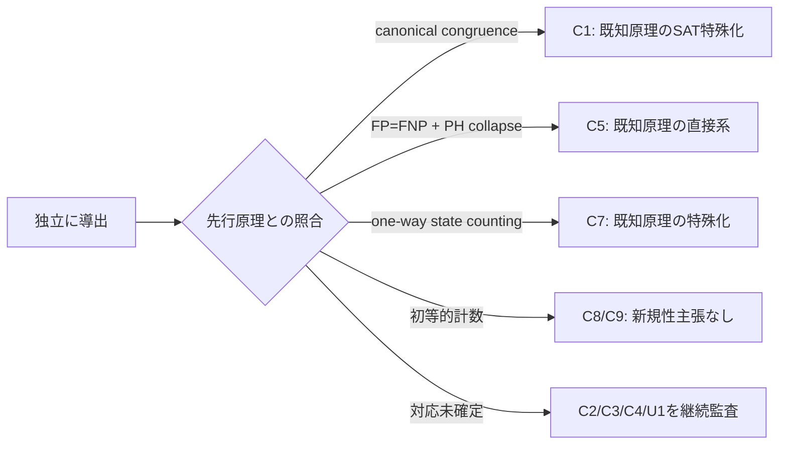

# P vs NP 研究：独立導出した定理・補題の新規性台帳

- 作成日: 2026-07-10
- 現版: v0.17
- 再始動監査日: 2026 09 05
- 親ノート: `P_vs_NP_semantic_compression_research.md`
- 目的: 研究中に独立に導出した命題を、既知事項・予想・研究計画から分離する。

> **v0.17訂正の優先順位:** C1–C32は研究履歴として保存し、新C33–C38と末尾の今回監査を優先する。Bridge-0という条件文そのもの、C31のgeneric extractor存在命題を無条件反証とは扱わない。C20の上界とprefix bindingを合成しても、P≠NPへの矛盾は出ない。新規性確認済みの命題は引き続きゼロである。

## 重要な表示規則

このファイルへの収録は、学術的新規性を意味しない。各命題を二軸で管理する。

1. **数学的状態**: 証明済み／条件付き／未証明／反証済み
2. **新規性状態**: 既知確認済み／folklore可能性大／新規可能性あり／新規性未監査／新規性確認済み

十分な先行研究検索と専門家による照合を経て「新規性確認済み」になったものだけを、人類未踏の成果と呼べる。現時点で、その状態にある命題はない。

## 1. 候補一覧

| ID | 命題 | 数学的状態 | 新規性状態 | P≠NPへの役割 |
|---|---|---|---|---|
| C1 | Boundary Completeness Lemma | 証明済み | 既知原理の特殊化 | 強い意味要約が境界関数を保存する |
| C2 | Contextual Compilation Trichotomy | 条件付き証明済み | 新規性未監査 | 小文脈族・再計算・強い表現の三分岐 |
| C3 | Normal-Form Hardness Lemma | 条件付き証明済み | 新規性未監査 | E-NFと既知下界からP≠NPを導く |
| C4 | No-Free-Normal-Form Trichotomy | 条件付き証明済み | 新規性未監査 | 表現クラス選択のボトルネック |
| C5 | PH-verifiable Summary Search Lemma | 証明済み | 既知原理の直接系 | P=NP仮定下の要約探索 |
| C6 | Width-to-#SAT Lemma | 証明済み | folklore可能性大 | 意味状態幅から#SAT時間へ変換 |
| C7 | Residual-to-Streaming-Space Lemma | 証明済み | 既知原理の特殊化 | MRECからstreaming空間下界へ変換 |
| C8 | Residual Cardinality Ceiling | 証明済み | 初等的計数・新規性なし | MREC witness cutを制約 |
| C9 | MREC Cut Feasibility Corollary | 証明済み | C8の直接系・単独新規性なし | 左右端の不可能領域を排除 |
| C10 | Sparse-Language Residual Ceiling | 証明済み | 新規性未監査・folklore可能性大 | MRECを反証 |
| C11 | Decision Streaming–ORRS Equivalence | 証明済み | モデル同値・新規性なし | search仮定とは非同値。強い十分条件にはなる |
| C12 | Full Abstraction Does Not Imply Succinctness | 証明済み | 初等的反例・新規性なし | Semantic–Resource Gapを固定 |
| C13 | ICC Normal Form Does Not Supply Instance Summaries | 証明済み | 定義上の分離・新規性なし | Program/Instance Gapを固定 |
| C14 | Existential-Bit Update Impossibility | 証明済み | 初等的反例・新規性なし | 原点の弱い合流を排除 |
| C15 | Black-Box Context Extraction Lower Bound | 証明済み | 標準adversary論法・新規性なし | E-NFはnon-black-boxである必要 |
| C16 | Search-Streaming–Uniformizer–ORRS Equivalence | 証明済み | モデル同値・新規性なし | search型と全uniformizer実現の量化を固定 |
| C17 | Sparse Search Residual Exact Count | 証明済み | 初等的計数・新規性未監査 | search版の残余数ベース空間経路を閉じる |
| C18 | Canonical Uniformizer Trap | 証明済み | 初等的反例・新規性なし | lex-min一つから全solverへの推論を反証 |
| C19 | SAT-Promise Restriction Extraction Lower Bound | 証明済み | 標準adversaryのSAT埋込み・新規性未監査 | black-box barrierを3-CNF promiseへ強化 |
| C20 | MMW Witness-Carrying Separation Criterion | 証明済み | MMW構成の直接系・新規性未監査 | exact WC下界だけでP≠NPを導く |
| C21 | Relativized Terminal–Witness-Carrying Separation | 証明済み | 標準permutation inversionの適用・新規性未監査 | generic terminal-to-WC normal formを相対化反証 |
| C22 | Relativized Live-WC Lower Bound for Actual Oracle-MCSP | 証明済み | Ren–Santhanam Theorem 3.4の直接系 | decision→live witnessのrelativizing bridgeを反証 |
| C23 | Slack-Shattering Lemma | 証明済み | 初等的point patching・新規性なし | slackのあるunique-prefix gadgetを排除 |
| C24 | Mask-to-Prefix Permutation Counting Barrier | 証明済み | 初等的計数・新規性なし | generic permutation-only mask移送を制約 |
| C25 | Cryptographic Prefix-Selector Barrier | 条件付き証明済み | 既知PRF論法の直接的変形・新規性未監査 | PRF存在下で対応sizeのlive-WCを排除 |
| C26 | Addressed-WC Partial-MCSP Corollary | 条件付き証明済み | Ilango Theorem 11の直接系 | fixed-order化が失う本質を同定 |
| C27 | Sequential PME Oracle-Saturation Lemma | 証明済み | 初等的semantic-oracle構成・新規性未監査 | full-update semantic-oracleに頑健なWC下界法を排除 |
| C28 | SAT Key Stabilizer and Query-Forcing Failure Lemma | 証明済み | 初等的群作用・新規性未監査 | naïve keyed-SAT transcript extractionを排除 |
| C29 | Full-Table PH Padding–Secrecy Trilemma | 条件付き証明済み | 初等的parameter obstruction・新規性未監査 | random oracleのfull-table PH canonicalizationを排除 |
| C30 | PAP–Prefix Compiler Bridge | 条件付き証明済み | 1-bit liftとArteche et al. Theorem 1.1の直接合成 | witness-bindingを回路→Resolution compilerへ局在化 |
| C31 | Generic Implicit-PAP Extraction Collapse | 条件付き証明済み | Arteche et al. Corollary 5.6とFleming et al. Theorem 1.1の直接合成 | arbitrary implicit-Resolution抽出路線をP=NP級と同定 |
| C32 | PITT Index-Slip, Sentinel-Type, and Padding-Collapse Audit | 証明済み（反証補題） | 初等的uniform complement構成・型検査・padding計算 | AltmanのMISによるP≠NP bridgeを反証。現行MCSP本線には影響なし |
| C33 | Conditional-Bridge Classification | 証明済み（条件文の論理監査） | 初等論理・新規性なし | Bridge-0の偽ラベルを訂正 |
| C34 | Easy-Witness Direction Audit | 証明済み（既知結果の直接系） | 新規性なし | P=NP⇒NEXP⊄P/poly |
| C35 | Lexicographic Next-Bit Patch | 証明済み（指定基底） | 初等構成・新規性未確認 | 次bit forcingの余裕条件を強化 |
| C36 | Ordered-Interval Patch | 証明済み（連続区間・指定基底） | 初等trie構成・新規性未確認 | k点変更をO(n+k)追加gateで実現 |
| C37 | Explicit-Prefix Completion Audit | 条件付き証明済み | 構成の直接系・新規性未確認 | 自明completionを許す抽出器はP=NP級 |
| C38 | Witness-Endgame Direction Audit | 証明済み（含意の向きの監査） | 初等論理・新規性なし | binding完成と無条件WC下界を分離 |
| U1 | MCSP Residual Explosion Conjecture | 反証済み | 該当なし | C10とMCSP回路計数に反する |

## 2. 証明済み候補

### C1. Boundary Completeness Lemma

境界変数を介して任意の外部文脈と合成され、全文脈についてSAT値を正確に保存する要約は、部分式が各境界割当てを実現できるかを完全に保存しなければならない。

**証明の核:** 二つの部分式がある境界割当てで異なる実現可能性を持つなら、その割当てを強制する単位節文脈を接続する。合成後のSAT値が異なるため、同じ要約へ併合できない。∎

**新規性監査結果:** 抽象的な構造は既知である。finite integer indexでは、同じ境界を持つ二つの対象を、すべての境界付き外部対象とのgluing後に問題の答えが一致するかで同値化する。これはC1の「全文脈に対する交換可能性」と同型である。SATで単位節文脈を用いて境界関数の各点を読み出す部分は明快な特殊化だが、独立した新原理とは扱わない。

- Langer et al., [Linear Kernels on Graphs Excluding Topological Minors](https://arxiv.org/abs/1201.2780), Definition 3。finite integer indexの概念自体はBodlaender–van Antwerpen-de Fluiter (2001) に遡る。

### C2. Contextual Compilation Trichotomy

文脈族相対の完全要約は、概ね次のいずれかになる。

1. 文脈族が小さく、答えベクトルを保存できる。
2. 問合せ時に元の判定器を再実行する。
3. 強い表現を保存し、一般関数表現の下界問題を引き受ける。

有限文脈族の真理値ベクトル上界と再実行上界から導出した。ただし完全なメタ定理にするには、計算モデルとコスト尺度の固定が必要である。

### C3. Normal-Form Hardness Lemma

P=NPの仮定から対象関数を、既知の超多項式下界を持つ制限表現クラスへ一様・多項式サイズで抽出できるなら、その下界と矛盾し、P≠NPが従う。

**証明の核:** P=NPを仮定し、E-NFで多項式サイズの制限表現を構成すると、対象関数族の既知表現下界に反する。∎

量化、対象関数族、uniformity、下界の適用範囲をすべて一致させる必要がある。

### C4. No-Free-Normal-Form Trichotomy

正規形の表現クラスを選ぶと、弱すぎてP=NPから抽出できない、強すぎて必要な下界がない、または抽出と下界の両立自体がP≠NP級の突破口になる、のいずれかに入る。

メタ定理化には「弱い」「強い」「抽出」の順序関係を形式化する必要がある。

### C5. PH-verifiable Summary Search Lemma

要約候補の正しさが多項式階層内で検証でき、適切な多項式長要約の存在が保証されるなら、P=NPの仮定下で要約を自己還元的に探索できる。

**証明の核:** P=NPならPHがPへ崩壊する。候補の各ビットについて、指定prefixを持つ正しい要約が存在するかを検査し、辞書順最小候補を逐次復元する。∎

**新規性監査結果:** 新規原理ではない。P=NPならFP=FNPとなる標準的なwitness reconstructionに、P=NPによるPHのPへの崩壊を前置きした直接の系である。本研究固有なのは「正しい要約」を証人関係として置いた適用先だけである。

- Bellare and Goldwasser, *The Complexity of Decision versus Search*, SIAM Journal on Computing 23(1), 1994。
- 標準的関係: $P=NP$ iff $FP=FNP$。

### C6. Width-to-#SAT Lemma

変数を逐次処理するexact semantic mergeが各層で高々 $W(n)$ 状態を持ち、遷移・正規化・同値判定・重み併合が状態あたり多項式時間なら、#SATは

\[
O\!\left(nW(n)n^{O(1)}\right)
\]

時間で計算できる。重み付きBDD／動的計画法の標準的観察である可能性が高い。

### C7. Residual-to-Streaming-Space Lemma

長さ $N$ の言語を認識する決定的一方向streaming algorithmが切断 $i$ で $S(N)$ ビットを使うなら、prefix residual同値類数 $K(N,i)$ に対し

\[
S(N)\ge \log_2 K(N,i).
\]

異なる残余同値類が同じ内部状態へ到達すると、両者を区別する共通suffix上で機械が誤るためである。これはMyhill–Nerode法、および通信行列の異なる行数から決定的一方向通信量を下げる標準的議論の特殊化であり、新規原理とは扱わない。

### C8. Residual Cardinality Ceiling

任意の $L\subseteq\{0,1\}^{N}$ について、

\[
K_L(N,i)\le \min\{2^i,2^{2^{N-i}}\},
\qquad
\log_2K_L(N,i)\le\min\{i,2^{N-i}\}.
\]

prefix数と、suffix集合上のBoolean関数数による二重計数である。∎ 初等的な全数上界なので、単独の学術的新規性は主張しない。

### C9. MREC Cut Feasibility Corollary

\[
\log_2K_s(2^n,i)>s(n)^d
\]

には

\[
i>s(n)^d,
\qquad
2^n-i>d\log_2s(n)
\]

が必要である。C8の二つの上界から直ちに従う。∎ C8の直接系なので、単独の学術的新規性は主張しない。ただしMREC探索領域を狭める研究上の実用性はある。

## 2.1 第一次新規性監査の結論

追加監査によりU1も反証された。証明済み命題ではC2–C4の定式化に独自性が残る可能性があるが、現状はメタ観察の域を出ておらず、新定理とは呼ばない。

## 3. 反証された中心候補と監査補題

### C10. Sparse-Language Residual Ceiling

長さ$N$のYES文字列を$M_N$個しか持たない任意の言語$L$では、任意の切断$i$で

\[
K_L(N,i)\le M_N+1.
\]

completionを持たないprefixは空残余の一クラスになる。completionを持つ各prefixに受理suffixを一つ割り当てると、異なるprefixは異なるYES文字列を与えるためである。∎

以下$s(n)\ge n$とする。MCSP$[s]$のYES真理値表数はサイズ$s$の回路数以下、すなわち$2^{O(s\log s)}$以下なので、

\[
\log K_s(2^n,i)=O(s\log s).
\]

**新規性状態:** 初等的でfolkloreの可能性が高い。MRECを破棄する監査補題として重要だが、人類初とは主張しない。

### C11. Decision Streaming–ORRS Equivalence

prefixを短い状態へオンライン更新し、最終判定でき、同じ状態へ併合されたprefixが同じ残余を持つ系をORRSと呼ぶ。決定的一方向streaming algorithmとORRSは、機械構成を状態名とする対応により資源保存的に同値である。

**数学的状態:** 証明済み。

**新規性状態:** 計算モデルの展開による同値であり、新規定理とは扱わない。ただしcanonical residualだけを下げても、より細かく更新しやすい状態系を排除できないRefinement Trapを明示する役割がある。

**searchとの関係:** search-MCSP theoremの仮定との同値ではない。ただしsearch solverの$\bot$/回路出力からdecision値を読めるため、decision-MCSP lower boundはsearch solver不在を示す強い十分条件になる。

### C12. Full Abstraction Does Not Imply Succinctness

Boolean回路を真理値表へ展開する変換は、入力評価を観測文脈とすればextensional equivalenceを保存・反映するためfull abstractである。しかし出力長は$2^n$になり得る。従ってfull abstractionは多項式サイズ変換を含意しない。∎

**新規性状態:** 初等的な分離例であり、新規性は主張しない。形式意味論の意味保存条件だけではE-NFの資源条件を満たさないことを明示する監査例である。

### C13. ICC Normal Form Does Not Supply Instance Summaries

Ptime完全なICC言語が与えるのは関数$f$の固定プログラム$P_f$であり、各入力$F$を前処理した多文脈要約$D_F$ではない。後者を得るには、$P_f$を$F$でspecializeする時間、residual objectのサイズ、query timeの追加境界が必要である。従ってICCのprogram representation theoremだけからinstance compilationは従わない。∎

**新規性状態:** program representationとpartial evaluation後のdata representationの定義上の差であり、新規定理とは扱わない。E-NFの欠落仮定を特定する監査命題である。

### C14. Existential-Bit Update Impossibility

残余式$G$を現在充足可能かどうかの一ビット$b(G)$だけへ要約したとき、$b(G)$と次の代入値$a$だけから$b(G|_{x=a})$を常に更新する関数は存在しない。$G=x$と$H=\neg x$はともに現在SATだが、$x=1$後のSAT値が異なるためである。∎

**新規性状態:** 初等的反例であり新規性なし。元の意味圧縮案が、現在のSAT値ではなくcompletion全体の振舞いを保存しなければならない理由を最小形で示す。

### C15. Black-Box Context Extraction Lower Bound

未知の$f:\{0,1\}^n\to\{0,1\}$へのmembership queryだけから、全$x$で$f(x)$を正確に答える表現を生成する決定的変換は、最悪時$2^n$ queryを要する。全応答を0としたときの未照会点$x^*$を選び、全零関数と$x^*$だけ1の関数を区別できないというadversary論法で従う。∎

**新規性状態:** 標準的なexact learning／query complexityのadversary論法であり、新規性なし。本研究では、decision algorithmをblack boxとして完全残余表現へ変換する経路を排除する。SAT固有の時間下界を与えず、non-black-box抽出の必要性だけを示す。

### C16. Search-Streaming–Uniformizer–ORRS Equivalence

全入力長にわたる全域search relation family

\[
\mathcal R=(R_N)_N
\]

の決定的final-output one-pass solverは、一つのuniformizer family

\[
f=(f_N)_N,
\qquad
f_N(x)\in R_N(x)
\]

を選ぶ。prefix $u$後の完全な内部構成を$\sigma_i(u)$とすると、

\[
\sigma_{N,i}(u)=\sigma_{N,i}(v)
\Longrightarrow
\forall z,\ f_N(uz)=f_N(vz).
\]

function-ORRS familyには、全$N,i$で共通する一つの固定アルゴリズム

\[
\operatorname{Init}(N),\quad
U(N,i,q,b),\quad
\operatorname{Rep}(N,q)
\]

を要求し、各入力長専用の巨大transition adviceを許さない。従ってspace $m$、update time $t$、reporting time $r$の一つのsolverが全入力長で存在することと、あるuniformizer family $f$に対して同じ資源のuniform function-ORRS familyが存在することは、位置情報$O(\log N)$を除き同値である。逆向きは固定された初期化器、更新器、reporterをそのまま実行すればよい。online outputも、総出力長$L$をbufferして$m+O(L)$ space、$r+O(L)$ reporting timeでfinal-output化できる。∎

**数学的状態:** 証明済み。

**新規性状態:** deterministic streaming transducerを内部状態で展開したモデル同値であり、新規定理とは扱わない。

**重要な量化:** search solverの存在は

\[
\exists f\in\operatorname{Unif}(\mathcal R)
\]

なので、search仮定と同値な形でsolver不在を示すには、各uniformizer family $f$について、それを所定資源で実現するuniform function-ORRS familyが存在しないことを示す必要がある。uniformizer自体は全域relationから存在し、排除対象ではない。C11のdecision-ORRSはsearch theoremの仮定との同値ではないが、decision lower boundはsearch lower boundの十分条件である。

### C17. Sparse Search Residual Exact Count

固定した$\operatorname{search\text{-}MCSP}^A[s]$について、$Y$をサイズ$s$以下の$A$-oracle回路が計算するtruth table集合とする。NO入力の唯一の出力を$\bot$とする。cut $i$で

\[
\operatorname{Live}_i=\{u:\exists z,\ uz\in Y\},
\qquad
\operatorname{Dead}_i=\{0,1\}^i\setminus\operatorname{Live}_i.
\]

任意のuniformizer $f$に対し、

\[
u\equiv_i^f v
\iff
\forall z,\ f(uz)=f(vz)
\]

と置くと、その同値類数は厳密に

\[
K_f(i)=
|\operatorname{Live}_i|
+\mathbf1[\operatorname{Dead}_i\ne\varnothing].
\]

**証明:** 異なるlive prefix $u\ne v$について$uz\in Y$となる$z$を選ぶ。$vz$がNOなら出力は回路と$\bot$で異なる。$vz$もYESなら、同じ固定oracle回路が異なるtruth table $uz\ne vz$を計算することはないため、任意のuniformizerで出力が異なる。dead prefix同士は全suffixで$\bot$を返す。∎

さらに各live prefixからYES completionを一つ選ぶ写像は単射なので、

\[
|\operatorname{Live}_i|
\le |Y|.
\]

一般の$n,s$では回路記述数から

\[
|Y|\le 2^{O(s\log(n+s))}.
\]

MMWの設定$s\ge n$ではこれが

\[
|Y|\le 2^{O(s\log s)}
\]

となる。従って$s\ge n$の下で、全uniformizerについて

\[
\log K_f(i)=O(s\log s).
\]

**数学的状態:** 証明済み。

**新規性状態:** 初等的なprefix計数とoutput-separationの組合せであり、folklore／既知の可能性が高い。専門家監査前に新規性を主張しない。

**役割:** search版でも残余同値類数／Myhill–Nerode state countだけからsuper-$\operatorname{poly}(s)$ space下界を得る経路を閉じる。他のspace lower-bound技法すべてを排除するものではない。短い抽象IDの存在は一様な更新器を与えず、残る標的をtransition computationへ限定する。

### C18. Canonical Uniformizer Trap

$N=2m$、入力$ab\in\{0,1\}^m\times\{0,1\}^m$について、

\[
R(ab)=
\begin{cases}
\{0,1\},&a=b,\\
\{1\},&a\ne b
\end{cases}
\]

とする。$0<1$のlex-min uniformizerは$a=b$のときだけ0を返す。中央cutではprefix $a$ごとの残余がsuffix $a$の一点だけ0となるため$2^m$個あり、決定的一方向streaming spaceは少なくとも$m=N/2$ビットである。一方、constant-1 uniformizerは全入力でvalidで、$O(1)$ spaceで計算できる。∎

**数学的状態:** 証明済み。

**新規性状態:** Equalityの標準one-way lower boundを用いる初等的反例であり、新規性なし。

**役割:** 一つのcanonical／lex-min selectorの下界からsearch relation全体の下界を導く推論を反証する。全uniformizerを量化するか、資源保存的canonicalization theoremが別途必要である。

### C19. SAT-Promise Restriction Extraction Lower Bound

以下$n\ge3$とし、3-CNFは各節の幅が高々3であることを意味する。ちょうど3 literalの規約では反復によりpaddingする。境界変数$x_1,\dots,x_n$と$s\in\{0,1\}^n$について、

\[
f_s(x)=\mathbf1[x\ne s]
\]

を考える。$\ell_i=x_i$ if $s_i=0$、$\ell_i=\neg x_i$ if $s_i=1$とし、長い節$\bigvee_i\ell_i$をchain化すれば、$n-3$補助変数、$n-2$節の3-CNF $\Phi_s(x,y)$で

\[
\exists y\,\Phi_s(x,y)\iff f_s(x)
\]

を実現できる。

境界変数だけへの部分代入$\rho\in\{0,1,*\}^n$を許すoracle

\[
O_\Phi(\rho)=\operatorname{SAT}(\Phi\land\rho)
\]

を考える。promiseを恒真3-CNF $\Phi_\top$またはsingle-hole $\Phi_s$とする。構文を見ずrestriction queryだけから、抽出後には$O_\Phi$を呼ばず単独評価できるoracle-freeな投影関数表現$x\mapsto\exists y\,\Phi(x,y)$を出す決定的変換は、最悪時$2^n$ queriesを必要とする。

**証明:** $\Phi_\top$上の全1 transcriptを考える。$2^n$未満のqueryでは、完全代入として未照会の$s$がある。非完全なrestrictionには少なくとも二つのcompletionがあり、holeは一点だけなので$\Phi_s$もSATである。完全queryも$s$以外なのでSATである。従ってtranscriptは同一だが、投影関数は$s$で異なり、同じ出力表現は両方に正しくなれない。∎

**数学的状態:** 証明済み。

**新規性状態:** 標準的なall-one対single-hole adversaryを線形サイズexistential 3-CNFへ埋め込んだもの。近いexact-learning/query下界との照合前なので新規性を主張しない。

**限界:** 構文を読めばliteralの極性から$s$を線形時間で復元できる。補助変数へのrestriction、一般formula query、評価時のoracle再利用もモデル外である。従ってnon-black-box SAT algorithmの時間下界ではない。

### C20. MMW Witness-Carrying Separation Criterion

一つのtime-constructible $s=s(n)\ge n$、一つの固定$A\in PH$を取る。$N=2^n$、辞書順入力を$x_0,\ldots,x_{N-1}$、prefixを$u=u_0\cdots u_{i-1}$とし、そのversion spaceを

\[
V^A_{n,s}(u)=
\left\{
C:\ |C|\le s,
\forall j<i,\ C^A(x_j)=u_j
\right\}
\]

とする。

uniform exact witness-carrying system（exact WC）とは、全$n,i$で共通する一つの固定machine

\[
\operatorname{Init}(n,s),\quad
U(n,s,i,q,b),\quad
\operatorname{Dec}(n,s,i,q)
\]

で更新されるstate $q_i(u)$が、過去prefixを再読せず、

\[
V^A_{n,s}(u)\ne\varnothing
\Longrightarrow
\operatorname{Dec}(q_i(u))\in V^A_{n,s}(u),
\]

\[
V^A_{n,s}(u)=\varnothing
\Longrightarrow
\operatorname{Dec}(q_i(u))=\bot
\]

を満たすものとする。$n,s,i$は公開parameterとしてdecoderへ渡してよい。$n$ごとのadviceや巨大transition tableは許さない。初期化は最初のupdateへ、回路記述の書出しはdecode/report timeへ課す。

#### 命題

任意のこのような$s,A$について、

\[
P=NP
\Longrightarrow
\exists\text{ uniform exact WC}
\]

であり、その資源は

\[
\begin{aligned}
\text{persistent state length}&=O(s\log s),\\
\text{total working space}&=\operatorname{poly}(s),\\
\operatorname{update}&=\operatorname{poly}(s),\\
\operatorname{decode},\operatorname{report}&=O(s\log s)
\end{aligned}
\]

である。従って、

\[
\exists s\ \exists A\in PH\
\left[
\nexists\operatorname{poly}(s)\text{-resource uniform exact WC}
\right]
\Longrightarrow
P\ne NP.
\]

#### 証明

stateに、現在のprefixに整合するサイズ$s$以下の$A$-oracle circuit $C_i$とalive flagを保持する。新しいbit $b$を受け取るたび、次を計算する。

\[
\operatorname{Ext}(D;C_i,i,b)\iff
D\in\mathcal C^A_{n,s}\land
\forall j<i\,[D^A(x_j)=C_i^A(x_j)]
\land D^A(x_i)=b.
\]

候補があれば、サイズ、次いでencodingの辞書順で最初の$D$を返し、なければ$\bot$を返す。実装出力は$(\operatorname{ok},\langle D\rangle)$としてfailureと有効encodingを分離する。これはMMWのCircuit-Min-Mergeを1 bitへ特殊化したPrefix-Min-Extensionである。

新prefixがliveなら、任意のfull completion circuitがmergeの存在証人なので成功する。deadなら失敗し、deadの全extensionもdeadである。従って帰納的にexactnessを満たす。

canonical output bitは

\[
\exists D\left[
D_k=1\land\forall x\,G(D,x)
\land\forall E\prec D\ \exists y\,\neg G(E,y)
\right]
\]

と書け、無効encodingを明示処理すれば$\exists D\forall(x,E)\exists y\,R^A$、従って$\Sigma_3^A$である。instance長とoutput長は$O(s\log s)$。$P=NP$かつ$A\in PH$なら$A\in P$かつ$\Sigma_3^A=P$なので、全output bitを一つの固定machineが$\operatorname{poly}(s)$時間・$\operatorname{poly}(s)$作業空間で生成できる。persistent stateは回路記述、位置、flagだけで$O(s\log s)$、decode/reportは回路または$\bot$の複写である。∎

**重要なscope:**

- MMW Algorithm 1はblockwiseである。本命題は同Algorithmをそのまま各prefix decoderと呼ぶのではなく、Section 2.1のCircuit-Min-Mergeを各bitで呼ぶ明示的改変である。
- $O(s\log s)$はpersistent stateだけの上界であり、collapse後の総作業空間は$\operatorname{poly}(s)$である。
- exact WCはterminal solverの特殊例なので、「no exact WC」は「no terminal solver」より弱いlower-bound仮定である。両者の同値は主張しない。
- 任意terminal solverをWCへ変換するnormal-form theoremは、このP≠NP十分条件には不要である。
- dead時を問わないlive-promise WCの不在もP≠NPを導くが、これはno exact WCより強い主張である。
- 一つのcanonical selectorだけのhardnessから全terminal solverのhardnessは従わない。ただしMMWのcanonical merge自体の無条件下界も、直接$P=NP$と矛盾し得る。

**数学的状態:** 証明済み。MMW一次論文の構成を全prefix witness保持として明示化した直接の系。

**新規性状態:** 新規性未監査。既知構成のrepackagingであり、専門家照合前に新しいmagnification theoremとは呼ばない。

**未解決部分:** exact WCまたはlive-promise WCに対する$\operatorname{poly}(s)$資源下界は何も証明していない。

**量化:** 構成側は$\forall s\forall A\,[P=NP\Rightarrow\exists M_{s,A}\exists k\exists n_0\forall n\ge n_0]$である。対偶側では、ある$s,A$について$\forall M\forall k\forall n_0\exists n\ge n_0$でexactnessまたはいずれかの資源上界を破る必要がある。$M$は固定$s,A$に依存してよいが、$n$ごとのadviceは持たない。

- McKay, Murray, Williams, [Weak Lower Bounds on Resource-Bounded Compression Imply Strong Separations of Complexity Classes](https://people.csail.mit.edu/rrw/MCSP-MKTP-stoc19.pdf), Sections 2.1, 4 and Theorems 1.2–1.3.

### C21. Relativized Terminal–Witness-Carrying Separation

各$m$でforward permutation oracle

\[
\pi_m:\{0,1\}^m\to\{0,1\}^m
\]

を考える。description $d$が表すconceptを

\[
T_d=\pi_m(d)\Vert d,
\qquad
\mathcal H_m^\pi=\{T_d:d\in\{0,1\}^m\}
\]

とし、prefix $u$のversion spaceを

\[
V_m^\pi(u)=\{d:T_d\text{ has prefix }u\}
\]

とする。このfamilyが誘導する全域terminal search relationを

\[
R_m^\pi(ab)=
\begin{cases}
\{b\},&a=\pi_m(b),\\
\{\bot\},&a\ne\pi_m(b)
\end{cases}
\]

とする。WCは、live prefixで$V_m^\pi(u)$内のdescriptionを、dead prefixで$\bot$をstate-onlyに返すgeneric concept-family版である。

#### 命題

一つのoracle family $\pi=(\pi_m)_m$を選び、

1. $R^\pi$には$O(m)$ space、一回のoracle query、$\operatorname{poly}(m)$ timeのuniform terminal solverが存在する。
2. $R^\pi$には$\operatorname{poly}(m)$ query／space／timeのuniform deterministic live-promise WC systemが存在しない。

を同時に成立させられる。

#### 証明

terminal solverは$a,b$を保存し、最後に$\pi_m(b)=a$かを一回だけqueryして$b$または$\bot$を返す。

一方、中央prefix $a$は常にliveで、その唯一のdescriptionは

\[
\pi_m^{-1}(a)
\]

である。従ってWCの初期化、最初の$m$ updates、state-only decodeを合成するとforward permutation inverterになる。

$M=2^m$点の未知permutationをforward queryだけで反転する決定的worst-case query complexityは$M-1$である。$M-2$回以下なら、adversaryは照会点へ異なる非target出力を返し、少なくとも二つの未照会domain点を残せる。targetのpreimageをそのどちらへ置くcompletionも同じtranscriptに整合するため、algorithmは両方に正しくなれない。$M-1$回なら、targetが返らなかった場合の最後の点を答えればよい。

clocked pair $(M,c)$を列挙する。$m^c$の資源上限を超えれば資源条件を破り、超えなければ十分大きい未使用長で上のadversaryにより正しさを破るlength-by-length diagonalizationを行う。oracleはtyped same-length function oracleとし、他長の符号化曖昧性を残さない。これで一つのoracle familyを得る。∎

**数学的状態:** 証明済み。

**新規性状態:** 標準的なblack-box permutation inversion adversaryの適用。新規性未監査。

**役割:** 中央prefixは常にliveなので、genericでrelativizingなresource-preserving terminal-to-live-WC theoremまで反証する。

**限界:** 人工的なcompact-representation relationであり、search-MCSP、$A\in PH$、unrelativized worldの分離ではない。MCSP固有のnonrelativizing変換も排除しない。

### C22. Relativized Live-WC Lower Bound for Actual Oracle-MCSP

Ren–Santhanam Theorem 3.4を$c=2$で固定する。あるoracle $B=(O,\operatorname{itrMCSP})$について、

\[
\operatorname{MCSP}^B\in\operatorname{DTIME}^B(O(N))
\]

である一方、任意の$N^2$-time deterministic $B$-oracle machine $M$には、任意に大きい長さ$N=2^n$で

\[
CC^B(x)\le8n
\]

なのに、$M(x)$が$x$を計算するサイズ$N/(4n)$以下の$B$-oracle circuitを出力できない$x$がある。任意に大きい長さを取れるのは、同論文のstage constructionが各machineを無限回列挙するためである。

#### 命題

このoracle $B$では、$s(n)=8n$に対するuniform deterministic $B$-oracle live-promise WCで、updateとdecodeが$\operatorname{poly}(s)$時間のものは存在しない。

#### 証明

存在すると仮定し、hard truth table $x$の全$N$ bitsを辞書順に流す。$CC^B(x)\le8n$なので全prefixがliveであり、最終decodeはサイズ$8n$以下の正しい回路を返す。総時間は

\[
N\operatorname{poly}(n)+\operatorname{poly}(n)\le N^2
\]

であり、十分大きい$n$では$8n\le N/(4n)$なのでTheorem 3.4に矛盾する。有限長はhard-codeし、全machineを$N^2$でclockできる。∎

**数学的状態:** 証明済み。Ren–Santhanam Theorem 3.4の直接系。

**役割:** generic概念族でなくactual relativized MCSPについて、decision容易性からlive witness selectorがrelativizingには得られないことを示す。hard streamの全prefixがliveなのでdead detectionは使わない。

**限界:** terminal searchもこのworldで困難であり、terminal/WC分離ではない。$B\in PH$、unrelativized WC下界、P≠NPのいずれも導かない。

- Ren, Santhanam, [A Relativization Perspective on Meta-Complexity](https://eccc.weizmann.ac.il/report/2021/089/download), Theorem 3.4.

### C23. Slack-Shattering Lemma

標準fan-in 2の$\{\mathrm{AND},\mathrm{OR},\mathrm{NOT}\}$ circuit、free fan-out、NOTも1 gateとする。prefix $u$に整合する回路$C$と、未読の相異なる$k$点の集合$S$を取る。

#### 命題

\[
|C|\le s-(kn+n+2)
\]

なら、任意のlabeling $\alpha:S\to\{0,1\}$について、$u$と$\alpha$の双方に整合するサイズ$s$以下の回路$C_\alpha$が存在する。従って、

\[
\{(D(z))_{z\in S}:D\in V_{n,s}(u)\}=\{0,1\}^k.
\]

$k=1$ではslack $2n+1$で足りる。一般基底で安全な主表示は$O(kn)$である。

#### 証明

全入力negationを$n$ gatesで共有し、各$z\in S$のpoint indicatorを$k(n-1)$ AND gatesで作る。target 0のindicatorのORを$D_0$、target 1のORを$D_1$とし、

\[
C_\alpha=(C\land\neg D_0)\lor D_1
\]

とする。OR treesと最終接続を含めた追加gate数は$kn+n+2$以下である。$S$外では$C_\alpha=C$、$S$上では$C_\alpha=\alpha$となる。∎

**数学的状態:** 証明済み。

**新規性状態:** 初等的point patchingであり、新規性なし。

**役割と限界:** $\Theta(n)$規模のslackがあるunique-completion／forced-next-bit gadgetを排除する。version spaceのshatteringからselectorの計算容易性は従わない。ordinary gatesだけを使うので、同じ基底を含む$A$-oracle circuitsにも成立する。

### C24. Mask-to-Prefix Permutation Counting Barrier

$N=2^n$、辞書順の先頭$N/2$点を$P_{N/2}$とする。

#### 命題

すべてのhalf-mask $S\subseteq\{0,1\}^n$、$|S|=N/2$を

\[
S=\pi(P_{N/2})
\]

と表すsame-domain permutation circuit $\pi$のfamilyは、最悪時

\[
(r+n)\log(r+n)=\Omega(N)
\]

となる内部gate数$r$を必要とする。通常の$r\le N$では$r=\Omega(N/\log N)=\Omega(N/n)$である。

#### 証明

$n$入力$n$出力、$r$ internal gatesのmulti-output circuit数は、gate記述と$n$本のoutput source指定を合わせて

\[
2^{O((r+n)\log(r+n))}
\]

以下である。従って$\pi(P_{N/2})$の候補数もこれ以下。一方、

\[
\binom{N}{N/2}=2^{N-O(\log N)}
\]

個のhalf-maskがあるので、全maskを覆うには表示の下界が必要である。∎

**数学的状態:** 証明済み。

**新規性状態:** 初等的計数であり、新規性なし。

**限界:** standalone permutation-only transferだけを扱う。domain blowup、gadget、非単射embedding、mask oracle、structured maskは排除しない。$\operatorname{poly}(s)$を排除できるのも、$\operatorname{poly}(s)\log(\operatorname{poly}(s)+n)=o(N)$のparameter領域に限る。

### C25. Cryptographic Prefix-Selector Barrier

標準Boolean circuitについて$n\le s$とし、ある絶対定数$a$に対して

\[
|\mathcal C_{n,s}|\le2^{a s\log_2s}
\]

とし、

\[
L=\lceil(a+2)s\log_2s\rceil\le2^n
\]

と置く。

#### 命題

長さ$L$のlex-prefixがサイズ$s$以下の回路へcompletion可能なら、最終decodeでproperなサイズ$s$回路を返すuniform deterministic algorithm $W$があり、dead入力を含む全入力で$\operatorname{poly}(s)$時間に停止するとする。このとき、$s(\lambda)=\operatorname{poly}(\lambda)$かつ全keyでevaluation circuit sizeが$s(\lambda)$以下のbit-output PRF familyは安全でない。

#### 証明

oracle $H$の最初の$L$点の値を$W$へ流し、decoded circuitが有効で同じ$L$点に一致する場合だけacceptする。PRF側は自身がcompletionなので確率1でacceptする。random function $R$側は

\[
\Pr[\operatorname{accept}]
\le|\mathcal C_{n,s}|2^{-L}
\le2^{-2s\log s}.
\]

時間とquery数は$\operatorname{poly}(s)=\operatorname{poly}(\lambda)$である。∎

**数学的状態:** 条件付き証明済み。

**新規性状態:** 既知のMCSP–PRF union-bound論法を短いprefixとproper live searchへ適用した直接的変形。新規性を主張しない。

**系:** HILLとGGMにより、OWFが存在するなら、その構成のevaluation sizeを支配する**ある**polynomial bound $s$についてefficient live-WCは存在しない。

**限界:** 任意に固定した小さい$s=n^c$用WC一つから全OWFを否定しない。superpolynomial $s$では$\operatorname{poly}(s)$をPPTと呼べない。$A$-oracle circuitへは$A$がefficiently evaluableな場合だけ同じ検査を移せる。

- Håstad, Impagliazzo, Levin, Luby, [A Pseudorandom Generator from any One-way Function](https://epubs.siam.org/doi/10.1137/S0097539793244708).
- Goldreich, Goldwasser, Micali, [How to Construct Random Functions](https://www.wisdom.weizmann.ac.il/~/oded/ggm.html).

### C26. Addressed-WC Partial-MCSP Corollary

updateが固定次bitでなく任意のaddress-label pair $(x,b)$を受け取るlive-promise WCを考える。

#### 命題

ETHの下で、Ilango Theorem 11の$m$入力、threshold $s=m-1$のhard familyに対し、$\operatorname{poly}(m)$ update/decode timeを持つuniform deterministic addressed live-WCは存在しない。

#### 証明

partial truth tableのdefined点を任意順に流し、最終decode回路を全defined点で検査する。YESなら一つのsize-$s$回路が全prefixに整合する。NOなら最終検査が必ず棄却する。長さ$N=2^m$の入力走査を含む総時間は

\[
N\operatorname{poly}(m)=N^{1+o(1)}\subseteq N^{o(\log\log N)},
\]

となり、ETH下のIlango Theorem 11に矛盾する。∎

**数学的状態:** ETHを仮定して証明済み。Ilango Theorem 11の直接系。

**役割:** arbitrary-mask Partial-MCSPからfixed lex-prefix WCへ移る際に失われる本質を、address付き任意順からaddressless固定順への変換へ限定する。

**限界:** fixed-order WCの下界ではない。単純reorderは回路合成でYES側$s+\ell$、逆変換側$s+2\ell$へthresholdを増やし、Ilangoのexact gapではNO soundnessを保てない。

- Ilango, [Constant Depth Formula and Partial Function Versions of MCSP are Hard](https://eccc.weizmann.ac.il/report/2020/183/download), Theorem 11.

### C27. Sequential PME Oracle-Saturation Lemma

固定した任意のoracle $A$、time-constructible $s(n)\ge n$を取る。十分大きい固定定数$c$に対し、サイズ$s$以下の$A$-oracle circuitを、明示的に計算可能な固定長

\[
L(n,s):=
c(s+n+1)\left\lceil\log_2(s+n+2)\right\rceil
=O(s\log s)
\]

bitsでpaddingして符号化する。C20のPrefix-Min-Extensionのcanonical outputを、成功時

\[
(1,\operatorname{pad}(\langle D\rangle)),
\]

失敗時

\[
(0,0^L)
\]

とし、その第$k$ bitを返す一つのBoolean languageを$O^A_{\mathrm{PME}}$とする。queryには$n,s,C,i,b,k$を含め、malformed queryと範囲外indexには0を返す。

#### 命題

updaterだけが$O^A_{\mathrm{PME}}$へアクセスするuniform exact WCが無条件に存在する。witness classは引き続き$A$-oracle circuitである。資源は

\[
\begin{aligned}
\text{persistent state}&=O(s\log s),\\
\text{queries/update}&=O(s\log s),\\
\text{query length}&=O(s\log s),\\
\text{oracle rounds within one update}&=1,\\
\text{total update time/space}&=\operatorname{poly}(s),\\
\text{decode/report}&=O(s\log s).
\end{aligned}
\]

#### 証明

stateを現在prefixに整合する回路$C_i$とalive flag、または吸収的dead flagとする。新bit $b$について、canonical PME outputの全$L+1$ bitsを、公開parameter $n,s,i$、旧state $C_i$、新bit $b$、出力位置$k$から作る非適応queryで得る。ここで1 roundは、回答を見る前に全queryを固定するtruth-table/batch accessを意味する。$C_i$がprefix $u$に整合するとき、

\[
\{D:\operatorname{Ext}_{A,n,s}(D;C_i,i,b)\}
=V^A_{n,s}(ub).
\]

従ってok bitが1であることと$ub$がliveであることは同値であり、okなら返された回路を次stateにする。失敗ならdeadへ移る。定数0回路から始めて帰納すれば、全prefixでok iff liveとなり、dead exactnessを含むexact WCを得る。全queryは一update内で非適応だが、全$N$ stepをunrollしたglobal pathのadaptivityは$O(N)$である。明示的query-writing timeは$O(L^2)$である。queryを逐次生成すればtransient spaceは$O(L)$、batch全体を保持すれば$O(L^2)$になり得るので、total working spaceは安全側に$\operatorname{poly}(s)$とする。∎

**数学的状態:** 証明済み。$A\in PH$も$P=NP$も不要。

**新規性状態:** 初等的にPMEのgraphをoracleへ入れた構成。CHOPRS/Pichの定理の系ではなく、専門家照合前に新定理とは呼ばない。

**役割:** updaterだけに特別な補助oracle $O^A_{\mathrm{PME}}$を与えてもそのまま残る下界法は、C20のWC下界を証明できない。witness classは$A$-oracle circuitのままであり、$A\oplus O^A_{\mathrm{PME}}$-oracle circuitをwitnessにする通常の対称的relativizationではない。成功する証明はこのfull-update semantic-oracleと通常の$\operatorname{poly}(s)$-time updateを区別する計算的性質を使う必要がある。

**限界:** ordinary oracle-free WCは構成していない。query localityまたはquery量を上の飽和点より小さく制限した下界は排除しない。CHOPRSの非一様full-input decision modelへ直接移植もしない。

### C28. SAT Key Stabilizer and Query-Forcing Failure Lemma

公開profile族

\[
G_1,\ldots,G_m:\{0,1\}^p\to\{0,1\}
\]

と秘密key $k\in\{0,1\}^p$に対して、

\[
t_k(i,c):=G_i(c\oplus k)
\]

をtarget tableとする。共通XOR stabilizerを

\[
H:=\{\Delta:\forall i,a,\ G_i(a)=G_i(a\oplus\Delta)\}
\]

と置く。

#### 命題

任意の$\Delta\in H$に対して

\[
t_{k\oplus\Delta}=t_k.
\]

従って$H\ne\{0\}$なら、key依存入力としてtarget tableまたはそれを計算する任意の回路しか受け取らないextractorは、coset $k+H$内で元のkeyを識別できない。

#### 証明

\[
t_{k\oplus\Delta}(i,c)
=G_i(c\oplus k\oplus\Delta)
=G_i(c\oplus k)
=t_k(i,c).
\]

これは全$i,c$で成り立つ。∎

さらに、$H=\{0\}$はquery forcingに十分でない。具体的に

\[
F(x_0,x_1,x_2)=\neg x_0\land x_1
\]

で$x_2$を自由なsuffix変数、$p=2$とすると

\[
G(a_0,a_1)=\exists x_2\,F(a_0,a_1,x_2)
=\neg a_0\land a_1
\]

はtrivial stabilizerを持つ。しかしkey $k=01$では

\[
t_{01}(c)=G(c\oplus01)=c_0\land c_1
\]

であり、通常の1個のAND gateがSAT queryなしでtargetを計算する。canonical keyed restriction queryは、楽観的なmacro会計でも1 SAT gateで同サイズ、標準のquery-encoding gateを数えればNOT encoderとSAT gateの少なくとも2 gatesを要する。

最小のpoint版でも、$F_0(x)=x$、$k=1$ならtargetは$\neg c$であり、1個のNOT gateがkeyed SAT queryを完全に隠す。

**数学的状態:** stabilizer命題と明示反例は証明済み。有限探索は証明の発見・監査に使っただけで、主張自体は計算機仮定に依存しない。

**機械監査:** 3変数全256関数でprefix stabilizer分布は

\[
\{1:120,\ 2:54,\ 4:82\}.
\]

3節以下の2,952 CNF、246個の相異なる意味関数では

\[
\{1:112,\ 2:54,\ 4:80\}.
\]

全query templateのSAT値を総当たり照合し、上のquery-free回路をexact synthesisで再現した。詳細は
[`experiments/FINDINGS.md`](experiments/FINDINGS.md)。

**役割:** SAT self-reductionのquery構文にkeyが現れることから、任意の小さいSAT-oracle回路のtranscriptにkeyが現れることは従わない。成功する固定$A=\mathrm{SAT}$案には、少なくともtrivial common stabilizerと、全小回路を対象にした別個のquery-forcing lower boundまたはsemantic normal formが必要である。

**限界:** 全SAT-based encodingを排除しない。対象はXOR-shift profile型と、canonical queryの構文だけから抽出する議論である。SAT oracle gateのinput wireも数えるIlango型会計ではgeneric SAT self-reduction circuitがNO thresholdを超える場合があり、C28だけからWCやlocalizability全体の不可能性は従わない。

### C29. Full-Table PH Padding–Secrecy Trilemma

logical oracle sliceが$D$個のBoolean pointを持つとする。次の三条件を同時に要求する特定のinstantiation strategyを考える。

1. lazy-sampling型のblack-box secrecyを全size-$s$ circuitに使うため、 adversaryが全pointを列挙できないよう
   \[
   D>s.
   \]
2. 「goodな$D$-bit sliceの辞書順最小値」をPH predicateの明示的な全表witnessとして量化するため、padded oracle query length $p$に
   \[
   p\ge D.
   \]
3. oracle gateへの全input wireをsizeに数える標準oracle-circuit modelで、そのqueryをsize-$s$回路が発行するため
   \[
   p\le s.
   \]

#### 命題

上の三条件は同時に成立しない。

#### 証明

\[
D>s\ge p\ge D
\]

となり矛盾する。∎

**数学的状態:** 上記三条件を採用するfull-table canonicalization strategyについて証明済み。

**役割:** random oracleを「全表をPH witnessとして辞書順canonicalizeした固定oracle」で置換する直接案を排除する。Ren–Santhanamのstage constructionを単にpaddingしてP/PHへ入れる案も同じ圧力を受ける。hard sliceを選ぶ有限探索はlogical query lengthに対して指数または二重指数であり、十分なpaddingはoracle gateのwire costをNO thresholdより大きくする。

**限界:** 固定$A\in PH$によるROM置換一般の不可能性ではない。succinct seedから局所評価できるslice、非black-boxなanti-autoreducibility、proof-complexity encoding、標準wire-countと異なるoracle-gate modelは排除しない。

- Ilango, [NP-Hardness of Approximating Meta-Complexity: A Cryptographic Approach](https://eccc.weizmann.ac.il/report/2023/165/revision/1/download), Definition 10。oracle gateへの全input wireをsizeに数える。
- Ren and Santhanam, [Hardness of MCSP for Multi-Output Boolean Functions](https://eccc.weizmann.ac.il/report/2021/089/download), Theorem 3.4。finite-stage oracle diagonalizationの比較対象。

### C30. PAP–Prefix Compiler Bridge

$\varphi$を$n$変数、$\operatorname{poly}(n)$節のCNF、$r\ge n^3$とする。$\varphi$から多項式時間で全真理値表$f_\varphi$とthreshold $S$を作る写像、および次のcompilerがあると仮定する。

1. $\varphi$が充足可能なら$CC(f_\varphi)\le S$。
2. $f_\varphi$を計算する任意のsize-$S$以下の回路$C$から、
   \[
   \operatorname{Ref}_r(\varphi)
   \]
   のResolution refutation $\pi_C$を$\operatorname{poly}(n,S)$時間・サイズで構成できる。

$f_\varphi$の全表を新しい最上位bitが0の半分へ置くproper prefix

\[
u_\varphi(0,z)=f_\varphi(z)
\]

を作る。

#### 命題

$u_\varphi$に整合する任意のsize-$S$以下の回路$D$から、$\varphi$の充足割当てを$\operatorname{poly}(n,S)$時間で抽出できる。

#### 証明

$D(0,\cdot)$へrestrictionして、sizeを増やさず$f_\varphi$を計算する回路$C$を得る。仮定2で$\pi_C$へcompileする。Arteche–Atserias–de Rezende–Khaniki Theorem 1.1を適用すると、$\pi_C$から$\varphi$の充足割当てをdeterministic polynomial timeで抽出できる。∎

**数学的状態:** 二つの仮定の下で証明済み。1-bit selector liftと既知のProof Analysis定理の直接合成。

**役割:** proof-worldでは「任意の短い対象から元witness」というreverse-Levin bindingが既に成立している。未証明部分を、任意の小回路を短いResolution proofへ写す**回路→証明compiler**へ局在化する。

**限界:** compilerも、NO側の回路下界も、C20のonline transition lower boundも与えていない。従ってP≠NPの証明ではない。implicit Resolutionは回路で指数長proofをsuccinctに表せるが、既知のPAP extractorは明示proof長に多項式であり、そのまま展開すれば指数時間になる。さらにC31により、arbitrary implicit proofを展開せず解析するtotal polynomial-time generic extractor自体が$P=NP$を含意する。残るのは明示的poly-size proofまたはrestricted compiler imageである。

- Arteche, Atserias, de Rezende, Khaniki, [The Proof Analysis Problem](https://arxiv.org/abs/2506.16956), Theorem 1.1。
- Fleming, Grosser, Pitassi, Robere, [Provable Reductions in TFNP](https://arxiv.org/abs/2606.27931)。implicit Resolutionと$G_1$のpolynomial equivalence。

### C31. Generic Implicit-PAP Extraction Collapse

> **v0.17訂正:** 下の「Ext存在⇒P=NP」は維持する。Extを無条件に反証した意味ではない。本丸級の未解決足場と分類する（新C38）。

$Q$をExtended Fregeをp-simulateする任意の命題証明系、$s(n)$を任意の多項式とする。次を満たすtotal deterministic algorithm $\operatorname{Ext}$が存在すると仮定する。

1. 入力はvalidな$\mathsf{PAP}_Q[s]$ instance
   \[
   (\varphi,\pi,1^{s(n)}),
   \qquad
   \pi:Q\vdash\neg\operatorname{Ref}_{s(n)}(\varphi).
   \]
2. $\operatorname{Ext}$は全入力で入力長の多項式時間内に停止する。
3. $\varphi$が充足可能なら、$\operatorname{Ext}$は$\varphi$の充足割当てを返す。

#### 命題

上の$\operatorname{Ext}$が存在すれば$P=NP$である。特に、arbitrary implicit Resolution proof、同値な$[EF,\mathrm{Resolution}]$ proof、または$G_1$ proofを対象にするgeneric PAP extractorは、$P=NP$を先取りする。

#### 証明

validな$\mathsf{PAP}_Q[s]$ instance上で$\operatorname{Ext}$を実行し、返された文字列$\alpha$について$\varphi(\alpha)=1$を多項式時間で検証する。条件2により必ず停止し、条件3により$\varphi$が充足可能ならacceptする。充足不能ならvalidな充足割当ては存在しないためrejectする。従って

\[
\mathsf{PAP}_Q[s]\in P.
\]

Arteche–Atserias–de Rezende–Khaniki Corollary 5.6により、$Q$がEFをp-simulateするなら、任意の多項式$s(n)$に対して$\mathsf{PAP}_Q[s]$は多項式時間many-one Levin reductionでNP-completeである。よって$P=NP$。Fleming–Grosser–Pitassi–Robere Theorem 1.1はimplicit Resolutionと$G_1$のpolynomial equivalenceを与え、$G_1$はEFをp-simulateするため、この場合にも適用できる。∎

**数学的状態:** 上の量化の下で条件付き証明済み。既知二定理の直接合成であり、独立した学術的新規性は主張しない。

**役割:** C30の第二候補だった「arbitrary implicit Resolution proofを展開せず解析するgeneric extractor」を停止する。これは技術不足ではなく、目標そのものが$P=NP$級である。

**限界:** 次は排除しない。

1. 入力長自体が多項式である**明示的な短いResolution proof**。
2. completion circuitから生じる**restricted compiler imageだけ**を解析し、像に局所的に検証可能なreverse-witness構造を持たせる方法。
3. $\operatorname{Ext}$がNO instanceで多項式時間停止しないpromise-only手続き。

従ってC30の正確な残存形は「small circuitから明示的poly-size Resolution proofを作る」または「局所認識可能なrestricted-image implicit proofを作る」である。

- Arteche, Atserias, de Rezende, Khaniki, [The Proof Analysis Problem](https://arxiv.org/abs/2506.16956), Corollary 5.6。
- Fleming, Grosser, Pitassi, Robere, [Provable Reductions in TFNP](https://arxiv.org/abs/2606.27931), Theorem 1.1。

### C32. PITT Index-Slip, Sentinel-Type, and Padding-Collapse Audit

Altmanの2026年8月のpreprintは、clocked stage machine $P_i$、有限domain $D_i$、sentinel $z_i$に対し

\[
\mathcal C_i=(D_i\setminus\{z_i\})\setminus L(P_i)
\]

を定義し、$\mathit{MIS}\in NP\setminus P$、従って$P\ne NP$を主張する。自己対角化

\[
L(P_i)\ne\mathcal C_i
\]

自体は正しいが、aggregate languageへのbridgeは三つの独立な理由で成立しない。

#### 命題1：index-slip

標準的なacceptable numberingでは、$s$-$m$-$n$定理によりtotal computableなindex map $h$が存在し、$P_{h(i)}$は入力$u$上で$P_i(u)$をstage clockまでsimulateして結果を反転できる。従って

\[
\forall i\qquad L(P_{h(i)})=\mathcal C_i.
\]

これは$L(P_i)\ne\mathcal C_i$と矛盾しない。前者は**別index $h(i)$**のmachine、後者は**同じindex $i$**の自己補集合を比較するからである。論文のBridge Theoremが$\mathit{MIS}\in P$から構成する$G(i)$は前者の型であり、PITTが禁じる後者の型ではない。実際、上の$h$は$\mathit{MIS}$を仮定せず一様に存在する。

#### 命題2：sentinel type mismatch

論文は

\[
D_i=\{0,1\}^{n_i},\qquad z_i=\#^{n_i}
\]

と定義する一方、valid aggregate $U_i=(u_1,\ldots,u_m)$には全component $u_j\in D_i$を要求する。従って

\[
z_i\notin D_i
\]

であり、Slice Theoremで用いる

\[
(u,z_i,\ldots,z_i)
\]

はvalid aggregateではない。alphabetへ$\#$を追加する修正は可能だが、現行定義のTheorem 2はdomain外入力に$\mathit{MIS}$を適用している。

#### 命題3：explicit-padding collapse

論文のvalid aggregateを明記どおりexplicit tuple

\[
U_i=(u_1,\ldots,u_m),\qquad |u_j|=n_i,\qquad q_i=|U_i|=mn_i
\]

と読み、fixed constant $k$に対して

\[
m=\Omega(n_i^{i-k})
\]

を課す。各componentについて$P_i$を$n_i^i$ steps simulateし、$\mathcal C_i(u_j)$を決定論的に判定すれば、全走査時間は

\[
O(mn_i^i)=O(q_i n_i^{i-1}).
\]

$i\ge k$では$q_i=\Omega(n_i^{i-k+1})$かつ$i-1\le k(i-k+1)$なので

\[
O(q_i n_i^{i-1})\subseteq O(q_i^{k+1}).
\]

有限個の$i<k$は定数処理できる。従って論文自身のpadding条件の下で

\[
\boxed{\mathit{MIS}\in P}
\]

であり、Theorem 4とMain Theoremに直接反する。もしcomponentsをsuccinctに暗黙表現するなら、$q_i=mn_i$という入力長会計とSlice/NP verifierの記述を別途作り直す必要がある。

**数学的状態:** 反証済みbridge。論文のPCL/PITTという同一index上の限定命題までは否定しない。

**現行台帳への影響:** C20--C31は変更なし。このpreprintはMCSP、search witness、prefix completion、streaming WCのいずれにも必要な新しい下界を与えない。母定理M0もこの反証には用いず、反証済みbridgeを再利用しない監査規則としてのみ扱う。

- Altman, [A Predictor-Impossibility Theorem and Applications](https://arxiv.org/html/2608.05613), Theorems 1--6。

### U1. MCSP Residual Explosion Conjecture（MREC、反証済み）

適切なtime-constructible $s(n)\ge n$ と切断 $i(n)$ が存在し、

\[
\log K_s(2^n,i(n))=s(n)^{\omega(1)}.
\]

C10とMCSP回路記述数上界により左辺は常に$O(s\log s)$である。従って予想は偽であり、研究ゲートから除外する。

## 4. 依存関係

```mermaid
flowchart TD
    C8["C8 Residual ceiling"] --> C9["C9 Cut feasibility"]
    C9 --> U1["U1 MREC"]
    C10["C10 Sparse-language ceiling"] --> X["U1を反証"]
    U1 --> X
    C7["C7 Residual→space"] --> B["MCSP streaming lower bound"]
    X --> R["残余数ベース空間ルートを閉鎖"]
    B --> MG["既知 hardness magnification"]
    MG --> PN["P ≠ NP"]
    C1["C1 Boundary completeness"] --> C2["C2 Contextual trichotomy"]
    C2 --> C4["C4 No-free normal form"]
    C3["C3 Normal-form hardness"] --> PN
    C5["C5 PH summary search"] --> C4
    C6["C6 Width→#SAT"] --> AUX["algorithm-to-lower-bound副経路"]
    C11["C11 decision ORRS"] --> DONLY["decisionのみ"]
    C16["C16 search uniformizer ORRS"] --> SBR["search bridgeの型"]
    C17["C17 search residual exact count"] --> SCLOSE["残余数ベース空間路線を閉鎖"]
    C18["C18 canonical trap"] --> ALLU["全uniformizer量化"]
    C19["C19 SAT-promise query lower bound"] --> NB["non-black-box必須"]
    MMW["MMW Circuit-Min-Merge"] --> C20["C20 exact WC criterion"]
    C20 --> PN
    C21["C21 relativized terminal/WC separation"] --> WKILL["generic WENFを破棄"]
    RS["Ren–Santhanam Thm 3.4"] --> C22["C22 actual oracle-MCSP live-WC下界"]
    C22 --> REL["decision→live-WCのrelativizing bridgeを破棄"]
    C23["C23 slack shattering"] --> TIGHT["tight-budget prefix rigidity"]
    C24["C24 permutation counting"] --> PMASK["permutation-only mask移送を制約"]
    PRF["PRF security"] --> C25["C25 cryptographic prefix barrier"]
    IL["Ilango Partial-MCSP"] --> C26["C26 addressed-WC下界"]
    C26 --> ORDER["addressless fixed-order gap"]
    PME["tailored full-update PME oracle"] --> C27["C27 sequential oracle saturation"]
    C27 --> OFILT["PME-oracleに頑健な情報量だけの下界法を排除"]
    SATK["keyed SAT profiles"] --> C28["C28 stabilizer/query-forcing failure"]
    C28 --> QF["syntax-only SAT extractionを排除"]
    FTPH["full-table PH canonicalization"] --> C29["C29 padding–secrecy trilemma"]
    C29 --> QR["succinct anti-autoreducible PH slice"]
    PAP["Proof Analysis Thm 1.1"] --> C30["C30 PAP–prefix compiler bridge"]
    C30 --> PC["small circuit→short Resolution compiler: 未証明"]
    IP["Implicit Resolution ≡ G1"] --> C31["C31 generic implicit-PAP extraction collapse"]
    PAPH["PAP_Q NP-complete for Q ≥ EF"] --> C31
    C31 --> IKILL["arbitrary implicit extractorを破棄"]
    C31 --> RIMG["restricted compiler image: 未証明"]
    PITT["Altman PITT: same-index self-complement"] --> C32["C32 index-slip / sentinel-type / padding collapse"]
    C32 --> PKILL["MISによるP≠NP bridgeを破棄"]
    SBR --> ALLU
    SCLOSE --> ALLU
    ALLU --> TG["uniform transition下界: 未証明"]
    TG --> PN
```

## 5. 新規性監査プロトコル

1. 命題を量化記号・計算モデル・コスト尺度まで固定する。
2. 同義語を展開して教科書、survey、原論文、引用文献を検索する。
3. 既知定理の直接の系、名称違い、folkloreでないかを調べる。
4. 小さい反例と境界条件を機械的または手計算で検査する。
5. 専門家レビュー前は「人類未踏」「新定理」と公称しない。

## 6. 次の監査順序

1. C30の回路→Resolution compilerを主賭け筋とする。ただしC31によりarbitrary implicit Resolutionのgeneric extractionは破棄する。小回路を明示的poly-size Resolution proofへ変換する条件、または局所認識可能なrestricted compiler imageを固定する。
2. C22のRen–Santhanam oracleを常設kill-testにし、候補bridgeがrelativizeするかを最初に判定する。
3. C27の$O^A_{\mathrm{PME}}$置換を候補下界法のtriageに使い、置換後も成立すると主張する状態数・情報量だけの議論を棄却する。通常計算量を本質利用する候補はこのtestだけで捨てない。
4. C29を避けるsuccinct、locally evaluable、query-resistantな固定$A\in PH$ sliceを定義する。worst-case circuit hardnessだけでなく、同じ$A$へのsmall self-reductionに対するanti-autoreducibilityを要求する。
5. C28をSAT案のunit testとし、trivial stabilizerとexact query-forcing budgetの両方がないencodingを早期棄却する。
6. MUX total $f$-Simple-Extensionからreverse witnessを得られるかを第二経路として小さい$n$から検査する。
7. C24が排除しないstructured mask、domain blowup、gap付きgadgetだけをprefix transfer候補として検査する。
8. C25の「対応sizeのPRFを破る」量化を、既知MCSP–pseudorandomness文献と照合する。
9. lex-prefix MCSP／fixed-order proper consistent selectorに直接対応する先行研究検索を継続する。
10. C20のone-bit改変が既に明記された既知系か、streaming MCSP／proper consistent learner文献と専門家に照合する。
11. uniform transition computationを保存できる下界モデルが、既知random-access SAT time–space下界を再現できるか検査する。
12. C1–C5、C19、C21、C27–C29の未完の新規性監査を継続する。
13. claimed $P\ne NP$ proofにstage/self-referenceが現れた場合、C32のsame-index／cross-index型検査、sentinel/domain型検査、padding全走査検査を最初に適用する。

## 7. 2026-07-23 / v0.9 監査記録

- C11がdecision languageだけの同値でありsearch仮定とは非同値だが、強い十分条件にはなることを明記。
- C16でsearch solverをuniformizerとfunction-ORRSへ正しく型付け。
- C17で全uniformizerに共通するsearch residual幅を正確に計数し、search版の残余数ベース空間経路を閉鎖。
- C18でcanonical uniformizer一つの下界から全solver下界への推論を反証。
- C19でblack-box context extraction下界を線形サイズexistential 3-CNF promiseへ強化。
- いずれもP≠NPの肯定的bridgeではなく、新規性確認済みの命題も依然として存在しない。

## 8. 2026-07-23 / v0.10 監査記録

- C20でexact witness-carrying systemを一様性、state-only decoder、dead exactness、全資源会計まで含めて定義。
- MMW Circuit-Min-Mergeの1 bit特殊化により、$P=NP$から$\operatorname{poly}(s)$資源のexact WCが得られることを証明。
- その対偶として、ある$s,A$に対するexact WC不在だけでP≠NPが従うことを固定。
- terminal-to-WC normal formはこの直接の十分条件に不要と判明。
- C21でforward permutation oracleに対するterminal/WC相対化分離を証明し、generic WENFを破棄。
- MMW block algorithmと1 bit改変、exact WCとlive-promise WC、actual MCSPと人工oracle relationを明確に分離。
- Partial-MCSPの任意mask hardnessはlex-prefix maskへ移らず、MFSPもformula-specificであるとscopeを修正。
- 状態は「C20/C21の数学的主張は証明済み、肝心のWC lower boundは未証明、新規性確認済み命題は依然ゼロ」。

## 9. 2026-07-24 / v0.11 監査記録

- C20を行監査し、persistent state $O(s\log s)$とtotal working space $\operatorname{poly}(s)$を分離。旧版の総space $O(s\log s)$を撤回。
- Prefix-Min-Extension predicate、failure flag、$\Sigma_3^A$ output-bit条件、正確なmachine量化を追加。
- C21をdeterministic live-promise WCまでの相対化分離へ強化し、clocked-pair diagonalizationを明示。
- C22でRen–Santhanam Theorem 3.4からactual oracle-MCSPのlive-WC下界を導出。既知定理の直接系として登録。
- C23で$\Theta(n)$ slackのpoint patching、C24でsame-domain permutation-only mask移送の計数障壁を証明。
- C25で対応sizeのPRFとlive prefix selectorの非両立、C26でaddressed WCへのIlango hardness移送を定式化。
- 主標的をtight-budget prefix rigidity、固定順序、uniform transition computationの交点へ絞った。
- P≠NPの証明は未完成。新規性確認済み命題も依然ゼロ。

## 10. 2026-07-24 / v0.12 監査記録

- C27 Sequential PME Oracle-Saturation Lemmaを追加し、任意の固定$A$でsemantic PME oracle付きexact WCが無条件に存在することを証明。
- per-updateのquery数、query長、oracle rounds、persistent state、total workspaceを分離。
- CHOPRS/Pichのfull-input nonuniform decision localityと、uniform online WCの型差を固定。
- C22の含意をdecision-to-live oracle-preserving bridgeの反証へ限定し、live-WC下界一般への過大解釈を撤回。
- CHMY 2021、Atserias–Müller 2025、Hirahara–Ilango 2025が現行live-WCへ直結しないparameter、promise、仮定、witness型を監査。
- 次標的をcanonical circuitでなく任意の小回路を拘束するprefix witness-bindingへ強化。
- P≠NPの証明は未完成。新規性確認済み命題も依然ゼロ。

## 11. 2026-07-24 / v0.13 監査記録

- C28でXOR-shifted SAT profileのkey stabilizerを厳密化し、trivial stabilizerでも1-gate query-free circuitがquery forcingを破る明示反例を追加。
- 3変数全関数と3節以下CNFの有限探索を再現可能なscript・raw log付きで監査。
- C29でrandom oracleのfull-table PH canonicalizationに、secrecy、PH witness length、oracle-wire costの両立不能を証明。scopeをこの実装戦略に限定。
- Ren–Santhanam oracleの単純paddingが、decidabilityをP/PHへ下げる一方でoracle query wireをthreshold超過させることを確認。
- Arteche–Atserias–de Rezende–Khaniki Theorem 1.1により、Resolution proof worldでは任意の短い対象からSAT witnessを抽出できることを確認。
- C30 PAP–Prefix Compiler Bridgeを追加し、主未証明点をsmall circuitからshort Resolution refutationへのcompilerへ局在化。
- Fleming–Grosser–Pitassi–Robereのimplicit Resolution $\equiv G_1$を隣接するsuccinct-proof橋として登録。ただしPAP extractorの指数展開問題は未解決。
- 主賭け筋をproof-analysis compiler、第二経路をsuccinct anti-autoreducible PH slice、第三経路をMUX total $f$-Simple-Extensionへ更新。
- P≠NPの証明は未完成。新規性確認済み命題も依然ゼロ。

## 12. 2026-07-31 / v0.14 監査記録

- C31 Generic Implicit-PAP Extraction Collapseを追加。
- Arteche et al. Corollary 5.6とimplicit Resolution $\equiv G_1$を合成し、arbitrary implicit proofからのtotal polynomial-time PAP extractionが$P=NP$を含意することを固定。
- C30の残存形を、明示的poly-size Resolution proofまたは局所認識可能なrestricted compiler imageへ限定。
- Cavalar–de Rezende–Gray–Santhanam TR26-128のpartial monotone circuit gap hardnessは重要な外部結果だが、独立導出命題ではないため候補IDを付けず親ノート側へ記録。
- P≠NPの証明は未完成。新規性確認済み命題も依然ゼロ。

## 13. 2026-08-14 / v0.15 監査記録

- C32 PITT Index-Slip, Sentinel-Type, and Padding-Collapse Auditを追加。
- AltmanのPITTは同一index $L(P_i)\ne\mathcal C_i$しか示さず、Bridgeが作るcross-index predictor $L(P_{h(i)})=\mathcal C_i$を禁止しないことを反証として固定。
- aggregate growth $m=\Omega(n_i^{i-k})$とexplicit input長$q_i=mn_i$から、MISを$O(q_i^{k+1})$時間で全走査できることを証明。
- Weak Rank Principle、depth-4 Majority下界、今週のECCC/arXiv更新を照合したが、C20--C31のMCSP本線を進めるparameter matchは見つからなかった。
- P≠NPの証明は未完成。新規性確認済み命題は依然ゼロ。

## 14. 2026-08-14 / v0.16 監査記録

- C32へsentinel type mismatchを追加。
- $D_i=\{0,1\}^{n_i}$、$z_i=\#^{n_i}$、valid aggregateの全componentが$D_i$所属という三定義から、Slice Theoremの$(u,z_i,\ldots,z_i)$がdomain外であることを固定。
- C32の反証はindex-slip、sentinel-type、padding-collapseの三本となった。C20--C31への変更はない。

## 15. 2026 09 05 / v0.17：再始動監査

今回の完全証明・一次文献・再現範囲は親ノート§32と P_vs_NP_restart_2026-09-05.md に収録した。

### C33. Conditional-Bridge Classification

H=SAT∈P、Q=全3-CNFに共通多項式サイズOBDD表現が存在、と固定する。既知の¬Qの下では (H⇒Q)↔¬H。旧Bridge-0条件文を「偽」とした表示を訂正する。P関数一般→小OBDDという無条件原理へのHWB反例は維持する。Qを任意CNFのビット長へ読み替えてはならない。

### C34. Easy-Witness Direction Audit

IKWの NEXP⊆P/poly⇒NEXP=MA と、P=NP⇒PH=P、MA⊆PH、時間階層定理から、P=NP⇒NEXP⊄P/poly が成立する。上位クラスの回路下界を、P=NPへの矛盾としてそのまま使えない。さらに∀k∃L_k∈NPと∃L∈NP∀kの量化交換を禁止する。

### C35. Lexicographic Next-Bit Patch

n≥1、1≤i<2^n、w=popcount(i)。uに整合する任意Cに対し a_i(x)=AND_{iの1bit位置}x_j と置くと、a_iは全x<iで0、x=iで1。C∨a_iとC∧¬a_iは既読prefixを保存し、次bitをそれぞれ1/0へ変更する。追加gateはw/w+1（AND/OR fan-in2、NOT1gate、free fanout）。未読suffix全体を保存する必要はない。

τ(u)=最小整合回路sizeなら、forced0⇒s−τ<w、forced1⇒s−τ<w+1。i=2^rではslack2で両bitが可能。i=0は定数回路で別処理する。繰返し更新で固定budgetを維持できることは示していない。

記号的証明とn≤4の1,969,768変更ケースで検証。有限回路全数列挙ではn=2,s=3,i=3のu=011（OR）とu=100（NOR）が両方向の境界を達成する。

### C36. Ordered-Interval Patch

n≥1,k≥1、連続区間I=[a,a+k)上の任意αへ変更し、I外はCと完全一致させる。共有prefix trieで追加gate≤3k+3n−3。NOT課金、定数入力不要。n≤4全区間・全αで263,172回路、8,403,968評価行を検査した。任意散在点へはこの線形上界を主張しない。

### C37. Explicit-Prefix Completion Audit

長さk≥1の明示prefix uにはsuffix0のcompletionをB(n,k)=3k+3n−3 gates以下で多項式時間構成できる。φからpoly長prefixを生成し、s≥Bで、全域多項式時間extractorがSAT時の全size≤s completionからSAT witnessを返すなら、completionを自分で構成してextractorを実行できるためP=NP。WCは不要である。無条件のextractor不存在ではなく条件付き監査命題。

### C38. Witness-Endgame Direction Audit

prefix generator、全completionからのSAT witness extractor、stream長とthresholdを含む総多項式時間保証が揃うと、効率的WCの存在WからSAT∈PすなわちH=P=NPが従う。MMWのH⇒Wと、同じモデル・threshold familyで合わせればW⇔Hという特徴づけになる。¬Wは得られず、P≠NPへの矛盾も得られない。PAP compilerは還元としての有意義な目標だが、無条件下界とは別管理する。

### 確定した補題

- C33–C36の表示した範囲の記号的導出。
- C37の明示prefix／threshold／全域停止の条件付き系。
- C38の論理方向監査。旧C20のMMW構成は維持。

### 反証された橋

- 無条件なP関数→小OBDD、MREC、一selectorから全selectorへの無条件転用は維持。
- witness binding⇒無条件WC下界、という推論は使わない。
- Bridge-0条件文そのもの、C31のextractor存在命題を「反証済み」として扱う旧表示は訂正し、C33/C38を優先する。

### 未証明命題

- P=NP/P≠NP、通常一様計算での全WCのpoly(s)資源下界。
- prefix binding/PAP compilerと、その先の無条件endgame。
- 母定理M0。今回の証明前提には用いない。
- C35–37の学術的新規性。複数担当は同じモデル系列を共有するため完全独立の検証者ではない。

### 次の実験

有限台帳のtight例から、入力長全体にわたるprefix構造命題を一つ固定する。最初にC35とC37の構成で攻撃し、生き残る場合のみ全completionからのwitness抽出を進める。
