# P≠NP 証明探索ノート：意味的分岐圧縮から計算下界へ

- 状態: 継続研究中・証明未完成
- 初版: 2026-07-10
- 現版: v0.25
- 再始動監査日: 2026 09 05
- 研究モード: 探索 + 反証優先監査
- 対象: 3-SAT、意味的状態合流、知識コンパイル、分岐プログラム、回路下界
- 独立導出した命題の別冊: [`P_vs_NP_candidate_original_results.md`](P_vs_NP_candidate_original_results.md)

> **重要**  
> 本ノートには P≠NP の証明は含まれていない。確定した限定補題、反証された橋、未証明命題を分離して記録する。

> **2026 09 05 / v0.25 の読み方**  
> 現在地と訂正は末尾の **§32** を優先する。§1–31の「現在」「主経路」は各更新時点の研究史である。回収したv0.24の原本は今回の研究パックに別途保存した。
>
> 重要な訂正：①SAT∈Pを前件とするBridge-0は無条件反証ではない（C33）。②P=NP⇒NEXP⊄P/polyが既知結果から成立する（C34）。③PAP/witness bindingだけではWCの無条件下界にならない（C38）。④C31のextractorは「反証」ではなくP=NPを含意する未解決命題。⑤旧§30のwidth批判は版と対象式のUNSAT性を区別し、今回の追補で検証範囲を明記する。
>
> 追加した構成：C35（辞書順の次ビット変更）、C36（連続区間変更）、C37（自明prefix completionの監査）。いずれもP vs NPの解決ではなく、新規性未確認の初等補題である。

---

## 0. 研究目的と判定ラベル

### 目的

3-SAT の素朴な分岐木に現れる指数爆発を、同じ「未来意味」を持つ状態の合流として捉え、その合流不能性から一般の多項式時間アルゴリズムに対する下界を導けるか調べる。

### ラベル

- **[確定]** 定義から証明できたこと、または既知定理に直接接続できること
- **[既知]** 文献で確立していること
- **[反証]** 明示的反例または論理的不一致が見つかったこと
- **[未証明]** 現在の中心ギャップ
- **[候補]** 次に検査する命題
- **[危険]** P≠NP への接続を過大評価しやすい箇所

---

## 1. 出発点：意味的分岐圧縮

Boolean 式を

\[
F(X,B)
\]

とする。ここで $X$ は内部で消去する変数、$B$ は未処理部分との境界変数である。

境界に残す意味的要約を

\[
S_F(B):=\exists_X F(X,B)
\]

と定義する。意味的 ε 遷移は

\[
(F(X,B),X,B)
\Rightarrow_\varepsilon
(S_F(B),B)
\]

であり、正確性条件は

\[
\forall b\quad
\left(
\exists x\,F(x,b)
\iff
S_F(b)
\right)
\]

である。

変数順序 

\[
\pi=(x_1,\ldots,x_n)
\]

を固定する。先頭 $i$ 変数への履歴代入を 

\[
\alpha\in\{0,1\}^{i}
\]

とする。残りの境界変数を $b$、さらに内部で存在量化する変数を $u$ として、履歴 

\[
\alpha
\]

の未来意味を

\[
R_\alpha(b):=\exists_u F(\alpha,b,u)
\]

と定義する。

### 完全に安全な ε 合流

\[
\alpha\sim_i\beta
\quad\Longleftrightarrow\quad
R_\alpha=R_\beta.
\]

すなわち

\[
\forall b\quad R_\alpha(b)=R_\beta(b)
\]

の場合に限り、二つの履歴を未来計算上同一の状態として扱う。

---

## 2. [確定] 残余関数数と最小状態幅

深さ $i$ に現れる異なる残余関数の数を

\[
M_i(F,\pi)
=
\left|
\{R_\alpha:\alpha\in\{0,1\}^{i}\}
\right|
\]

とする。

### 補題 2.1：状態一致は残余関数一致を含意する

要約状態を $q(\alpha)$、ビット $a\in\{0,1\}$ による決定的更新を

\[
q(\alpha a)=\delta(q(\alpha),a)
\]

とする。また、完全代入後の状態から元の Boolean 関数値を正確に判定できると仮定する。

このとき

\[
q(\alpha)=q(\beta)
\Longrightarrow
R_\alpha=R_\beta.
\]

#### 証明

もし $R_\alpha\ne R_\beta$ なら、ある未来代入 $z$ が存在し

\[
R_\alpha(z)\ne R_\beta(z)
\]

となる。しかし同じ状態から同じビット列 $z$ を入力した決定的機械は同じ終状態へ到達するため、異なる正解を返せない。正確性に矛盾する。∎

### 系 2.2：状態数下界

\[
|Q_i|\ge M_i(F,\pi).
\]

逆に、残余関数の同値類をそのまま状態とすれば正確な決定グラフを構成できる。よって固定順序 

\[
\pi
\]

について

\[
\boxed{
\text{深さ }i\text{ の最小完全要約状態数}
=M_i(F,\pi)
}
\]

である。

### 解釈

これは固定変数順序の既約 OBDD における層幅の残余関数による特徴づけである。元の「意味的 ε 合流」は、固定順序かつ一回読みの条件下では OBDD 最小化と同型になる。

---

## 3. [既知・確定] OBDD 型圧縮には指数下界がある

グラフ CNF などの明示的な CNF 族には、任意の変数順序に対して線形な subfunction width を持ち、OBDD サイズが

\[
2^{\Omega(n)}
\]

となるものがある。

したがって次は成立する。

### 限定定理 3.1

固定順序で変数を一度ずつ読み、すべての未来代入に対する真偽を保存する完全意味要約器では、すべての多項式サイズ CNF を多項式状態に圧縮できない。

### ただし

これは OBDD／知識コンパイルの下界であって、一般の SAT 判定時間の下界ではない。

参考：

- Simone Bova, Friedrich Slivovsky, [On Compiling Structured CNFs to OBDDs](https://arxiv.org/pdf/1411.5494)
- Randal E. Bryant, [Binary Decision Diagrams: An Algorithmic Basis for Symbolic Model Checking](https://www.cs.cmu.edu/~bryant/pubdir/hmc-bdd18.pdf)

---

## 4. [反証] 「残余関数が多い ⇒ P ではない」は成立しない

Hidden Weighted Bit 関数を

\[
\operatorname{HWB}_n(x_1,\ldots,x_n)
=x_{|x|},
\qquad
|x|=\sum_{j=1}^{n}x_j
\]

とする。境界ケースには通常の規約を置く。

この関数は

1. 入力中の 1 の個数 $k$ を数え、
2. $x_k$ を返す

ことで多項式時間、実際には単純な線形走査と索引参照で計算できる。

一方、HWB は任意の変数順序の OBDD に対して

\[
2^{\Omega(n)}
\]

のサイズを必要とする。

したがって

\[
\boxed{
\text{指数個の残余意味}
\centernot\Longrightarrow
\text{多項式時間計算不能}
}
\]

である。

参考：

- Beate Bollig et al., [On the Complexity of the Hidden Weighted Bit Function for Various BDD Models](https://www.numdam.org/item/ITA_1999__33_2_103_0.pdf)

---

## 5. [確定] 合成可能性の罠（Compositionality Trap）

### 命題 5.1：任意条件付けに閉じた要約は関数表現である

要約写像 

\[
\sigma(F)
\]

が次を満たすとする。

1. 任意の変数 $x$ と値 $a\in\{0,1\}$ に対し、多項式時間更新

   \[
   \operatorname{Cond}(\sigma(F),x=a)
   =\sigma(F|_{x=a})
   \]

   が可能。

2. 全変数を固定した後、真偽を正確に読み出せる。

このとき 

\[
\sigma(F)
\]

は、任意の完全代入 $z$ に対して $F(z)$ を計算できる Boolean 関数表現である。

#### 証明

完全代入 $z=(z_1,\ldots,z_n)$ に沿って Cond を順に適用し、最後に真偽を読み出せば $F(z)$ が得られる。∎

### 系 5.2

任意条件付けを正確かつ合成的にサポートする要約器への指数下界は、原則として知識コンパイル表現の下界である。それだけでは、単一入力に対して 

\[
\exists x\,F(x)
\]

を決める SAT アルゴリズムの時間下界にはならない。

### 補題 5.3：境界完全性補題（Boundary Completeness Lemma）

二つの部分式

\[
F(X,B),\qquad G(X',B)
\]

が共通の境界変数集合 $B$ を持つとする。要約写像を 

\[
\sigma
\]

とし、同じ要約を持つ部分式は、境界に接続される任意の文脈 $C(B,Y)$ に対して交換可能だと仮定する。すなわち

\[
\sigma(F)=\sigma(G)
\Longrightarrow
\left[
\operatorname{SAT}(F\land C)
\iff
\operatorname{SAT}(G\land C)
\right]
\]

がすべての $C(B,Y)$ について成立するとする。

このとき

\[
\sigma(F)=\sigma(G)
\Longrightarrow
\exists_X F(X,B)
\equiv
\exists_{X'}G(X',B).
\]

#### 証明

対偶を示す。境界関係が異なるなら、ある代入 $b\in\{0,1\}^{|B|}$ が存在して、一般性を失わず

\[
\exists_XF(X,b)=1,
\qquad
\exists_{X'}G(X',b)=0
\]

とできる。

ここで $B$ を $b$ に固定する単位節の連言

\[
C_b(B)
=
\bigwedge_{j:b_j=1}b_j
\land
\bigwedge_{j:b_j=0}\neg b_j
\]

を文脈として選ぶ。このとき

\[
\operatorname{SAT}(F\land C_b)=1,
\qquad
\operatorname{SAT}(G\land C_b)=0.
\]

したがって $F$ と $G$ は任意文脈の下で交換可能ではなく、同じ要約を持てない。∎

### 系 5.4：完全局所合成は境界関係の知識コンパイルである

任意文脈との正確な合成を保証する局所要約は、少なくとも

\[
R_F(B)=\exists_XF(X,B)
\]

という境界 Boolean 関数を区別するだけの情報を保持しなければならない。

したがって、セパレータ $B$ 上に $N$ 個の相異なる境界関係が生じる族では、任意文脈に対して完全合成可能な要約にも少なくとも $N$ 個の意味状態が必要になる。

これは treewidth／branchwidth 型動的計画法の指数的な境界表が単なる実装上の偶然ではなく、「任意の外部文脈に対する交換可能性」から必然化されることを示す。

### [重要な否定的帰結]

SSMS に任意文脈との交換可能性を要求すると SSMS は境界関数表現へ戻り、知識コンパイル下界しか得られない。一方、許される文脈を狭めれば、なぜ仮想的な一般 SAT アルゴリズムもその制限文脈だけで十分なのかを別途証明する必要がある。

よって中心課題はさらに絞られる。

\[
\boxed{
\text{任意文脈より弱く、単発 SAT より強く、P-SAT から必然的に抽出できる文脈族は存在するか}
}
\]

### 定義 5.5：文脈族相対の意味同値

境界 $B$ に接続可能な文脈の族を 

\[
\Gamma_B
\]

とする。部分式 $F(X,B),G(X',B)$ の 

\[
\Gamma_B
\]

相対同値を

\[
F\equiv_{\Gamma_B}G
\quad\Longleftrightarrow\quad
\forall C\in\Gamma_B,
\left[
\operatorname{SAT}(F\land C)
\iff
\operatorname{SAT}(G\land C)
\right]
\]

と定義する。

この定義により、合成性の強さを文脈族の大きさとして連続的に扱える。

### 補題 5.6：文脈単調性

\[
\Gamma_1\subseteq\Gamma_2
\]

ならば

\[
F\equiv_{\Gamma_2}G
\Longrightarrow
F\equiv_{\Gamma_1}G.
\]

したがって、文脈族を増やすほど同値類は細かくなり、必要な要約状態数は単調非減少となる。∎

### 両端

- 
  \[
  \Gamma_B=\{\top\}
  \]
  なら、要約は部分式単体の SAT/UNSAT 一ビットまで潰せる。
- 
  \[
  \Gamma_B\supseteq\{C_b:b\in\{0,1\}^{|B|}\}
  \]
  なら、境界完全性補題により 
  \[
  \exists_XF(X,B)
  \]
  を完全に保存しなければならない。

### [候補] 中間文脈問題

P≠NP への橋として必要なのは、文脈族 

\[
\Gamma_B^*
\]

を次の三条件が同時に成立するよう定義することである。

1. **抽出必然性**: 任意の仮想的 P 時間 SAT アルゴリズムから 
   \[
   \Gamma_B^*
   \]
   相対要約を多項式コストで抽出できる。
2. **非自明性**: 
   \[
   \Gamma_B^*
   \ne\{\top\}
   \]
   であり、一ビット SAT 要約に潰れない。
3. **非完全性**: すべての点固定文脈を無条件には含まず、完全知識コンパイルを密輸入しない。

現時点では、この三条件を満たす自然な文脈族は見つかっていない。

### SAT の自己還元性でも橋は埋まらない

仮に SAT 判定器 $A$ が多項式時間なら、

\[
A(F|_{x=0}),\qquad A(F|_{x=1})
\]

を再実行して充足割当を一つ抽出できる。しかし、これは一つの共有状態から Cond 更新を行うことを意味しない。

すべての履歴 

\[
\alpha\in\{0,1\}^{i}
\]

に対して別々に $A(F|_\alpha)$ を走らせれば、各実行は多項式時間でも履歴全体には指数個の異なる計算が存在し得る。したがって

\[
\text{自己還元可能性}
\centernot\Longrightarrow
\text{多項式個の共有意味状態}
\]

である。

### 監査原則

> SAT 判定に必要な一つの存在量化ビットより豊富な問い合わせ集合を要約に要求した場合、その下界を SAT 判定下界へ移すには、追加問い合わせ能力が任意の SAT 判定器から低コストで必然的に得られることを別途証明しなければならない。

---

## 6. [旧判定を訂正] 元の Bridge 命題（v0.25ではC33を優先）

元の暗黙の橋は次だった。

\[
3\text{-SAT}\in P
\Longrightarrow
\text{各 3-CNF に多項式状態の完全意味要約が存在する}.
\tag{Bridge-0}
\]

**v0.25訂正。** 旧版はここでBridge-0を「偽」と記したが、その条件文の判定は撤回する。後件を全3-CNFの多項式サイズOBDD表現と固定すると後件は既知に偽であり、この含意はSAT∉Pと同値になる。反証済みなのは「一般P関数なら小OBDD」という無条件変換原理である。従ってBridge-0は単純な補助補題として使えず、未証明・本丸同値級と分類する。§18.1および新C33と整合させる。

SAT 判定器は充足可能性だけを返せばよい。充足割当集合が OBDD で指数サイズになる式でも、式が必ず充足可能だと簡単に分かる場合がある。たとえば正リテラルだけからなる単調 CNF は全変数を 1 にすれば充足できるが、その Boolean 関数表現の OBDD が大きくなることはあり得る。

したがって、次の二つを分離しなければならない。

\[
\begin{aligned}
&\text{Decision complexity: } &&\exists x\,F(x)\text{ を決めるコスト},\\
&\text{Representation complexity: } &&\{x:F(x)=1\}\text{ を再利用可能に表すコスト}.
\end{aligned}
\]

---

## 7. OBDD から SDD へのモデル拡張

OBDD は線形な変数順序に沿って未来意味を分割する。次の段階では、変数集合を二分木（vtree）で再帰的に分割する。

変数集合を互いに素な $X,Y$ に分け、Boolean 関数を

\[
F(X,Y)
=
\bigvee_{j=1}^{m}
\left(
p_j(X)\land s_j(Y)
\right)
\]

と表す。

SDD では概ね次を要求する。

- **分解性**: $p_j$ と $s_j$ は互いに素な変数集合に依存する。
- **決定性**: 異なる prime $p_j,p_k$ は同時に真にならない。
- **網羅性**: primes が $X$ の全代入を覆う。
- **構造性**: すべての分割が共通の vtree に従う。

OBDD は右線形 vtree に制限した特殊ケースとみなせる。

### [既知] HWB は SDD では多項式サイズ

HWB は OBDD では指数サイズだが、SDD では多項式サイズ、具体的には既知構成で $O(n^3)$ 規模にできる。

したがって SDD は、OBDD が HWB を「難しい」と誤認した問題を少なくとも一つ解消する。

参考：

- Simone Bova, [SDDs Are Exponentially More Succinct than OBDDs](https://cdn.aaai.org/ojs/10107/10107-13-13635-1-2-20201228.pdf)
- Adnan Darwiche, Pierre Marquis, [A Knowledge Compilation Map](https://arxiv.org/pdf/1106.1819)

### ただし SDD でも同じ根本問題が残る

SDD／d-DNNF の指数下界を得ても、それは充足割当集合の構造化表現の下界であり、単発 SAT 判定の下界ではない。

特に充足不能式の Boolean 関数は定数 

\[
\bot
\]

なので、意味的に最小の SDD／d-DNNF は定数サイズである。難しい反駁過程と、最終的な関数表現サイズは一致しない。

---

## 8. 新しいモデル：構造化意味合流系

### 定義候補 8.1：Structured Semantic Merge System（SSMS）

SSMS を次の組として定義する。

\[
\mathcal M=(T,\Sigma,\operatorname{split},\operatorname{merge},\operatorname{forget},\operatorname{eval})
\]

ここで

- $T$: 変数分割を指定する vtree
- 
  \[
  \Sigma
  \]
  : 有限記述可能な要約状態
- split: 式または状態を vtree の左右に分ける操作
- merge: 排他的な場合分けを統合する操作
- forget: 内部変数を存在量化する操作
- eval: 根で SAT/UNSAT を返す操作

### 要求候補

1. **健全性**

   \[
   \operatorname{eval}(\mathcal M(F))=1
   \iff
   \exists x\,F(x)
   \]

2. **局所合成性**: 親状態が子状態と局所境界情報だけから計算できる。

3. **一様性**: 操作列および状態表現が入力長に対して一様に生成される。

4. **多項式構築時間**: 状態数だけでなく、merge／forget の計算時間も多項式。

5. **問い合わせ最小性**: 任意条件付けやモデル数計算など、SAT 判定に不要な能力を無条件には要求しない。

### [未証明] SSMS の価値

SSMS が SDD の単なる言い換えになれば、再び知識コンパイル下界に留まる。一方、問い合わせ能力を SAT の一ビットだけに弱めすぎると、任意の SAT アルゴリズムを根だけの SSMS として自明に埋め込め、構造的下界を得られない。

したがって必要なのは、

\[
\boxed{
\text{一般の P 時間計算を排除せず、かつ下界証明に十分な最小合成性}
}
\]

の発見である。

### 命題 8.2：強い SSMS は SDD に還元される

SSMS が固定 vtree に従い、各 merge が

\[
\bigvee_j(p_j\land s_j)
\]

という排他的・網羅的・分解可能な場合分けであり、同一状態を DAG として共有するとする。このとき、各状態を対応する SDD ノードへ置き換えることで、SSMS 全体をサイズ多項式増加以内の SDD に変換できる。

#### 証明概略

vtree の葉から帰納する。葉状態はリテラルまたは定数へ写す。内部状態の split／merge は、仮定により SDD の sentential decision

\[
\{(p_j,s_j)\}_j
\]

の構文条件をそのまま満たす。同一状態の共有を同一 SDD ノードの共有に写せば、展開による指数増加を避けられる。∎

### 帰結

固定 vtree、決定的分割、分解可能 AND、完全な意味保存を採用するだけでは、新しい一般計算モデルではなく SDD／structured d-DNNF の再定義になる。

したがって SSMS に新規性を持たせる候補は、少なくとも次のいずれかに限られる。

- 文脈族相対の意味保存
- 入力依存または計算途中で変化する分解構造
- 最終関数表現ではなく構築過程・証明過程の計量
- 誤差を許した要約と、最終段だけの決定的な誤差除去

最後の候補は、最悪時に完全正確な SAT 判定を要求すると誤差除去自体が指数化する可能性があるため、独立に監査する。

---

## 9. モデル梯子と停止条件

| 段階 | モデル | 吸収できる計算 | 現在の評価 |
|---|---|---|---|
| 1 | OBDD | 固定順序・一回読み | 指数下界あり。ただし HWB を誤って難しく判定 |
| 2 | FBDD / read-once BP | 履歴依存の変数選択 | 明示関数の下界あり。一般 P には遠い |
| 3 | SDD / structured d-DNNF | 木構造分割・分解可能な共有 | HWB は多項式化。依然として知識コンパイル |
| 4 | unrestricted d-DNNF / branching programs | より自由な共有・非決定的分解 | 強い一般下界が急激に困難化 |
| 5 | 一般 Boolean 回路 | 非一様多項式計算 | NP の超多項式下界なら P≠NP を含意する核心領域 |
| 6 | 一様 Turing machine | P そのもの | 目標 |

### 停止条件

各モデルで下界を主張する前に、次を確認する。

1. そのモデルで既知の簡単な P 関数が多項式サイズになるか。
2. 下界対象が SAT 判定なのか、全解表現なのか。
3. モデルへの変換が仮想的な P 時間 SAT アルゴリズムすべてに適用できるか。
4. 変換時に任意条件付け、モデル列挙、カウントなどの余分な能力を密輸入していないか。
5. 状態数だけでなく状態の生成・同値判定・更新が多項式か。

---

## 10. 三大障壁との関係

### 相対化

残余関数数や OBDD 下界だけでは、オラクルを利用する一般アルゴリズムを拘束しない。P≠NP の証明へ進むには、最終的に相対化しない要素が必要になる。

### Natural Proofs

「多くのランダム関数が持ち、真理値表から効率的に検査でき、容易な回路を排除する」性質へ一般化すると Natural Proofs 障壁に接触する可能性が高い。残余関数の多さは制限モデルでは有効だが、一般回路下界への素朴な一般化は危険である。

- Alexander Razborov, Steven Rudich, [Natural Proofs](https://mit6875.github.io/PAPERS/natural_proofs.pdf)

### Algebrization

現在の意味的合流議論は直接には代数化を使っていない。しかし、一般アルゴリズムへの橋を低次数多項式延長などで構成する場合は algebrization 監査が必要になる。

- Scott Aaronson, Avi Wigderson, [Algebrization: A New Barrier in Complexity Theory](https://www.scottaaronson.com/papers/alg.pdf)

---

## 11. 最終証明へ向かう地図

### 11.1 P≠NP へ到達する主要ルート

矢印は「その結果が得られれば、矢印の先の結論を含意する」という向きである。

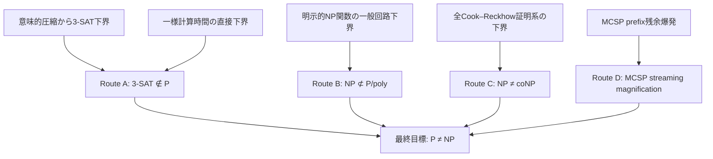

本研究の現在位置は Route A のうち「意味的圧縮から 3-SAT 下界」を狙う枝である。ただし、Route B と Route C は代替経路であると同時に、意味的圧縮の議論が既知の困難な下界問題へ変形されただけではないかを監査する比較対象でもある。

### 11.2 証明の論理骨格

狙っている最終証明は、論理的には次の背理法になる。

\[
\begin{aligned}
&P=NP\\
&\Longrightarrow 3\text{-SAT}\in P\\
&\xRightarrow{\text{E-NF}}
  \text{全3-CNFに多項式資源の同一CCP要約が存在}\\
&\xRightarrow{\text{Lower Bound }L}
  \bot\\
&\Longrightarrow P\ne NP.
\end{aligned}
\]

このうち既知部分と未証明部分を依存DAGにすると次のようになる。

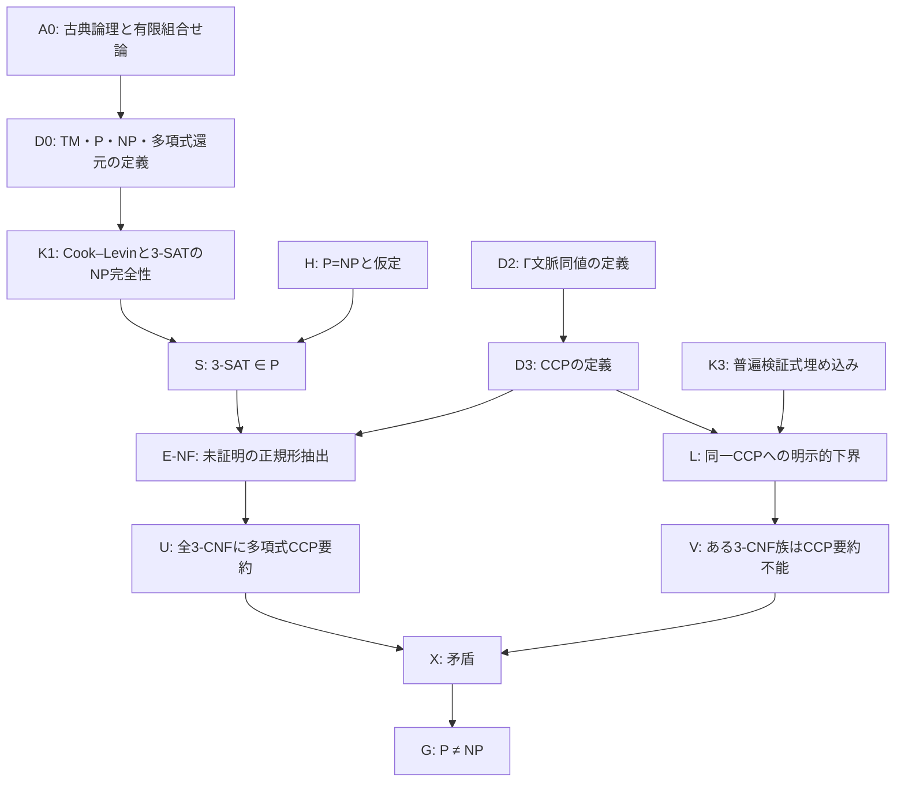

### 11.3 公理・定義・定理台帳

「公理」という語は、ここでは研究固有の仮定を事実扱いする意味では使わない。A0 は通常の数学的推論基盤、D 系は定義、K 系は既知定理、E／L 系は今後証明すべき命題である。

| ID | 種別 | 内容 | 状態 | 主な依存先 |
|---|---|---|---|---|
| A0 | 推論基盤 | 古典論理、有限集合・グラフ・Boolean関数に関する通常の有限組合せ論 | 採用 | 全体 |
| D0 | 定義 | 決定性Turing machine、P、NP、多項式時間多対一還元 | 既知の標準定義 | K1 |
| K1 | 既知定理 | SATおよび3-SATのNP完全性 | 確立 | S |
| K2 | 既知系 | $P=NP\Rightarrow3\text{-SAT}\in P$ | 確立 | E |
| D1 | 定義 | 残余関数 $R_\alpha$、完全ε合流、状態幅 $M_i$ | 確定 | T1 |
| T1 | 限定定理 | 固定順序完全要約幅とOBDD残余関数数の一致 | 本ノートで証明 | OBDD下界 |
| T2 | 監査定理 | 任意条件付け可能な正確要約はBoolean関数表現になる | 本ノートで証明 | Bridge-0反証 |
| T3 | 監査定理 | 任意文脈との交換可能性は完全な境界関係保存を強制する | 本ノートで証明 | D2 |
| D2 | 定義 | 文脈族相対同値 $\equiv_{\Gamma_B}$ | 確定 | E、L |
| T4 | モデル同定 | 強いSSMSはSDD／structured d-DNNFへ還元される | 証明概略あり | モデル監査 |
| D3 | 定義 | 文脈・表現・前処理・問い合わせを含むCCP | 確定 | E-NF、L |
| K3 | 既知定理の帰結 | 普遍検証式の境界関数へ任意のNP言語を埋め込める | 本ノートで導出 | L、Route B |
| E-NF | 必須補題 | P時間3-SAT判定器を、下界可能な制限CCPへ正規化できる | **未証明** | U |
| L | 必須補題 | 明示的3-CNF族が、E-NFと同一CCPで超多項式資源を要求する | **未証明** | V |
| T5 | 監査定理 | 既知P関数下界を持つクラスへのE-NFだけでP≠NPが従う | 本ノートで証明 | E-NF評価 |
| T6 | 探索定理 | P=NP下ではPH検証可能な多項式長要約をFPで構築できる | 本ノートで証明 | 構築時間評価 |
| T7 | アルゴリズム変換 | 状態幅とmerge時間の上界から#SAT実行時間上界を得る | 本ノートで証明 | Williams副経路 |
| DT | 未証明ゲート | 上位時間クラスの回路下界をNPの下界へ下方移送する | **未知** | 副経路→主経路 |
| MG | 既知bridge | MCSPの所定streaming下界からP≠NPを導くhardness magnification | 先行研究 | Route D |
| T8 | 状態下界 | MCSP prefix残余同値類数からstreaming空間下界を得る | 本ノートで証明 | MG |
| MREC | 反証済み予想 | MCSP prefix残余クラス数がpoly(s)空間を超えるほど巨大 | **反証済み** | 疎言語残余上界に反する |
| X | 論理結合 | E-NFの上界とLの下界を同じモデル・同じ尺度で衝突させる | E-NFとL待ち | P≠NP |

### 11.4 文脈族の探索地図

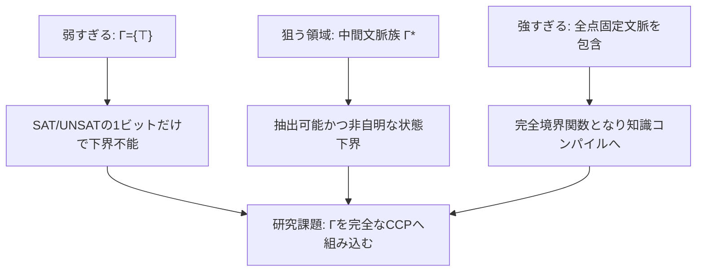

中間文脈族 

\[
\Gamma_B^*
\]

には次のゲートをすべて課す。

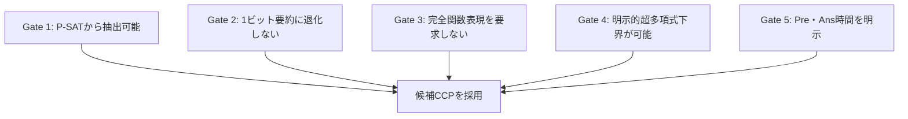

### 11.5 クリティカルパス

現時点の最短クリティカルパスは次である。

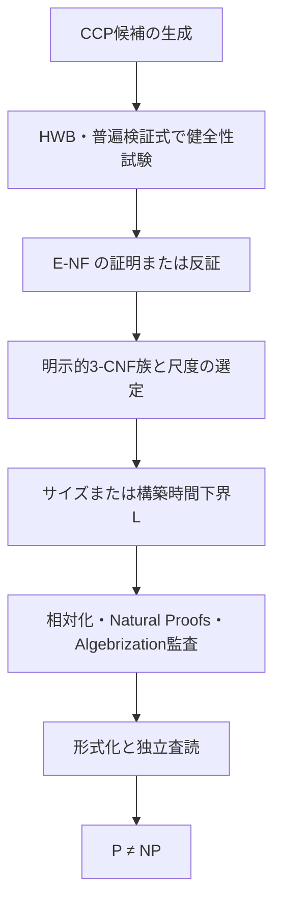

ただし C2 の E-NF が最も危険な関門である。Bridge-0 はすでに反証されているため、C2 で一般 P 計算にはない能力を密輸入した時点で、その候補経路を棄却する。

### 11.6 証明完成条件

最終的に「証明」と呼ぶためには、少なくとも次が必要である。

1. E-NF と L が同じ CCP、同じ一様性条件、同じ 
   \[
   (S,T_{pre},T_{query})
   \]
   を使用している。
2. E-NF が任意の P 時間 3-SAT アルゴリズムを対象とし、特定のDPLL／分岐法だけを対象にしていない。
3. L の対象が表現サイズだけでなく、E-NF が保証する構築・問い合わせ資源と正確に対応している。
4. HWBなどの既知 P 関数を誤って排除しない。
5. 相対化・Natural Proofs・Algebrizationとの関係が明示され、少なくとも既知障壁を単に言い換えていない。
6. 全補題の量化範囲、入力符号化、定数、漸近評価、一様性が形式化されている。
7. 機械検証または複数の独立した専門家査読で依存DAG全体を検査できる。

---

## 12. 現在の中心ギャップ

### v0.7での主経路更新

E-NF経路は依然有効だが、弱い表現クラスではE-NF自体がP≠NP級である。これに対し、MCSP streaming hardness magnificationは既知のDownward Transferを提供する。

v0.7では第一主経路を

\[
\text{MREC}
\Longrightarrow
\text{streaming space lower bound}
\Longrightarrow
P\ne NP
\]

へ暫定更新した。しかしv0.11でMRECは反証された。Route Dのうち、残余同値類数だけから空間下界を出す経路は閉じ、update timeとの同時下界問題としてのみ残る。E-NFを再び主経路とする。

### 反証済みの命題

\[
\text{残余関数数が指数的}
\Longrightarrow
\text{P 時間計算不能}
\]

は偽。

### 依然として必要な橋

次のような SAT 固有の命題が必要だが、現時点では根拠がない。

> **E-NF 候補**  
> もし 3-SAT に多項式時間アルゴリズムが存在するなら、そのアルゴリズムを、一般回路より真に制限され、既知の下界技法を適用できるCCPへ多項式オーバーヘッドで正規化できる。

E-NF は曖昧なままでは循環論法になる。文脈族だけでなく表現クラスと資源尺度を先に独立に定義し、次の両方を証明する必要がある。

\[
\begin{aligned}
&\text{E-NF: } &&P\text{-SAT algorithm}\Rightarrow\text{poly-resource CCP in }\mathcal R^*,\\
&\text{Lower bound: } &&\exists\{F_n\}\;\forall\text{ same CCP},\quad
  \operatorname{Resource}(F_n)\ge n^{\omega(1)}.
\end{aligned}
\]

E-NF が一般 P 計算に対して成立しなければ P≠NP へ届かない。表現クラスを強くしすぎると Lower Bound は一般回路下界へ合流する。この normal-form の挟み撃ちが研究の核心である。

---

## 13. 次の研究課題

### 優先 A：合成可能性の最小化

- SAT 一ビットだけでは自明すぎる。
- 任意条件付け閉包では知識コンパイルになり強すぎる。
- その中間として、どの問い合わせ・更新集合が自己還元性から必然的に得られるかを分類する。

候補操作：

\[
\operatorname{Restrict},\quad
\exists_x,\quad
\operatorname{DisjointOr},\quad
\operatorname{DecomposableAnd}
\]

について、SAT 判定器からの抽出可否と、抽出に必要な再実行回数を調べる。

### 優先 B：HWB 健全性テスト

提案するモデルは、少なくとも HWB、整数加算、比較、パリティなどの既知 P 関数を多項式サイズで表現・判定できることを要求する。

これに失敗するモデルの下界は、P≠NP の証拠として採用しない。

### 優先 C：表現下界と構築時間下界の分離

最終関数が定数 

\[
\bot
\]

でも、その定数へ到達するコンパイル／消去過程が難しい可能性がある。したがって最終表現サイズではなく、局所操作列の総計算量、あるいは検証可能な中間証明の長さを測る。

これは proof complexity への接続候補である。ただし特定の証明系の下界は一般の P≠NP を直ちには与えない。

### 優先 D：アルゴリズムから下界への方向

直接「SAT は遅い」と証明する代わりに、制限回路クラスに対する高速 SAT アルゴリズムから回路下界を得る既知の algorithm-to-lower-bound 型の方向も並行候補とする。

目的は、意味的圧縮が本当に新しい一般下界を生むのか、それとも既知の回路下界問題へ言い換わるだけかを判定することである。

---

## 14. 先行研究との位置づけ

### 14.1 文脈同値は Myhill–Nerode 型である

本ノートの

\[
F\equiv_{\Gamma_B}G
\]

は、「境界に接続される文脈に対して同じ判定結果を返す部分構造を同一視する」という意味で、形式言語の Myhill–Nerode 同値、境界付きグラフ／ハイパーグラフの canonical equivalence、parameterized complexity における finite integer index（FII）と同型の発想である。

FII では、固定サイズの境界を持つ二つの部分グラフが、任意の境界付きグラフとの貼り合わせに対して問題の答えを保存するなら同値とする。有限個の同値類しかなければ、大きな protrusion を小さな代表元へ置換するアルゴリズムが可能になる。

本研究との差は、境界サイズを定数に固定せず、3-SAT の一般入力に対して境界が入力長とともに成長する場合の同値類数・代表構築時間を問題にしている点である。固定境界での有限指数は bounded-width アルゴリズムを与えるが、それだけでは一般 SAT の多項式時間性を決めない。

参考：

- Eun Jung Kim et al., [Linear Kernels and Single-Exponential Algorithms via Protrusion Decompositions](https://www.lirmm.fr/~sau/Pubs/ProtDec.pdf)
- René van Bevern et al., [Myhill-Nerode Methods for Hypergraphs](https://cgi.cse.unsw.edu.au/~sergeg/papers/BevernFGR13isaac.pdf)

### 14.2 Knowledge compilation との対応

knowledge compilation では、コンパイル先言語を次の三軸で評価する。

1. 表現の簡潔さ
2. 多項式時間で答えられる問い合わせ
3. 多項式時間で適用できる変換

これは本ノートで「文脈族だけを指定しても不十分で、要約言語・前処理時間・問い合わせ時間を同時に固定しなければならない」という修正に直接対応する。

- Adnan Darwiche, Pierre Marquis, [A Knowledge Compilation Map](https://www.jair.org/index.php/jair/article/download/10311/24622/19002)
- Marco Cadoli et al., [Preprocessing of Intractable Problems](https://www.dis.uniroma1.it/~liberato/papers/cado-etal-00-c.pdf)
- Marco Cadoli et al., [Space Efficiency of Propositional Knowledge Representation Formalisms](https://arxiv.org/pdf/1106.0233)

### 14.3 制限表現に対する下界

DNNF／d-DNNF などの制限表現では、充足割当集合が必要とする rectangle cover と通信複雑性を使って指数下界を証明できる。これは本研究の Lower Bound $L$ を制限モデルについて進める有力な道具である。

ただし、その下界を P≠NP へ接続するには、任意の P 時間 SAT アルゴリズムを同じ制限表現へ正規化できる Extraction $E$ が別途必要である。

- Simone Bova et al., [Knowledge Compilation Meets Communication Complexity](https://www.ijcai.org/Proceedings/16/Papers/147.pdf)

### 14.4 圧縮・カーネル化下界との違い

OR-SAT の多数インスタンスを、各入力長だけの多項式サイズへ圧縮する strong distillation／instance compression は、標準的仮定の下で不可能であることが知られている。ただし、この結果は

\[
NP\nsubseteq coNP/poly
\]

などを仮定した条件付き下界であり、それ自体が P≠NP の無条件証明ではない。

- Lance Fortnow, Rahul Santhanam, [Infeasibility of Instance Compression and Succinct PCPs for NP](https://people.csail.mit.edu/rrw/presentations/fortnow-santhanam.pdf)

### 14.5 アルゴリズムから回路下界への代替経路

制限回路クラスに対する非自明な SAT／#SAT アルゴリズムから、その回路クラスに対する下界を導く Williams 型の program は、地図上の Route B に対する実証済みの方法論である。本研究の意味圧縮が一般回路下界へ戻る場合、この方向へ接続できるかを検討する。

- Ryan Williams, [Algorithms for Circuits and Circuits for Algorithms](https://people.csail.mit.edu/rrw/ICM-survey.pdf)
- Ryan Williams, [Non-Uniform ACC Circuit Lower Bounds](https://www.cs.cmu.edu/~ryanw/acc-lbs.pdf)

---

## 15. 文脈コンパイル・プロファイルへの再定式化

### 定義 15.1：Contextual Compilation Profile（CCP）

文脈族だけでは計算モデルを特定できない。そこで研究対象を

\[
\mathfrak C
=
(\Gamma,\mathcal R,\operatorname{Pre},\operatorname{Ans},S,T_{pre},T_{query})
\]

と定義する。

- 
  \[
  \Gamma_n
  \]
  : 長さ $n$ の対象に接続可能な文脈の族
- 
  \[
  \mathcal R
  \]
  : 要約表現クラス
- 
  \[
  s_F=\operatorname{Pre}(F)
  \]
  : 前処理／要約生成
- 
  \[
  \operatorname{Ans}(s_F,c)
  \]
  : 文脈コード $c$ に対する問い合わせ
- $S(n)$: 要約サイズ上限
- $T_{pre}(n)$: 前処理時間
- $T_{query}(n)$: 一問い合わせ時間

文脈コード $c$ から合成式

\[
\operatorname{Comp}(F,c)
\]

を多項式時間で生成できるとする。CCP が正確であるとは

\[
\operatorname{Ans}(\operatorname{Pre}(F),c)
=
\operatorname{SAT}(\operatorname{Comp}(F,c))
\]

がすべての許可文脈について成立することをいう。

### 補題 15.2：小文脈族の真理値ベクトル上界

もし

\[
|\Gamma_n|\le n^k
\]

で文脈を列挙できるなら、各 $F$ に対して応答ベクトル

\[
v_F
=
\left(
\operatorname{SAT}(\operatorname{Comp}(F,c))
\right)_{c\in\Gamma_n}
\]

が存在し、その長さは多項式である。

したがって、明示的な応答表を許すモデルでは、小文脈族に対する超多項式な**情報量／表現サイズ**下界は不可能である。P=NP を仮定すれば、このベクトル自体も多項式時間で構築でき、問い合わせは表引きで行える。制限表現クラスに対する構文的下界はあり得るが、それは情報量下界ではない。∎

### 補題 15.3：再実行上界

3-SAT に多項式時間判定器 $A$ が存在し、Comp が多項式時間なら、任意の多項式長コードを持つ文脈族について

\[
\operatorname{Pre}(F)=F,
\qquad
\operatorname{Ans}(F,c)=A(\operatorname{Comp}(F,c))
\]

と置ける。

この CCP は

\[
S(n)=O(n),
\qquad
T_{pre}(n)=O(n),
\qquad
T_{query}(n)=n^{O(1)}
\]

を満たす。

#### 帰結

問い合わせ器 Ans に任意の P 時間計算を許すなら、Extraction $E$ は自明になる。しかし、そのモデルに対する Lower Bound $L$ は「このような P 時間 SAT 判定器 $A$ は存在しない」と直接示すことになり、P≠NP を簡単な表現下界へ還元したことにはならない。∎

### 補題 15.4：固定入力による回路化

結合応答関数を

\[
H(F,c)
=
\operatorname{SAT}(\operatorname{Comp}(F,c))
\]

とする。P=NP なら $H\in P$ であるため、$H$ は多項式サイズの P-uniform Boolean 回路族を持つ。

明示的な式族 $F_n$ を第一入力へ固定すると

\[
h_{F_n}(c):=H(F_n,c)
\]

にも多項式サイズ回路が存在する。

したがって、ある明示的 $F_n$ について

\[
\operatorname{CircuitSize}(h_{F_n})=n^{\omega(1)}
\]

を示せれば P≠NP を含意するが、これは一般 Boolean 回路下界そのものである。∎

### 定理 15.5：文脈コンパイル三分岐

文脈意味圧縮から P≠NP を狙う経路は、少なくとも次の三領域に分かれる。

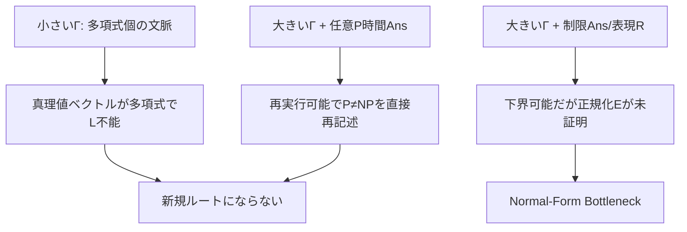

この三分岐により、文脈族 

\[
\Gamma^*
\]

の選択だけでは不十分であることが確定した。新しい証明経路には、任意の P 時間 SAT アルゴリズムを、下界可能な制限表現 

\[
\mathcal R^*
\]

へ変換する非自明な normal-form theorem が必要である。

---

## 16. 普遍検証式埋め込み

### 定理 16.1：Universal Verifier Embedding Lemma

任意の言語

\[
L\in NP
\]

に対して、多項式 $p$ と多項式時間検証関係 $V$ が存在して

\[
x\in L
\iff
\exists w\in\{0,1\}^{p(|x|)}\;V(x,w)=1
\]

となる。

Cook–Levin／Tseitin 変換により、各入力長 $n$ について多項式サイズの 3-CNF

\[
U_n(X,W,Z)
\]

を一様に構成でき、

\[
x\in L
\iff
\exists w,z\;U_n(x,w,z)=1
\]

となる。ここで $X$ を境界変数、$W,Z$ を内部変数とみなすと、境界関数

\[
R_{U_n}(x)
=
\exists w,z\;U_n(x,w,z)
\]

は長さ $n$ における $L$ の特性関数そのものである。∎

### 系 16.2：完全境界要約は NP 関数表現を含む

すべての多項式サイズ 3-CNF を表現クラス 

\[
\mathcal R
\]

へ多項式サイズで完全境界要約できるなら、すべての NP 言語は 

\[
\mathcal R
\]

による多項式サイズ表現を持つ。

特に 

\[
\mathcal R
=
\text{general Boolean circuits}
\]

なら、完全境界要約に対する超多項式サイズ下界は

\[
NP\nsubseteq P/poly
\]

を示す強い非一様回路下界へ直結する。

### 重要な分岐：サイズ下界と構築時間下界

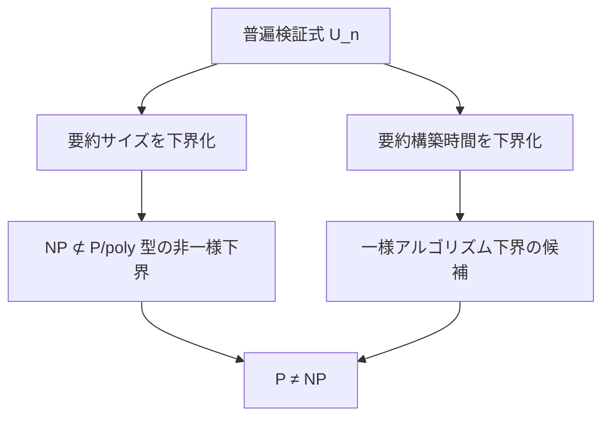

表現サイズだけを攻撃すると、元の目標 P≠NP より強い非一様回路下界を狙うことになる。P≠NP により近いのは一様な要約構築過程の時間下界だが、最終表現サイズの counting／通信複雑性下界だけでは構築不能性を示せない。

このため研究尺度を

\[
(S,T_{pre},T_{query})
\]

の三つ組で保持し、サイズ下界と時間下界を混同しない。

---

## 17. 候補経路の追加監査

### 17.1 近似要約の一意解脆弱性

境界変数数を $b$ とする。恒偽関数 $f_0$ と、ただ一つの代入 $a$ だけで真になる関数 $f_a$ を考える。

正規化 Hamming 距離は

\[
d(f_0,f_a)=2^{-b}
\]

である。

したがって、一様分布上の誤り率だけを

\[
\varepsilon\ge2^{-b}
\]

まで許す近似では、恒偽近似が $f_0$ にも $f_a$ にも許され得る。前者は UNSAT、後者は SAT なので、SAT の正確な存在判定は保存されない。

### 補題 17.1

任意の Boolean 関数について、Hamming 誤差保証だけから、すべての許容近似が SAT/UNSAT を正確に保存すると結論するには

\[
\varepsilon<2^{-b}
\]

が必要であり、誤り点数が整数であるため実質的に誤りゼロを要求する。∎

これは approximate knowledge compilation が確率推論などには有効でも、一意解を含む最悪時 SAT の正確な橋としてはそのまま使えないことを示す。

- Alexis de Colnet, Stefan Mengel, [Lower Bounds for Approximate Knowledge Compilation](https://www.ijcai.org/proceedings/2020/0254.pdf)

### 17.2 候補一覧

| 候補 | Extraction E | Lower Bound L | 判定 |
|---|---|---|---|
| 多項式個の文脈 | P=NP下で応答列挙可能 | ベクトルが多項式なのでサイズ下界不能 | 棄却 |
| 全文脈 + 任意P時間問い合わせ | SAT判定器の再実行で自明 | P≠NPを直接示す必要 | 再記述 |
| OBDD | 一般Pアルゴリズムから抽出不能 | 明示的指数下界あり | 制限モデル成果のみ |
| SDD / structured d-DNNF | normal-form theoremなし | 下界技法あり | 保留 |
| unrestricted DNNF | 抽出根拠なし | 通信複雑性下界あり | 保留 |
| general circuits | P=NPなら抽出可能 | NPの一般回路下界が必要 | Route Bへ合流 |
| 固定境界FII | 代表置換可能 | 境界成長を扱えない | bounded-width限定 |
| Hamming近似 | 小表現の可能性あり | 一意解でSAT保存不能 | 正確SATには棄却 |
| 一様構築時間下界 | P≠NPに近い | GoodがPHならP=NP下で探索可能 | 条件付き候補 |

### 17.3 Normal-Form Bottleneck

現在の意味圧縮経路における最重要命題を次へ更新する。

> **E-NF（Normal-Form Extraction）**  
> 任意の P 時間 3-SAT 判定器から、一般回路より真に制限され、既知の下界技法を適用できる CCP へ、多項式オーバーヘッドで変換できる。

E-NF が OBDD、SDD、d-DNNF 等に対して成立する根拠は現時点でない。むしろ、弱い表現クラスでは HWB などの P 関数が反例となる。強い表現クラスへ上げるほど E-NF は妥当になるが、L は一般回路下界へ近づく。

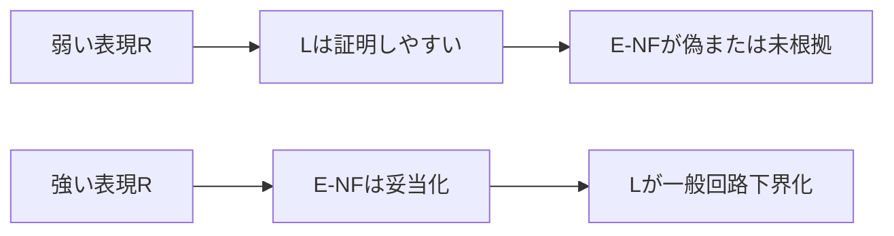

この張力を突破する新しい normal form が見つからない限り、意味的圧縮は P≠NP の短絡路ではなく、既知の表現下界と一般回路下界の間を可視化する研究枠組みに留まる。

### 17.4 改訂した優先順位

1. **E-NFが含意する表現クラス包含の研究**  
   候補クラス 
   \[
   \mathcal C
   \]
   が既にどのP関数を表現できないかを先に確認し、E-NF自体がP≠NPと同値級になっていないか判定する。
2. **普遍検証式を標準ベンチマーク化**  
   候補モデルが $U_n$ の境界関数を扱うとき、どの回路クラスの下界へ対応するかを毎回明示する。
3. **制限モデル下界は副成果として分離**  
   OBDD／SDD／DNNF 下界を P≠NP の証明と混同せず、E-NF が証明できた場合だけ主経路へ昇格する。
4. **Williams 型経路との接続を検査**  
   意味圧縮から制限回路 SAT の高速化が得られるなら、algorithm-to-lower-bound へ接続する。
5. **構築時間・proof complexity は条件付き候補**  
   UNSAT で最終関数が定数になる問題を避け、反駁証明の生成・長さとして過程を測る。ただし弱い証明系の下界を一般化しない。

### 17.5 Proof complexity でも同じ normal-form 問題が現れる

Cook–Reckhow の定理により、すべての恒真式に多項式長証明を持つ命題証明系が存在することと

\[
NP=coNP
\]

は同値である。したがって P=NP を仮定すれば、そのような多項式有界証明系は存在する。

一方、resolution、bounded-depth Frege、polynomial calculus など個別の証明系に対する下界は、その証明系に対応するアルゴリズム族を排除するだけで、任意の P 時間 SAT 判定器を排除しない。

これは CCP の E-NF と同じ構造を持つ。

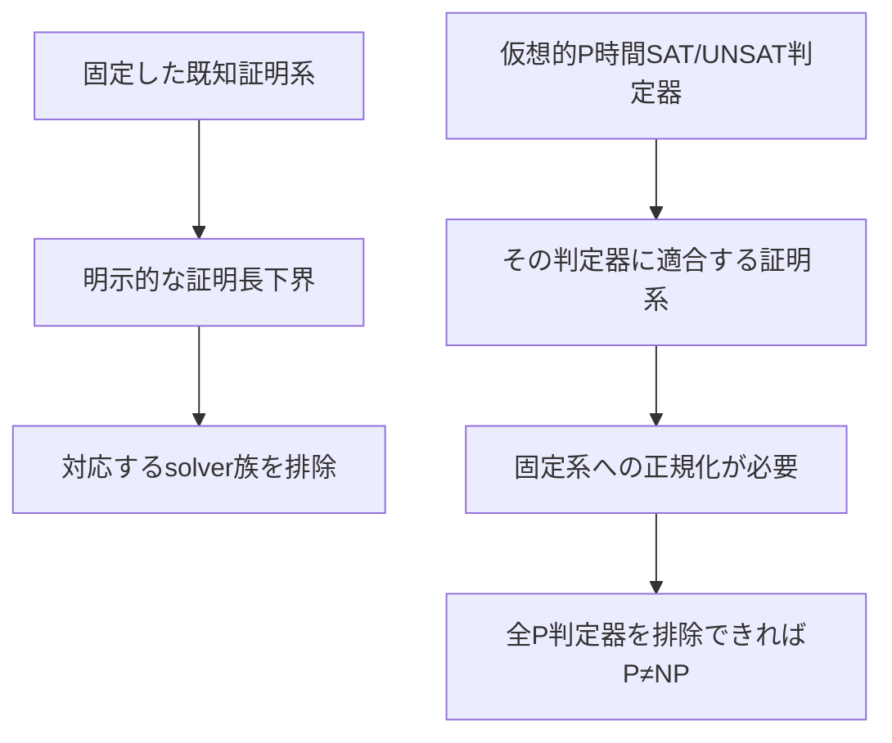

したがって proof complexity へ移るだけでは normal-form bottleneck は消えない。必要なのは次のいずれかである。

1. 任意の P 判定器が生成する証拠を、下界既知の固定証明系へ多項式変換する。
2. すべての Cook–Reckhow 証明系に共通する下界を証明する。
3. 固定系を拡張し続けた極限が任意の P 判定器を模倣することを示し、その極限系に下界を与える。

2 は $NP\ne coNP$ を直接示す強い目標であり、3 には極限系の検証可能性・一様性・p-simulation の監査が必要である。

参考：

- Jan Krajíček, [The Cook–Reckhow Definition](https://arxiv.org/pdf/1909.03691)
- Sam Buss, Jakob Nordström, [Proof Complexity and SAT Solving](https://jakobnordstrom.se/docs/publications/ProofComplexityChapter.pdf)

---

## 18. E-NF 自体の難しさ

### 定理 18.1：Normal-Form Hardness Lemma

Boolean 関数の表現クラスを 

\[
\mathcal C
\]

とする。ある明示的な P 関数族 

\[
f=\{f_n\}in P
\]

について、既に

\[
\operatorname{Size}_{\mathcal C}(f_n)=n^{\omega(1)}
\]

が証明されているとする。

定理16.1により、$f_n$ を境界関数として持つ多項式サイズ3-CNFの普遍検証式

\[
U_n^f(X,W,Z)
\]

を構成できる。

ここで次の E-NF を仮定する。

\[
3\text{-SAT}\in P
\Longrightarrow
R_{U_n^f}(X)
\text{ は多項式サイズの }\mathcal C\text{ 表現を持つ}.
\tag{E-\mathcal C}
\]

しかし

\[
R_{U_n^f}=f_n
\]

なので、既知の 

\[
\mathcal C
\]

下界と矛盾する。したがって

\[
3\text{-SAT}\notin P
\]

であり、P≠NP が従う。∎

### 帰結

既知の P 関数下界を持つ弱い表現クラスに対して、E-NF は単なる補助補題ではない。E-NF を証明すること自体が、既知下界と組み合わせた P≠NP 証明になる。

OBDD を例にすれば、HWB の指数下界が Lower Bound $L$ を既に供給する。残る

\[
SAT\in P
\Longrightarrow
\text{HWBの普遍検証式から多項式OBDDを抽出できる}
\]

という E-NF は、成立を証明した時点で P≠NP を示すほど強い。

### 定理 18.2：No-Free-Normal-Form Trichotomy

表現クラス 

\[
\mathcal C
\]

の選択には次の三場合しかない。

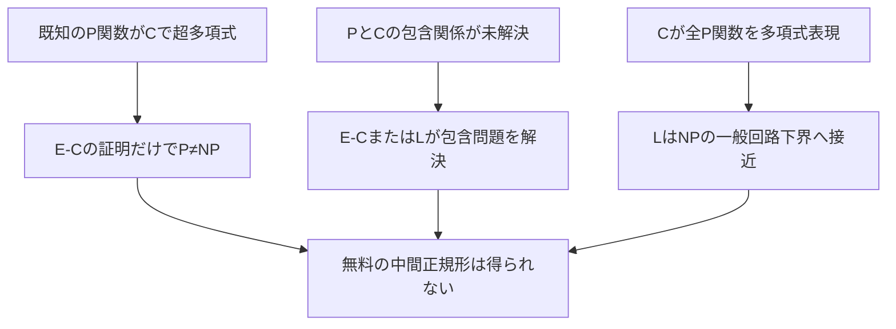

したがって「P の全アルゴリズムを含むが、強い既知下界も簡単に使える」表現クラスを選ぶだけで突破することはできない。もしそのようなクラスが見つかれば、それ自体が新しい主要定理である。

### 定理 18.3：PH-verifiable Summary Search Lemma

候補要約 $s$ の長さが

\[
|s|\le p(|F|)
\]

で抑えられ、正しい要約であることを表す関係

\[
\operatorname{Good}(F,s)
\]

が polynomial hierarchy（PH）に属するとする。

さらに P=NP の仮定下で、すべての $F$ に少なくとも一つ正しい多項式長要約が存在するとする。このとき、正しい要約を多項式時間で構築できる。

#### 証明

P=NP なら PH=P へ崩壊する。要約を先頭ビットから構成する。現在の接頭辞を $r$ とし、

\[
\exists t\quad \operatorname{Good}(F,r0t)
\]

を問い合わせる。この述語も PH に属するため、仮定下では P 時間で判定できる。真なら次のビットを0、偽なら1とし、これを $p(|F|)$ 回繰り返せば正しい要約が得られる。長さが可変なら終端記号を含む固定長表現へパディングすればよい。∎

### 系 18.4：境界回路要約は構築時間だけへ逃げられない

回路 $C(B)$ が

\[
C(b)
\iff
\exists x\,F(x,b)
\]

をすべての $b$ について満たすか、という正当性条件は PH 内、具体的には 

\[
\Pi_2^P
\]

で表現できる。

したがって P=NP の仮定下で多項式サイズの正しい回路が必ず存在するなら、定理18.3によりその回路を多項式時間で探索・構築できる。

このため、少なくとも PH で正当性を検証できる多項式長要約については、

\[
\text{非一様には小さいが、一様には構築困難}
\]

という差へ単純に逃げることはできない。P=NP という反証仮定の下では、その探索差も潰れる。

### 研究方針の修正

以前は「サイズ下界より構築時間下界の方が P≠NP に近い」と評価した。これは方向としては正しいが、定理18.3により次の制約が加わる。

- 多項式長の正しい要約が存在し、正当性が PH で検証できるなら、P=NP 下では構築も多項式化する。
- よって構築時間だけを独立の弱点として利用することは難しい。
- 主戦場は依然として、要約の**存在・サイズ・表現能力**、または PH 検証を超える特殊な正当性構造になる。
- 後者は検証不能な要約を導入する危険があり、証明の有限検査可能性と衝突する。

### 18.5 中間表現クラスのフロンティア

E-NF の受け皿候補を、既知の構造的包含関係から整理する。個別の最良指数は更新され得るため、ここでは安定したクラス関係だけを使う。

| 表現／回路クラス | 対応する計算像 | E-NF側 | L側 | 評価 |
|---|---|---|---|---|
| OBDD・制限DNNF | 強い構造制約を持つ知識表現 | 既知P関数で失敗 | 強い明示的下界あり | E-NF自体が本丸 |
| 多項式サイズDe Morgan formula | 非一様 $NC^1$ 相当 | 全P包含は未知 | 明示的P関数の超多項式下界が大問題 | 中間フロンティア |
| 多項式サイズbranching program | 非一様logspace相当 | 全P包含は未知 | 一般モデルの強い明示的下界が困難 | 中間フロンティア |
| $TC^0$ | 定数深さthreshold回路 | Pをすべて含む根拠なし | 深さ増加で下界が急激に困難 | 中間フロンティア |
| general Boolean circuits | $P/poly$ | P関数をすべて多項式表現 | NPの超多項式下界が未解決 | Route Bそのもの |

この表の中間行は「簡単な抜け道」ではない。たとえば SAT の多項式サイズ・一様 De Morgan formula をすべての次数で排除することは $NC^1\ne NP$ に対応し、一般目的の強い下界問題になる。threshold回路でも、深さが少し増えるだけで下界技法が急激に弱くなることが長年のフロンティアとして知られている。

参考：

- Ryan Williams, [Some Open Problems Regarding Lower Bounds for NP](https://www.cs.umd.edu/~gasarch/open/lbfornp.pdf)
- Mohit Gurumukhani et al., [Local Enumeration and Majority Lower Bounds](https://arxiv.org/abs/2403.09134)

---

## 19. 意味圧縮からアルゴリズム下界への副経路

### 19.1 Counting Semantic Merge（CSM）

入力変数順序を

\[
x_1,\ldots,x_n
\]

とし、深さ $i$ の要約状態集合を $Q_i$、遷移を

\[
\delta_i:Q_i\times\{0,1\}\to Q_{i+1}
\]

とする。

各状態 $q\in Q_i$ に、その状態へ合流した部分代入の個数

\[
\mu_i(q)
\]

を保持する。初期状態 $q_0$ について

\[
\mu_0(q_0)=1
\]

とし、各層で

\[
\mu_{i+1}(q')
=
\sum_{q\in Q_i}
\sum_{a\in\{0,1\}:\delta_i(q,a)=q'}
\mu_i(q)
\]

と更新する。

終状態の受理集合を $A\subseteq Q_n$ とすれば

\[
\#F
=
\sum_{q\in A}\mu_n(q)
\]

である。

### 定理 19.1：Width-to-#SAT Lemma

次を仮定する。

1. 各層の異なる要約状態数が

   \[
   |Q_i|\le W(n)
   \]

2. 状態の生成、遷移、同値判定または正規化、ハッシュ、整数重み加算が一状態あたり $n^{O(1)}$ 時間
3. 合流がすべての完全代入に対する受理結果を保存する

このとき #SAT は

\[
O\!\left(n\,W(n)\,n^{O(1)}\right)
\]

時間、概ね

\[
O\!\left(W(n)\,n^{O(1)}\right)
\]

空間で計算できる。

#### 証明

各層で高々 $W(n)$ 状態を一度ずつ処理し、各状態から二本の遷移を生成して正規化・集約する。各操作は多項式時間なので、一層の処理時間は $W(n)n^{O(1)}$、層数は $n$ である。重み 

\[
\mu_i(q)\le2^n
\]

は $O(n)$ ビットで表現できる。終層で受理状態の重みを合計すれば全充足代入数が得られる。∎

### 系 19.2：非自明な幅削減は #SAT 高速化になる

定理19.1の層数・状態操作・整数演算を含む総多項式オーバーヘッドを $n^c$ と書く。任意の定数 $k$ に対して

\[
W(n)\le\frac{2^n}{n^{k+c}}
\]

を達成できれば、対応する回路／式クラスの #SAT を

\[
\frac{2^n}{n^k}
\]

時間以内で解ける。

ここで状態数が少ないという存在事実だけでは足りない。同値判定、正規化、merge が指数時間なら高速化にはならない。この条件は以前の「隠れオラクル／隠れ全探索」監査を実行時間へ明示したものである。

### 19.3 Williams 型 algorithm-to-lower-bound との接続

Williams らの program では、典型的な回路クラス 

\[
\mathcal C
\]

について、#SAT または SAT を全探索より非自明に高速化すると、NEXP／Quasi-NP に対する 

\[
\mathcal C
\]

回路下界が得られる。

具体例として Vyas–Williams は、適切な閉包性を持つ典型的クラス 

\[
\mathcal C
\]

について、すべての定数 $k$ で $n^k$-size回路の #SAT を

\[
2^n/n^k
\]

時間で解ければ、NEXP が特定の 

\[
f\circ\mathcal C
\]

型多項式サイズ回路を持たないことを導いている。定理の正確な適用には、回路サイズ、uniformity、クラスの閉包性、SATか#SATかを個別に確認する必要がある。

参考：

- Nikhil Vyas, Ryan Williams, [Lower Bounds Against Sparse Symmetric Functions of ACC Circuits](https://arxiv.org/abs/2001.07788)
- Ryan Williams, [Algorithms for Circuits and Circuits for Algorithms](https://people.csail.mit.edu/rrw/ICM-survey.pdf)
- Ryan Williams, [New Algorithms and Lower Bounds for Circuits with Linear Threshold Gates](https://arxiv.org/abs/1401.2444)

### 19.4 圧縮から回路下界へのパイプライン

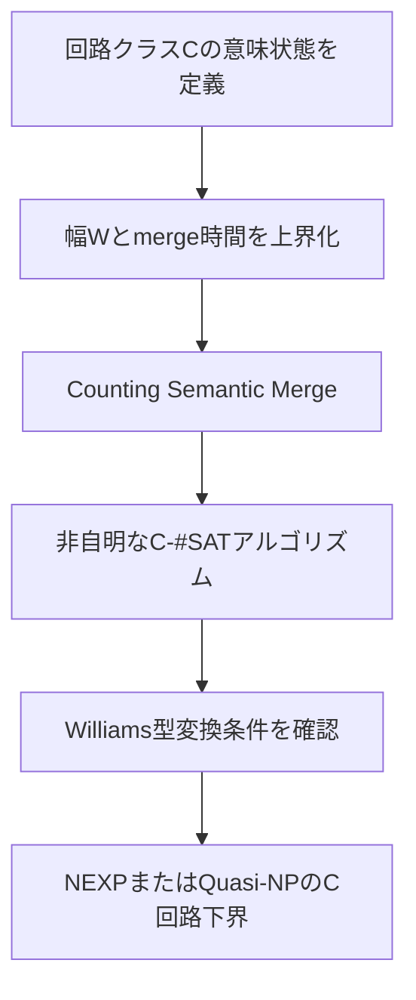

この副経路では、意味的圧縮が単なる表現論ではなく、実際のアルゴリズム改善を与えるかを検査できる。

### 19.5 P≠NPへの非含意

> **v0.25追補（C34）:** 以下の旧説明より強く、IKWのeasy-witness定理とPH collapseから **P=NP⇒NEXP⊄P/poly** が成立する。下の「排除する既知の定理はない」は過去の弱い説明として残す。同回路下界をP=NPとの矛盾として使うことはできない。新C34の証明と一次資料を優先する。

重要なのは

\[
NEXP\nsubseteq P/poly
\]

のような結論だけでは P≠NP は従わないことである。

仮に P=NP なら、padding argument により

\[
EXP=NEXP
\]

が従う。しかし P=NP から

\[
EXP\subseteq P/poly
\]

は導かれない。したがって Williams 型結論は、P=NP の仮定下では

\[
EXP\nsubseteq P/poly
\]

という別の回路下界へ読み替わるだけであり、P=NP との矛盾は既知の包含関係からは得られない。ゆえに

\[
P=NP
\quad\text{かつ}\quad
NEXP\nsubseteq P/poly
\]

を排除する既知の定理はなく、NEXP回路下界だけからP≠NPを結論できない。

よって algorithm-to-lower-bound は次の位置づけになる。

- 制限回路クラスに対する新しい無条件下界を得る副経路
- 意味圧縮の実効性を測る実験場
- 一般回路へ近づくための技法梯子
- ただし、NP自身への下界を下方移送する追加定理がない限り、P≠NP主経路には接続しない

### 19.6 新しい未証明ゲート：Downward Transfer

副経路を主経路へ戻すには、概略として

\[
NEXP\nsubseteq\mathcal C
\Longrightarrow
NP\nsubseteq\mathcal D
\]

または

\[
\text{C-#SAT高速化}
\Longrightarrow
3\text{-SATの多項式時間下界}
\]

のような下方移送が必要になる。

既知の Williams 型定理は通常、時間階層定理を使って上位クラスの下界を導く。そこから NP の一般下界へ降ろす機構は知られておらず、この Downward Transfer 自体が新しい主要問題である。

### 19.7 副経路の採否

| 評価軸 | 判定 |
|---|---|
| 数学的に健全な中間成果を生むか | はい |
| 意味圧縮を実アルゴリズムとして検査できるか | はい |
| 直接P≠NPを証明するか | いいえ |
| 主経路へ戻る既知の下方移送があるか | いいえ |
| 継続価値 | 副経路として高い |

### 19.8 Hardness Magnification による主経路への再接続

Downward Transfer は一般には未知だが、hardness magnification は、特定の自然問題に対する比較的弱いモデル下界から P≠NP などの大きな分離を導く既知の枠組みである。

特に Minimum Circuit Size Problem（MCSP）は、本研究の「意味圧縮」と直接関係する。

#### 19.8.1 MCSP

Boolean 関数

\[
f:\{0,1\}^n\to\{0,1\}
\]

の長さ

\[
N=2^n
\]

の真理値表を

\[
\operatorname{tt}(f)\in\{0,1\}^{N}
\]

とする。閾値関数 $s(n)$ に対して

\[
\operatorname{MCSP}[s]
=
\left\{
\operatorname{tt}(f):
\operatorname{CircuitSize}(f)\le s(n)
\right\}
\]

と定義する。

#### 19.8.2 既知の Magnification Theorem

McKay–Murray–Williams の結果として、time-constructible かつ

\[
s(n)\ge n
\]

を満たす適切な $s$ について、MCSPのsearch versionに

\[
\operatorname{poly}(s(n))
\]

空間・一入力記号あたり

\[
\operatorname{poly}(s(n))
\]

更新時間の一方向streamingアルゴリズムが存在しないことを示せれば

\[
P\ne NP
\]

が従う。

この定理は以下の文献で明示的に再掲・利用されている。

- Augusto Modanese, [Lower Bounds and Hardness Magnification for Sublinear-Time Shrinking Cellular Automata](https://arxiv.org/abs/2007.12048)
- Lijie Chen et al., [Beyond Natural Proofs: Hardness Magnification and Locality](https://arxiv.org/abs/1911.08297)
- Albert Atserias, Moritz Müller, [Simple General Magnification of Circuit Lower Bounds](https://arxiv.org/abs/2503.24061)

#### 定義 19.8.3：MCSP prefix residual equivalence

真理値表長 $N$ の切断位置 $0\le i\le N$ について、prefix

\[
u,v\in\{0,1\}^{i}
\]

を

\[
u\equiv_{s,i}v
\quad\Longleftrightarrow\quad
\forall z\in\{0,1\}^{N-i},
\left[
uz\in\operatorname{MCSP}[s]
\iff
vz\in\operatorname{MCSP}[s]
\right]
\]

で同値とする。

同値類数を

\[
K_{s}(N,i)
=
\left|
\{0,1\}^{i}/\!\equiv_{s,i}
\right|
\]

とする。

#### 定理 19.8.4：Residual-to-Streaming-Space Lemma

MCSP[s] を認識する決定的な一方向streamingアルゴリズムが、切断 $i$ まで読んだ時点で $S(N)$ ビットの作業空間を使うなら

\[
S(N)\ge\log_2 K_s(N,i)
\]

である。

#### 証明

streaming機械が切断 $i$ 後に持てる内部状態数は高々

\[
2^{S(N)}
\]

である。もし異なる残余同値類に属する二つのprefix $u,v$ が同じ内部状態へ到達したなら、定義により両者を区別する共通suffix $z$ が存在する。しかし同じ内部状態から同じ $z$ を読んだ決定的機械は同じ答えを返すため、どちらかで誤る。よって異なる同値類は異なる内部状態を必要とし、

\[
2^{S(N)}\ge K_s(N,i)
\]

が従う。∎

#### 系 19.8.5：残余クラス下界からP≠NPへ

ある適切な $s(n)\ge n$ について、すべての定数 $d$ に対し、無限に多くの $n$ またはmagnification theoremが要求する十分な入力長で、ある切断 $i=i(n)$ が存在して

\[
K_s(2^n,i)
>
2^{s(n)^d}
\]

を示せれば、MCSP[s] に 

\[
\operatorname{poly}(s(n))
\]

空間の決定的一方向streamingアルゴリズムは存在しない。

search algorithm が存在すれば、その出力の成功／失敗から decision も行えるという通常のモデル条件を満たす限り、decision版の空間下界はsearch版も排除する。したがってmagnification theoremの他の技術条件を満たせば

\[
P\ne NP
\]

が従う。

#### 19.8.6 新しい主経路候補

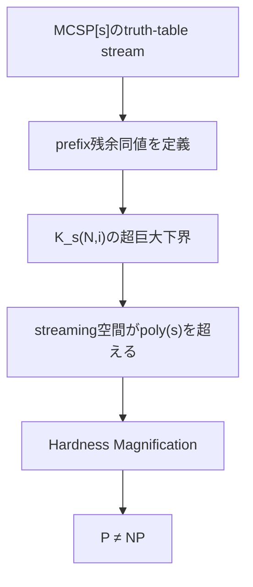

これは当初の意味的分岐圧縮と同じ Myhill–Nerode 型原理を使いながら、過剰な E-NF を要求せず、既知のmagnification theoremをDownward Transferとして利用する。

### 19.9 この経路の未解決核心

必要なのは、MCSPのtruth-table prefixを多数構成し、それらがsuffixによって対ごとに区別可能であることを示す fooling family である。

目標を次の形にする。

> **MCSP Residual Explosion Conjecture（MREC）**  
> 適切な $s(n)\ge n$ と切断 $i(n)$ が存在し、
> \[
> \log K_s(2^n,i(n))=s(n)^{\omega(1)}.
> \]

MREC はP≠NPを含意し得るため、容易な補題ではない。しかし、一般回路下界そのものではなく、truth-table streamのprefix/suffix識別という明確な組合せ問題へ目標を変換する。

### 19.10 直ちに必要な監査

1. **search版とdecision版のモデル差**  
   magnification theoremのsearch出力仕様を原論文で固定する。
2. **randomized streaming**  
   定理が決定的・乱択のどちらを対象にするかを区別する。上の残余補題は決定的exactモデルである。
3. **update time**  
   空間下界だけで十分か、reporting/update time条件との組合せを確認する。
4. **入力長の二重尺度**  
   回路入力変数数 $n$ とtruth-table長 $N=2^n$ を混同しない。
5. **閾値 $s(n)$**  
   magnificationが成立するconstructibility・増加率条件を原定理どおり固定する。
6. **locality barrier**  
   既知のhardness magnification locality barrierが残余／通信複雑性手法を遮断しないか確認する。

### 19.11 現時点の評価

| 項目 | 評価 |
|---|---|
| 元の意味圧縮との連続性 | 非常に高い |
| 既知Downward Transfer | hardness magnificationとして存在 |
| 最終的にP≠NPへ到達可能か | 条件付きではい |
| 必要な新規下界 | search-MCSP streamingのspace/update/report同時下界 |
| 難易度 | 証明すれば既知magnificationによりP≠NPを導く |
| 主経路への昇格 | **v0.11で撤回：MREC反証** |

### 19.12 原条件の固定と MREC の切断位置制約

Modanese による McKay–Murray–Williams 定理の再掲を本文まで確認すると、前節の magnification bridge は次の形である。

> $s:\mathbb{N}_{+}\to\mathbb{N}_{+}$ が time-constructible かつ $s(n)\ge n$ とする。MCSP$[s]$ の **search version** に対して、$\operatorname{poly}(s(n))$ 空間かつ $\operatorname{poly}(s(n))$ update time の streaming algorithm が存在しないなら、$P\ne NP$。

同論文のstreaming model定義を一次資料まで確認すると、入力を左から一度だけ読み、連続する入力bitの間の演算数をupdate time $u$で抑え、最終出力も$O(u)$時間でreportする。従って同論文へ接続するときはupdateとreportingを同じ資源$u$で課金する。

- 本研究のC11はexact deterministic **decision** streaming に対する同値であり、search仮定との同値ではない。
- search algorithmは正しい回路または一意の失敗sentinelを出すため、その出力からdecision値を読める。従ってdecision lower boundはsearch lower boundの十分条件になる。
- search仮定を正確に言い換えるには、§25.3のuniformizer familyと単一の一様$\operatorname{Init}/U/\operatorname{Rep}$が必要である。

#### 定理 19.12.1：Residual Cardinality Ceiling

任意の言語 $L\subseteq\{0,1\}^{N}$ と切断 $i$ に対する prefix residual 同値類数を $K_L(N,i)$ とすると、

\[
K_L(N,i)
\le
\min\left\{2^i,\;2^{2^{N-i}}\right\}.
\]

特に、

\[
\log_2 K_L(N,i)
\le
\min\left\{i,\;2^{N-i}\right\}.
\]

#### 証明

prefix は全部で $2^i$ 個しかないので、同値類数は $2^i$ 以下である。一方、各 prefix の残余は suffix 集合 $\{0,1\}^{N-i}$ 上の Boolean 関数である。このような関数は全部で $2^{2^{N-i}}$ 個しかない。二つの上界の小さい方を取ればよい。∎

#### 系 19.12.2：MREC Cut Feasibility

ある $d>0$ について

\[
\log_2 K_s(2^n,i)>s(n)^d
\]

を示すには、必要条件として

\[
i>s(n)^d
\quad\text{かつ}\quad
2^n-i>d\log_2 s(n)
\]

が要る。

したがって、極端に左の切断は prefix 数不足、極端に右の切断は suffix が誘導できる残余関数数不足で排除される。MREC の witness cut は少なくとも

\[
s(n)^{\omega(1)}<i<2^n-\omega(\log s(n))
\]

という意味で内側になければならない。

この上界は MREC を証明しないが、fooling family の探索領域を定量的に制約する。次の作業対象は、中央切断で多数の prefix を作り、各対に対する distinguishing suffix を MCSP の回路サイズ閾値をまたぐよう構成することである。

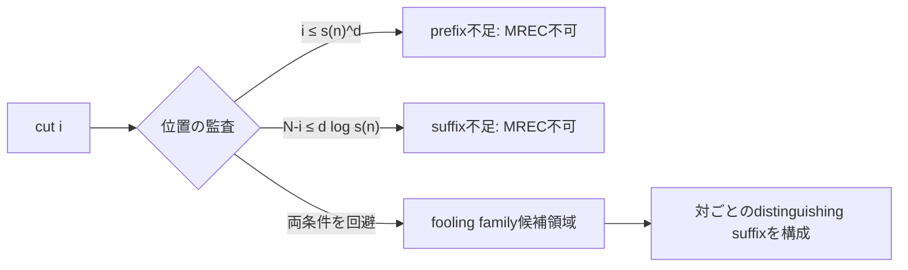

### 19.13 locality barrier の暫定判定

hardness magnification の locality 研究は、弱い下界と大きな分離との間にも既存手法を阻む障壁があり得ることを示している。一方、Residual-to-Streaming-Space Lemma 自体は単なる状態数え上げであり、障壁に抵触する核心ではない。困難は $K_s(N,i)$ の下界、すなわち MCSP の回路サイズ閾値を横切る distinguishing suffix の一括構成に集中する。

この評価はv0.10時点のものであり、次節の疎性上界によってMREC自体が反証された。

### 19.14 Sparse-Language Residual Ceiling：MRECの反証

#### 定理 19.14.1

任意の $L\subseteq\{0,1\}^{N}$ と切断 $i$ について、$M_N=|L\cap\{0,1\}^{N}|$ とすると

\[
K_L(N,i)\le M_N+1.
\]

#### 証明

受理completionを持たないprefixはすべて空残余という一クラスに属する。非空残余を持つ各prefix $u$ から受理suffix $z_u$ を一つ選ぶ。異なるprefixから得る $uz_u$ は異なるYES文字列なので、そのようなprefixは高々 $M_N$ 個である。従って非空残余クラスは高々 $M_N$ 個で、空残余クラスを加えればよい。∎

#### 系 19.14.2：MCSP残余上界

$s(n)\ge n$ なら、サイズ高々$s(n)$の$n$入力回路は $O(s(n)\log s(n))$ ビットで記述できる。従ってMCSP$[s]$のYES真理値表数は高々 $2^{O(s(n)\log s(n))}$ であり、全切断$i$について

\[
\log_2K_s(2^n,i)=O(s(n)\log s(n)).
\]

回路記述長とMCSPの疎性については、Modanese, [Lower Bounds and Hardness Magnification for Sublinear-Time Shrinking Cellular Automata](https://arxiv.org/abs/2007.12048) も参照。∎

#### 系 19.14.3：MRECは偽

MRECが要求する $\log K_s=s^{\omega(1)}$ は系19.14.2の多項式上界に反する。従って、残余クラス数だけからMCSPに$\operatorname{poly}(s)$を超えるstreaming空間下界を得る経路は閉じる。∎

### 19.15 Route Dの残存形：状態数ではなく遷移計算

反証されたのはhardness magnificationではない。$O(s\log s)$ビットで残余状態を**名付けられる**ことと、その状態を一様に$\operatorname{poly}(s)$ update timeで**計算できる**ことは別である。

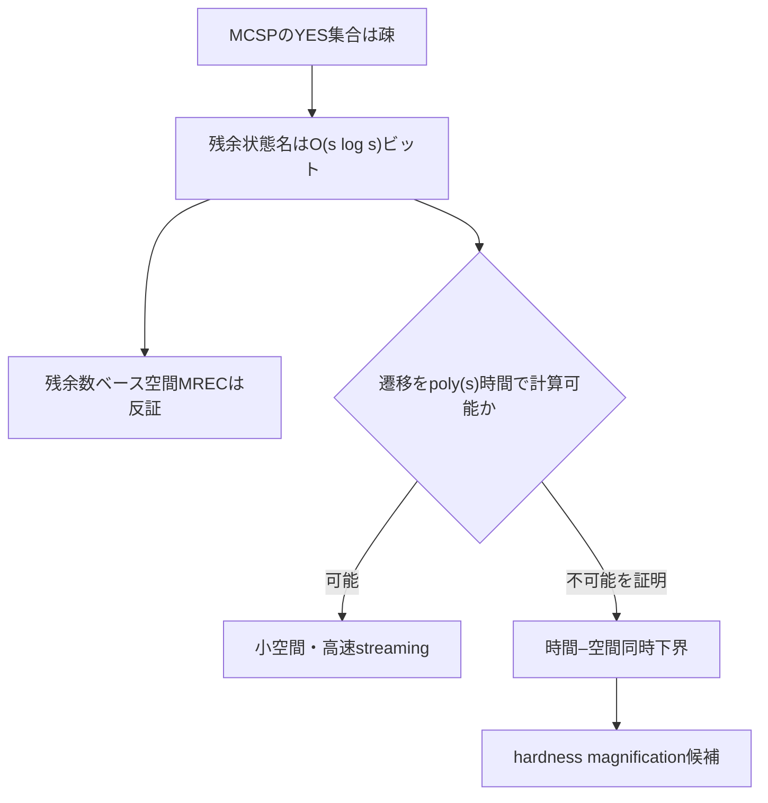

Route Dに残る正しい標的は、純粋な状態数下界ではなく「小さな残余名の正規化・遷移を高速には計算できない」という一様な時間–空間同時下界である。これは本研究で以前から現れていたnormalization costの問題へ戻る。

### 19.16 Online Residual Refinement Characterization

残存課題を計算モデルまで固定する。

#### 定義 19.16.1：オンライン残余精密化系

長さ$N$の言語$L$に対し、各切断$i$で写像

\[
\sigma_i:\{0,1\}^i\to\{0,1\}^{m(N)}
\]

を持ち、次を満たす系をオンライン残余精密化系（Online Residual Refinement System; ORRS）と呼ぶ。

1. **更新可能性:** $\sigma_{i+1}(ub)$ は $\sigma_i(u)$、$b$、$i$から計算できる。
2. **出力可能性:** $\sigma_N(x)$ から $x\in L$ を判定できる。
3. **残余精密化:** $\sigma_i(u)=\sigma_i(v)$ なら $u\equiv_{L,i}v$。

第3条件は、状態がcanonical residualより細かく分かれることを許す。

#### 定理 19.16.2：Streaming–ORRS Equivalence

$L$に$m(N)$ビット空間、update time $t(N)$、reporting time $r(N)$の決定的一方向streaming algorithmが存在することと、同じ漸近資源で更新・出力できるORRSが存在することは、有限制御と$O(\log N)$の位置情報を除いて同値である。

#### 証明

streaming algorithmからは、prefix $u$ を読んだ後の完全な内部構成を$\sigma_i(u)$とする。更新可能性と出力可能性は機械の定義から従う。もし$\sigma_i(u)=\sigma_i(v)$なのに残余が異なれば、両者を区別するsuffix $z$ がある。同じ構成から同じ$z$を読む決定的機械は同じ答えを返すため矛盾する。従って残余精密化条件も従う。

逆にORRSがあれば、$\sigma_0(\epsilon)$から始め、入力bitごとに更新器を適用し、最後に出力器を適用するstreaming algorithmになる。∎

> **v0.17 型修正**  
> この定理は最終出力が1bitの**decision language**に対する同値である。McKay–Murray–Williamsのhardness magnificationが仮定するのは、小回路そのものを返す
> $\operatorname{search\text{-}MCSP}^A[s]$である。従ってdecision-ORRSをsearch theoremの仮定と**同一視**することはできない。search relation、uniformizer、reporting costを含む修正版は§25.3で与える。ただしsearch solverの$\bot$/回路出力からdecision値を読めるため、decision-MCSPの下界はsearch下界の十分な強化条件としては有効である。

### 19.17 Canonical-State Trap

疎性上界によりcanonical residual quotientは高々$2^{O(s\log s)}$状態なので、各状態には$O(s\log s)$ビットの抽象的な番号を振れる。また、抽象商上では

\[
[u]_{i}\xrightarrow{b}[ub]_{i+1}
\]

という遷移がwell-definedである。

しかし、これは一様アルゴリズムを与えない。番号付け表や遷移表そのものが巨大であり、入力長ごとの非一様adviceを暗黙に埋め込んでいる可能性がある。

さらに、特定のcanonical番号付けの更新が難しいことを示すだけでは不十分である。streaming algorithmはcanonical quotientを使わず、より多くの状態を持つが更新しやすい精密化$\sigma_i$を使えるからである。

> **Refinement Trap**  
> canonical residualの正規化下界は、すべてのpoly$(s)$長ORRSに対する更新下界へ拡張できない限り、streaming下界を含意しない。

### 19.18 修正後のクリティカルゲート

Route Dの正確な未証明ゲートを次とする。

> **ORRS Update Lower Bound (OUL)**  
> 適切なMCSP$[s]$について、truth-table長$N=2^n$に対し$m(N)=\operatorname{poly}(s(n))$の任意の一様ORRSは、update timeまたはreporting timeが$\operatorname{poly}(s(n))$を超える。

Streaming–ORRS EquivalenceによりOULは所要のstreaming下界そのものであり、既知magnification theoremの条件が一致すればP≠NPを導く。従ってOULを単に別名で「証明目標」と置くだけでは進展にならない。今後必要なのは、ORRSに追加の正規形を強制する抽出定理か、全ORRSに適用できる下界尺度である。

> **v0.17 撤回・置換**  
> 上のOULはdecision版なので、既知magnification theoremのsearch仮定との同値ではなかった。「条件が一致すれば」という留保では不十分であり、**search仮定の正確な言い換え**としては撤回する。ただしdecision-MCSP lower boundはsearch solverも排除するため、より強い十分条件としては残る。search仮定と同値な標的は、§25.3のsearch-uniformizer ORRSについて、各uniformizer familyを効率的に実現する**すべての一様state refinement**を量化した同時space/update/reporting下界である。

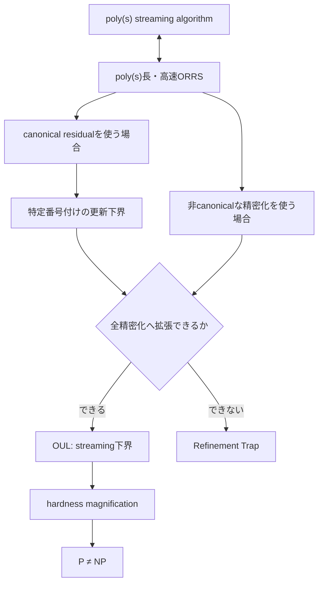

この結果により、Route DもE-NF経路と同じ構造を持つことが分かる。すなわち「任意のアルゴリズムを下界が証明できる正規形へ移す」抽出ゲートが再び中心に現れる。

### 19.19 形式意味論との対応

#### 19.19.1 Contextual equivalence と full abstraction

プログラム意味論では、二つのプログラムがすべての許容文脈で同じ観測を示すときcontextually equivalentとする。コンパイラ$T$のfull abstractionは概略、

\[
p\simeq_{\mathrm{src}}q
\quad\Longleftrightarrow\quad
T(p)\simeq_{\mathrm{tgt}}T(q)
\]

という文脈同値の保存と反映である。本研究の$\Gamma$-context equivalenceと同じ骨格を持つ。

- Abate, Busi, Tsampas, [Fully Abstract and Robust Compilation and How to Reconcile the Two, Abstractly](https://arxiv.org/abs/2006.14969)
- Devriese et al., [Modular, Fully-abstract Compilation by Approximate Back-translation](https://arxiv.org/abs/1703.09988)

後者で用いられるback-translationは、target contextによる区別をsource contextへ戻すことでreflectionを証明する。本研究のBoundary Completenessで、境界割当てを強制する単位節文脈を作る議論は、極めて単純なback-translationと見なせる。

#### 19.19.2 Abstract interpretation と strong preservation

抽象解釈はconcrete domainとabstract domainを抽象化・具体化写像で結び、soundな近似意味論を構成する。exact SATでは偽陰性・偽陽性の一方だけを許す通常のsoundnessでは不足し、対象問い合わせについてexactでなければならない。

Ranzato–Tapparoは、論理言語$\mathcal L$の全式についてconcrete modelとabstract modelの判定が一致するstrong preservationを、abstract interpretationのcompletenessと結び付け、必要な最小refinementを扱っている。

- Ranzato, Tapparo, [Generalized Strong Preservation by Abstract Interpretation](https://arxiv.org/abs/cs/0401016)
- Monniaux, [Completeness in static analysis by abstract interpretation, a personal point of view](https://arxiv.org/abs/2211.09572)

本研究では、$\mathcal L$に相当するものが文脈族$\Gamma$である。$\Gamma$-context equivalenceによる商は、$\Gamma$の全観測をstrongly preserveする最も粗いexact abstractionに対応する。

#### 19.19.3 Coalgebra、behavioural equivalence、partition refinement

coalgebraではシステム型からbehavioural equivalenceが定まり、determinizationやquotient minimizationを統一的に扱う。残余同値、ORRS、OBDD層状態はこの見方では、入力bitに反応して遷移し、最終観測を返すcoalgebraic systemである。

- Silva et al., [Generalizing Determinization from Automata to Coalgebras](https://arxiv.org/abs/1302.1046)
- Dorsch et al., [Efficient Coalgebraic Partition Refinement](https://arxiv.org/abs/1705.08362)

ただし既知の効率的partition refinementは通常、$n$状態・$m$辺の**明示的に与えられた有限システム**に対して$O(m\log n)$などの時間を与える。本研究のSAT／MCSPでは、意味状態グラフ自体が入力式や真理値表に対して指数的かつimplicitである。従って明示グラフサイズに多項式な最小化は、元入力サイズに多項式なE-NFを与えない。

### 19.20 意味保存と資源保存の分離

形式意味論の変換を、少なくとも次の三軸で評価する必要がある。

| 軸 | 条件 | 本研究での意味 |
|---|---|---|
| Adequacy / soundness | source観測をtargetが正しく保存 | SAT値を壊さない |
| Full abstraction / strong preservation | 観測同値を保存・反映 | 文脈区別能力を過不足なく保存 |
| Resource preservation | 変換時間・出力サイズ・query時間を制御 | P≠NP下界へ接続可能にする |

#### 定理 19.20.1：Full Abstraction Does Not Imply Succinctness

full abstractionは多項式サイズ変換を含意しない。

#### 証明

sourceを$n$変数Boolean回路、targetを長さ$2^n$の真理値表とし、観測文脈を入力$x$での評価とする。回路を真理値表へ展開する変換は、すべての入力で同じ値を返す回路を同じ関数へ写し、異なる関数はある入力文脈で区別される。従ってextensional contextual equivalenceを保存・反映し、full abstractである。しかし多項式サイズ回路のtarget表現長は$2^n$であり、指数的に膨張する。∎

同様に、最も粗いstrongly preserving abstractionが数学的に存在しても、その有限表現が小さいこと、または効率的に計算できることは従わない。

### 19.21 Resource-Aware Full Abstraction

本研究に必要な変換条件を次のようにまとめる。

> **Resource-Aware Full Abstraction (RAFA)**  
> 変換$T$が指定文脈族について観測同値を保存・反映し、さらに$T$の構築時間、$|T(x)|$、target query timeが指定した多項式境界内にある。

E-NFは、一般P時間SATアルゴリズムの計算意味から、既知下界を持つtarget表現へのRAFA型抽出を要求している。ただし通常のfull abstractionはプログラムからプログラムへの変換であり、「任意の判定アルゴリズムから知識表現を抽出する」ことまでは保証しない。この差を埋める追加仮定がE-NFの本体である。

### 19.22 Semantic Transformation Map

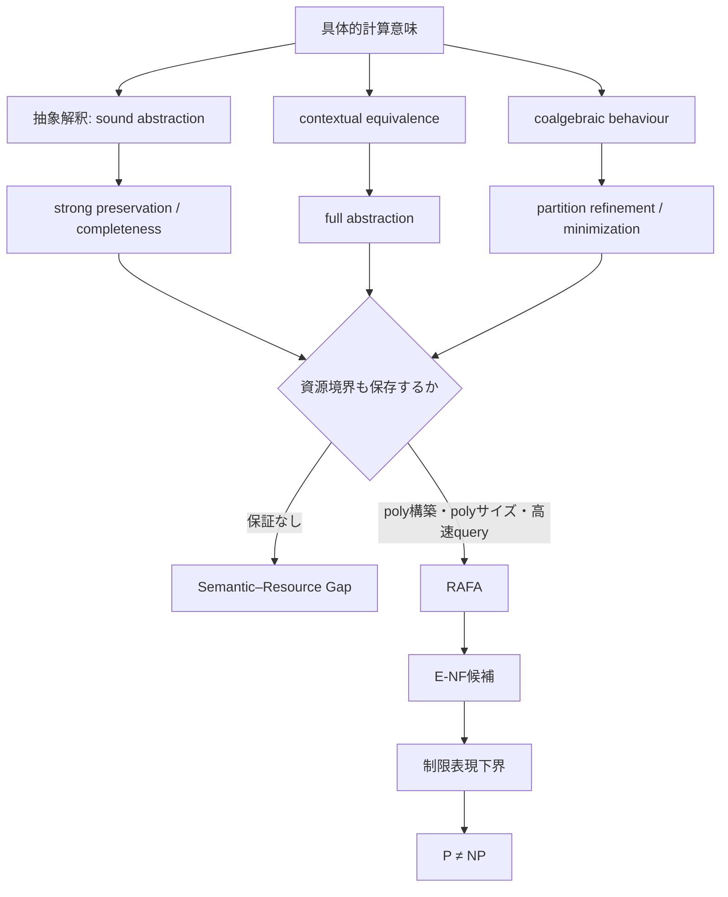

### 19.23 形式意味論調査から得た判定

1. **既知理論が与えるもの:** 観測同値、最も粗いexact abstraction、意味保存・反映を証明する技法。
2. **自動的には与えないもの:** 元入力に対する多項式サイズ、変換の多項式時間、implicit state space上の効率的最小化。
3. **研究への有効な輸入:** back-translation、strong preservation、complete shell、behavioural quotientを用いてE-NFの意味条件を精密化できる。
4. **残る核心:** RAFAを一般P判定器から抽出する定理、またはRAFAが不要な全アルゴリズム下界。

この調査により、normal-form bottleneckは形式意味論で既に十分研究された「意味保存」の不足ではなく、意味保存に**succinctnessとuniform constructibilityを同時付加する部分**にあると特定できる。

### 19.24 Cost SemanticsによるRAFAの精密化

cost semanticsでは、プログラムの意味を出力だけでなく評価コストと組にする。Danner–Licata–Ramyaaは、関数プログラムからcost/size recurrenceを抽出し、そのrecurrenceが評価コストの上界になることをlogical relationsで証明している。

- Danner, Licata, Ramyaa, [Denotational cost semantics for functional languages with inductive types](https://arxiv.org/abs/1506.01949)

本研究でも、変換$T$について単なる観測同値だけでなく、具体的なsimulation inequalityを要求すべきである。source costを$C_S$、target costを$C_T$として、少なくとも

\[
C_T(T(p),x)
\le
q\bigl(C_S(p,x),|p|,|x|\bigr)
\]

を、固定多項式$q$について要求する。instance compilationではさらに

\[
\operatorname{BuildTime}(T,F)\le\operatorname{poly}(|F|),
\]

\[
|T(F)|\le\operatorname{poly}(|F|),
\]

\[
\operatorname{QueryTime}(T(F),\gamma)le\operatorname{poly}(|F|+|\gamma|)
\]

を分離して記録する必要がある。

単にcostを観測ラベルへ加え、「cost-aware contextual equivalence」を保存すると述べるだけでは不十分である。どのcostを同値とみなすか、加法・定数倍・多項式歪みのどこまで許すかで結論が変わる。RAFAには明示的な数値不等式が必要である。

### 19.25 Implicit Computational Complexityとの対応

Implicit Computational Complexity（ICC）は、型、再帰スキーム、線形論理などの構文制約によってPtimeを特徴付ける。例えばbounded linear logic系にはPtimeに対するsoundnessとcompletenessを持つものがある。

- Dal Lago, Hofmann, [Bounded Linear Logic, Revisited](https://arxiv.org/abs/0904.2675)
- Perrinel, [Paths-based criteria and application to linear logic subsystems characterizing polynomial time](https://arxiv.org/abs/1701.01413)
- Aubert, Bagnol, Seiller, [Memoization for Unary Logic Programming: Characterizing PTIME](https://arxiv.org/abs/1501.05104)

これはE-NFに一見近い。すべてのPtime関数を資源制御された構文へ表現できるからである。しかし、ここにはprogram normalizationとinstance compilationの差がある。

#### 定理 19.25.1：ICC Normal Form Does Not Supply Instance Summaries

Ptime完全なICC言語へのプログラム表現定理だけから、各入力$F$に対するpoly-size・poly-build-time・高速多文脈queryの要約$D_F$は従わない。

#### 証明

ICC completenessが与えるのは、関数$f$を計算する固定プログラム$P_f$である。入力$F$について$f(F)$を得るには$P_f(F)$を実行する。文脈$\gamma$ごとの関数値$f(F,\gamma)$についても、固定プログラム$P_f$へ$(F,\gamma)$を渡して再実行できるにすぎない。

一方、instance summary $D_F$には、$F$だけを前処理して得た有限対象が、多数の$\gamma$へ高速に答えることが要求される。ICCのprogram representation theoremには、$P_f$を$F$でpartial evaluationしたresidual programのサイズ、specialization時間、各query時間を保証する主張は含まれない。従って前者から後者は論理的に従わない。∎

この差を **Program/Instance Normal-Form Gap** と呼ぶ。

### 19.26 Partial Evaluationを介した新しい分解

形式意味論からE-NFへ進む候補を、次の二段階へ分解する。

1. **Program normal form:** 一般Pアルゴリズム$A(F,\gamma)$を、資源保証付き意味言語のプログラム$P_A$へ変換する。
2. **Resource-bounded specialization:** $P_A$を静的入力$F$でspecializeし、residual object$D_F$を多項式時間・多項式サイズで生成する。

そして$D_F$が$\Gamma$の全queryをexactに保存し、target表現下界が適用できる必要がある。

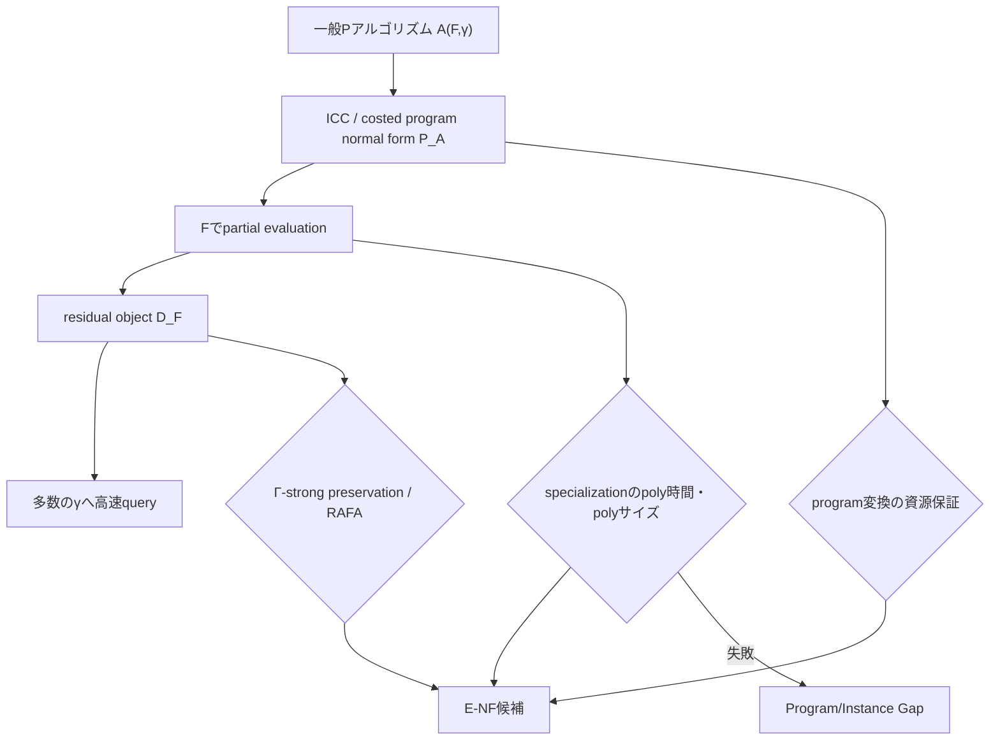

この分解は新しい証明を与えないが、E-NFの未知部分を「意味保存コンパイラ」全体から、**資源制限付きpartial evaluation**へ局所化する。次の先行研究調査は、binding-time analysis、Jones optimality、offline/online partial evaluation、succinctness blow-upへ向ける。

---

## 20. 現時点の結論

1. 意味的 ε 合流の初期案は、固定順序では OBDD の残余関数最小化として厳密化できた。
2. そのモデルには明示的な指数下界がある。
3. しかし HWB により、指数的残余関数数から一般時間下界への推論は反証された。
4. 任意条件付けに閉じた要約は Boolean 関数表現であり、そこで得る下界は知識コンパイル下界である。
5. SDD は HWB を多項式化するためモデル改善になるが、SAT 判定と全解表現の隔たりは残る。
6. 現在の真の課題は、一般 P 時間 SAT アルゴリズムから必然的に抽出でき、なおかつ非自明な下界を持つ「最小合成性」を定義することである。
7. 文脈族だけではモデルを特定できず、表現・前処理時間・問い合わせ時間を含む CCP が必要である。
8. 小さい文脈族では多項式応答ベクトルが存在し、大きい文脈族で任意P時間問い合わせを許すとSAT再実行が可能になる。
9. 普遍検証式の完全境界要約は任意のNP関数表現を含むため、一般回路サイズ下界は $NP\nsubseteq P/poly$ へ直結する。
10. 現在の最重要ボトルネックは E-NF（一般Pアルゴリズムを下界可能な制限表現へ移すnormal-form theorem）である。
11. Hamming誤差に基づく近似要約は、一意解により正確SAT判定を保存できない。
12. proof complexityへ移っても、任意のP判定器を固定証明系へ移すnormal-form問題が再発する。
13. 既知のP関数下界を持つ表現クラスへのE-NFは、それ自体がP≠NPを示す強さを持つ。
14. P=NP下ではPHで検証可能な多項式長要約をビットごとに探索できるため、構築時間だけへの退避も難しい。
15. 意味状態幅とmerge時間を同時に上界化できれば、Counting Semantic Mergeにより#SAT高速化へ変換できる。
16. #SAT高速化はWilliams型回路下界へ接続できるが、そのNEXP下界はP=NPと両立し得る。
17. 副経路をP≠NPへ戻すには、現在未知のDownward Transferが必要である。
18. MCSP streaming hardness magnificationは、特定問題について既知のDownward Transferを与える。
19. MCSP prefix残余同値類数の超巨大下界MRECは、MCSPの疎性による$O(s\log s)$上界で反証された。
20. Route Dに残る標的は、残余数だけの空間単独下界ではなく、残余遷移の一様な時間–空間同時下界である。
21. streaming algorithmはオンライン計算可能な残余精密化ORRSと同値であり、canonical正規化だけの下界では非canonical精密化を排除できない。
22. full abstraction、strong preservation、coalgebraic minimizationは意味条件を与えるが、多項式サイズ・一様構築時間を自動的には保証しない。
23. E-NFに必要なのは、意味保存・反映と資源境界を同時に要求するRAFA型変換である。
24. cost semanticsを導入しても、RAFAには多項式歪みを明示するsimulation inequalityが必要である。
25. ICCのPtime完全なprogram normal formは、instance-specificな多文脈要約を自動的には与えない。
26. E-NFの未知部分は、program normal formと資源制限付きpartial evaluationの二段階へ分解できる。

---

## 21. 更新ログ

### 2026-07-10 / v0.14

- cost semanticsを調査し、RAFAへ明示的なpolynomial simulation inequalityを追加。
- build time、summary size、query timeを独立の資源軸として固定。
- ICCのPtime soundness／completenessとE-NFの関係を調査。
- ICC program normal formだけではinstance-specific summaryが得られないことを証明。
- Program/Instance Normal-Form Gapを定義。
- E-NFをprogram normalizationとresource-bounded partial evaluationへ二段階分解。
- 次の調査対象をpartial evaluationの最適性・specialization blow-upへ限定。

---

## 22. 原点回帰：3-SAT分岐合流の最小核

### 22.1 最初の問い

3-CNF $F(x_1,\ldots,x_n)$ に変数を順に代入すると二分木ができる。同じ「将来」を持つ枝を合流し、状態数を多項式に抑えられるならSATを高速化できるのではないか、というのが出発点だった。

ここで「同じ将来」を弱く取りすぎると更新不能になり、強く取ると既知のknowledge compilation表現になる。この境界を最小例から再構成する。

### 22.2 SAT一ビット要約は合成不能

#### 定理 22.2.1：Existential-Bit Update Impossibility

残余式$G$の要約を

\[
b(G)=
\begin{cases}
1 & G\text{が充足可能},\\
0 & G\text{が充足不能}
\end{cases}
\]

の一ビットだけとする。この要約と次の代入値$a\in\{0,1\}$だけから、$b(G|_{x=a})$を常に正しく計算する更新関数$U$は存在しない。

#### 証明

$G=x$、$H=\neg x$とする。どちらも充足可能なので$b(G)=b(H)=1$である。しかし$a=1$に対し、

\[
b(G|_{x=1})=1,
\qquad
b(H|_{x=1})=0.
\]

従って同じ入力$U(1,1)$から異なる答えを要求され、矛盾する。∎

この例は3-CNFへ定数個の補助節を用いて埋め込めるので、3-SATでも本質は変わらない。

### 22.3 更新閉包が残余意味を強制する

#### 定理 22.3.1：Iterated Update Closure

prefix assignment $\alpha$からsummary $\sigma(\alpha)$を作り、次の変数値ごとに決定的に更新でき、全変数代入後に$F$の真偽を正しく出力できるとする。このとき

\[
\sigma(\alpha)=\sigma(\beta)
\]

なら、すべての共通completion $z$について

\[
F(\alpha z)=F(\beta z)
\]

である。

#### 証明

同じsummaryから同じcompletion $z$のbit列を順に更新すれば、決定性により最後まで同じ状態を通り、同じ出力になる。従ってある$z$で真偽が異なる二prefixは合流できない。∎

これはORRS定理のSAT分岐への直接適用である。原点の「意味的合流」を正確な逐次更新と両立させると、固定順序ではBoolean residual function、すなわちOBDD状態へ必然的に戻る。

### 22.4 モデル上昇の階段

| 分岐・合流能力 | 対応する既知モデル | 得られる下界の射程 | 一般Pとの差 |
|---|---|---|---|
| 全経路で同じ変数順序 | OBDD | 明示的指数下界あり | 順序制約が強い |
| 経路ごとに順序を変えるが各変数一回 | FBDD / read-once BP | 明示的指数下界あり | 再読込み不可 |
| 独立部分をAND分解 | decision-DNNF / AND-FBDD | CNF族への指数下界あり | exact解表現を構築 |
| 一般DNNF | decomposable circuit | CNF族への強指数下界あり | decomposability制約 |
| 変数再読込みを許す | branching program | 一般下界が急に困難 | 非一様空間計算へ接近 |
| 任意のwork tape・random access | 一般アルゴリズム | P対NPそのもの | 制限表現への変換なし |

関連する既知結果：

- Beame, Li, Roy, Suciu, [Lower Bounds for Exact Model Counting and Applications in Probabilistic Databases](https://arxiv.org/abs/1309.6815)：decision-DNNFからFBDDへのsimulationと、既知FBDD下界を用いたexact model counting表現下界。
- Bova et al., [A Strongly Exponential Separation of DNNFs from CNF Formulas](https://arxiv.org/abs/1411.1995)：expander由来CNFに対するDNNF強指数下界。
- Calí, Razgon, [On complexity of restricted fragments of Decision DNNF](https://arxiv.org/abs/2501.03710)：FBDD、AND付きOBDD、structured decision-DNNF周辺の分離。

### 22.5 原点から見た証明地図

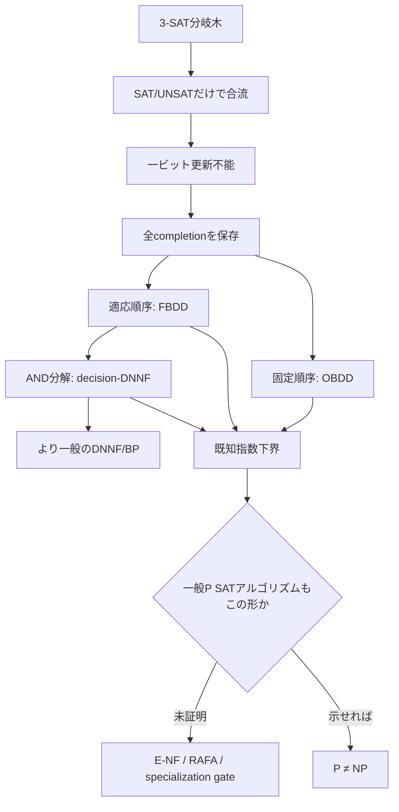

### 22.6 原点回帰後の研究判断

1. **維持する核心:** 「同じ未来を持つ枝の合流」という直感は、残余同値として数学的に正しい。
2. **捨てる近道:** 現在のSAT値だけを保存する合流は逐次更新できない。
3. **既知成果として使える範囲:** OBDD、FBDD、decision-DNNF、DNNFを構築するexactアルゴリズムには強い下界がある。
4. **越えられていない壁:** SATのYES/NOだけを返す一般Pアルゴリズムが、これらのexact表現を構築する必要はない。
5. **再設定した目標:** 一般アルゴリズムから完全な残余表現を抽出するのではなく、より弱いが全アルゴリズムに不可避な**計算履歴上の意味的不変量**を探す。

最後の項目はまだ定義されていない。候補不変量には、構成グラフ上の区別可能性、情報移送量、crossing sequence、communication cut、証明certificateの再利用可能性がある。ただし、それぞれが一般P計算に適用できるか、既知barrierを越えるかを個別に監査する。

### 22.7 更新記録（v0.15）

- 研究を3-SAT分岐木の意味的合流という原点へ戻して再構成。
- SAT/UNSAT一ビット要約が次代入に対して合成不能であることを最小反例で証明。
- 決定的逐次更新閉包が全completionに対する残余同値を強制することを再証明。
- OBDD→FBDD→decision-DNNF→DNNF→branching program→一般計算のモデル階段を整理。
- exact model counting／knowledge compilation下界の到達範囲と、一般SAT decisionとの差を固定。
- 次の探索対象を、完全残余表現より弱く一般計算に不可避な計算履歴不変量へ変更。

---

## 23. 過去の更新ログ（v0.13以前）

### 2026-07-10 / v0.13

- contextual equivalence／full abstractionと$\Gamma$-context equivalenceを対応付け。
- abstract interpretationのcompleteness／strong preservationとexact文脈要約を対応付け。
- coalgebraic behavioural equivalence／partition refinementと残余最小化を対応付け。
- 明示状態グラフ上の効率的最小化がimplicitなSAT意味空間の多項式変換を与えないことを監査。
- full abstractionがsuccinctnessを含意しないことを回路→真理値表変換で証明。
- 意味保存・反映と構築時間・サイズ・query時間を同時管理するRAFAを定義。
- E-NFの核心をSemantic–Resource Gapとして再定式化し、形式意味論から輸入できる部分と未解決部分を分離。

### 2026-07-10 / v0.12

- オンライン残余精密化系ORRSを定義。
- 決定的一方向streaming algorithmとORRSの資源保存同値を証明。
- canonical residualの小さな抽象状態数が一様な高速更新器を与えないことを明確化。
- canonical番号付けだけの更新下界では、更新しやすい非canonical精密化を排除できないRefinement Trapを導出。
- Route Dの正確なゲートOULを定義し、それ自体はstreaming下界の言い換えであるため正規形抽出または全ORRS下界尺度が必要と判定。
- Route DとE-NF経路が同じnormal-form bottleneckへ合流することを確認。

### 2026-07-10 / v0.11

- Sparse-Language Residual Ceilingを証明。
- MCSP$[s]$のYES真理値表数が$2^{O(s\log s)}$以下であることから、全切断で$\log K_s=O(s\log s)$を導出。
- MRECを反証し、MCSP残余クラス数による空間単独主経路を撤回。
- hardness magnification自体とMRECの失敗を分離。
- Route Dの残存課題を、短い状態名の一様なupdate timeを含む時間–空間同時下界へ修正。
- 独立導出結果の別冊にC10とU1反証を記録。

### 2026-07-10 / v0.10

- 別冊の第一次新規性監査を実施。
- Boundary Completeness Lemmaをcanonical congruence／finite integer indexのSAT特殊化と判定。
- PH-verifiable Summary Search Lemmaを$P=NP\Rightarrow FP=FNP$とPH collapseの直接系と判定。
- Residual-to-Streaming-Space LemmaをMyhill–Nerode／一方向通信の既知状態数え上げの特殊化と判定。
- Residual Cardinality CeilingとMREC Cut Feasibilityは初等的計数とその直接系であり、単独新規性を主張しない方針に変更。
- 証明済み結果と学術的新規性の混同をさらに解消。

### 2026-07-10 / v0.9

- 独立に導出した命題を `P_vs_NP_candidate_original_results.md` へ分離。
- 数学的正しさと学術的新規性を別々の状態として管理する運用を導入。
- 未証明のMRECを証明済み候補から明確に分離。
- 新規性監査プロトコルと監査優先順位を別冊に追加。

### 2026-07-10 / v0.8

- McKay–Murray–Williams の streaming magnification 定理を、Modanese による本文中の再掲まで戻って監査。
- $s$ の time-constructibility、$s(n)\ge n$、search version、一方向streaming、$\operatorname{poly}(s)$ 空間・update timeという条件を固定。
- 当時はreporting timeとsearch/decision変換の原仕様確認を保留したが、v0.17で一次資料まで確認し、reportingをupdate資源へ含め、decision下界は十分条件だがsearch仮定とは非同値と確定。
- 任意の二値言語に対する Residual Cardinality Ceiling を証明。
- MREC witness cut に $i>s(n)^d$ かつ $2^n-i>d\log_2s(n)$ が必要であることを導出。
- 極端な左右の切断を排除し、fooling family の探索領域を内部切断へ限定。
- locality barrier は残余補題ではなく、distinguishing suffix の一括構成段階に現れると暫定評価。
- 切断位置監査の Mermaid 図を追加。

### 2026-07-10 / v0.7

- 過去の「意味的分岐圧縮」案を復元。
- 残余関数数と固定順序完全要約幅の同値を証明。
- OBDD 下界から一般 P 時間下界へ進む Bridge-0 を HWB と単調 CNF で反証。
- 「合成可能性の罠」を監査補題として追加。
- 任意文脈との交換可能性が完全な境界関数保存を強制する「境界完全性補題」を証明。
- 文脈族相対同値 
  \[
  \equiv_{\Gamma_B}
  \]
  を導入し、単発 SAT と完全知識コンパイルの中間問題を定式化。
- OBDD から SDD／構造化意味合流系へのモデル拡張を定義。
- 強い SSMS が SDD に還元されることを確認し、単なるモデル改名を排除。
- P≠NPへ至る主要ルート、証明依存DAG、文脈族探索、クリティカルパスをMermaidで追加。
- 公理・定義・既知定理・未証明補題をID付き台帳へ整理。
- 証明完成条件を明文化し、E（抽出）とL（下界）を必須の二大未証明ゲートとして固定。
- Myhill–Nerode、finite integer index、knowledge compilation、compilability、instance compression、Williams型下界との対応を調査。
- 文脈コンパイル・プロファイル CCP を導入し、文脈族・表現・前処理・問い合わせを同時に固定。
- 小文脈族の真理値ベクトル上界、SAT判定器再実行上界、固定入力回路化を証明。
- 文脈コンパイル三分岐を導出し、Normal-Form Bottleneckを特定。
- 普遍検証式埋め込みにより、完全境界要約がNP関数表現を含むことを確認。
- サイズ下界が $NP\nsubseteq P/poly$ 型、構築時間下界が一様P≠NP型へ向かうことを分離。
- Hamming近似が一意解SATを保存できないことを証明。
- E-NFを新しい最重要ゲートに設定し、研究優先順位を改訂。
- Cook–Reckhow定理との対応を調べ、proof complexityでも同じnormal-form bottleneckが現れることを確認。
- 次の中心課題を E-NF（制限CCPへの正規形抽出）と、同一CCPに対する構築時間／サイズ下界として設定。
- 既知のP関数下界とE-NFだけでP≠NPが従う Normal-Form Hardness Lemmaを証明。
- 表現クラス選択に関する No-Free-Normal-Form Trichotomyを導出。
- P=NP下でPH検証可能な多項式長要約を構築できる PH-verifiable Summary Search Lemmaを証明。
- 構築時間だけを独立の突破口とする方針を降格し、要約存在・サイズ・表現能力へ再集中。
- De Morgan formula、branching program、TC0、一般回路をE-NF/Lの中間クラス地図として整理。
- Counting Semantic Mergeを定義し、状態幅とmerge時間から#SAT実行時間を得るWidth-to-#SAT Lemmaを証明。
- Williams型algorithm-to-lower-boundへの接続条件を整理し、圧縮→#SAT→NEXP回路下界の副経路を追加。
- NEXP回路下界がP=NPと両立し得ることをpaddingで監査。
- 副経路を主経路へ戻す未知のDownward Transferを新しいゲートとして記録。
- hardness magnificationを調査し、MCSP streaming下界からP≠NPへの既知bridgeを確認。
- MCSP prefix residual equivalenceとResidual-to-Streaming-Space Lemmaを定式化・証明。
- 残余同値類数の超巨大下界MRECを新しい主経路候補として設定。
- truth-table長と変数数、search/decision、乱択性、update time、locality barrierを監査項目化。

---

## 24. 一般計算履歴へ進む前の量化監査

### 24.1 Cross-Run Coherence Gap

分岐図$D_F$は、一つの式$F$に対する多数のpartial assignmentを、同じ状態空間の中で同時に比較・合流する。これに対し、一般SAT判定器$A$へ$F|_\alpha$と$F|_\beta$を入力した二回の実行は、独立した二本の計算である。

各実行のconfigurationには通常、入力テープ、work tape、head位置などが含まれる。入力式自体が異なるので、二実行のconfigurationを「同じ未来意味だから同じ状態」と同一視する規則は、機械モデルからは与えられない。

> **Cross-Run Coherence Gap**  
> knowledge compilation下界は、全条件付けを共有状態空間へ配置する表現を対象とする。一般decision algorithmは各条件付けを別実行として処理でき、実行間で再利用可能な状態名や合流規則を持つ必要がない。

このgapを埋めるには、次のいずれかが必要である。

1. $A$の異なる実行を資源保存的に一つのbranching objectへ束ねる抽出定理。
2. 実行を束ねず、一回の計算traceだけにも適用できる下界尺度。

前者はE-NF／RAFAへ戻る。後者が原点回帰後の新しい探索方向である。

### 24.2 Black-Box Context Extraction Lower Bound

#### 定理 24.2.1

未知のBoolean関数

\[
f:\{0,1\}^n\to\{0,1\}
\]

にmembership-query oracleでアクセスし、すべての$x$について$f(x)$を正確に答えられる表現$D_f$を必ず出力する決定的black-box変換は、最悪時に$2^n$回のoracle queryを必要とする。

#### 証明

$2^n$未満のqueryしか行わない変換を仮定する。oracleが全queryへ0を返した実行を考える。未照会点$x^*$が少なくとも一つ存在する。

全点で0の関数$f_0$と、$x^*$だけで1の関数$f_1$は、変換が見た全応答について同じである。決定的変換は同じ$D$を出力する。しかし$D$は$x^*$で$f_0(x^*)=0$と$f_1(x^*)=1$の両方を正しく答えられない。矛盾。∎

#### 含意と限界

この定理はSATに対する$2^n$時間下界ではない。SAT residualは「任意の未知関数oracle」ではなく、入力式と判定器コードを非black-boxに解析できる構造を持つ。

示しているのは、

\[
\text{decision accessだけ}
\Longrightarrow
\text{完全な多文脈表現}
\]

というblack-box抽出が不可能なことである。E-NFが成立するなら、判定器のコード、式の構文、計算traceなどを本質的に利用するnon-black-box変換でなければならない。

### 24.3 一回の計算traceに対する不変量候補

| 候補 | 強み | 一般P計算への問題 | 現判定 |
|---|---|---|---|
| configuration distinguishability | 任意の機械に定義可能 | 一入力の決定的traceは一本で、全completionの区別数を持たない | 単独では弱い |
| crossing sequence | tape境界を越える情報量から時間を下げられる | one-tape／sequential access制約に依存 | 制限モデル用 |
| communication cut | prefix/suffix・変数分割を情報量へ変換 | random access machineは固定cutを自由に往復できる | tradeoff化が必要 |
| branching-program time–space | 時間と状態記憶を同時に扱える | 入力bit query型モデルへのsimulationが必要 | 有望だが制限あり |
| pebbling / computation DAG | 再計算と記憶のtradeoffを表現 | 一般アルゴリズムはDAG自体を変更できる | canonical DAG抽出が必要 |
| proof/certificate reuse | UNSAT理由の再利用を測れる | 固定proof systemへの変換が必要 | normal-form問題再発 |

関連文献：

- Santhi, Vardy, [A Quadratic Time-Space Tradeoff for Unrestricted Deterministic Decision Branching Programs](https://arxiv.org/abs/cs/0608085)
- Chen et al., [Width-parameterized SAT: Time-Space Tradeoffs](https://arxiv.org/abs/1108.2385)

### 24.4 Configuration Countingの限界

時間$T(n)$、空間$S(n)$の決定的機械について、一回の実行が訪れるconfigurationは高々$T(n)+1$個である。一方、長さ$n$の全入力にわたる到達可能configuration集合は指数的でもよい。全入力横断のconfiguration数が大きいことは、一入力上の時間下界を与えない。

また、同じconfigurationへ到達すれば未来挙動は同じというMarkov性は成り立つが、異なる入力を保持したread-only input tapeをconfigurationの外へ置けば、同じwork stateでも未来のinput access結果が異なる。入力をconfigurationへ含めれば、異なる条件付け式は最初から別状態となり、意味合流は起きない。

従って一般機械でOBDD型状態数え上げを再現するには、入力のうち「既に読んだ部分／まだ読んでいない部分」を固定するアクセス規律が必要である。streamingやbranching programでcommunication cutが効くのは、この規律があるためである。

### 24.5 原点からの修正版ロードマップ

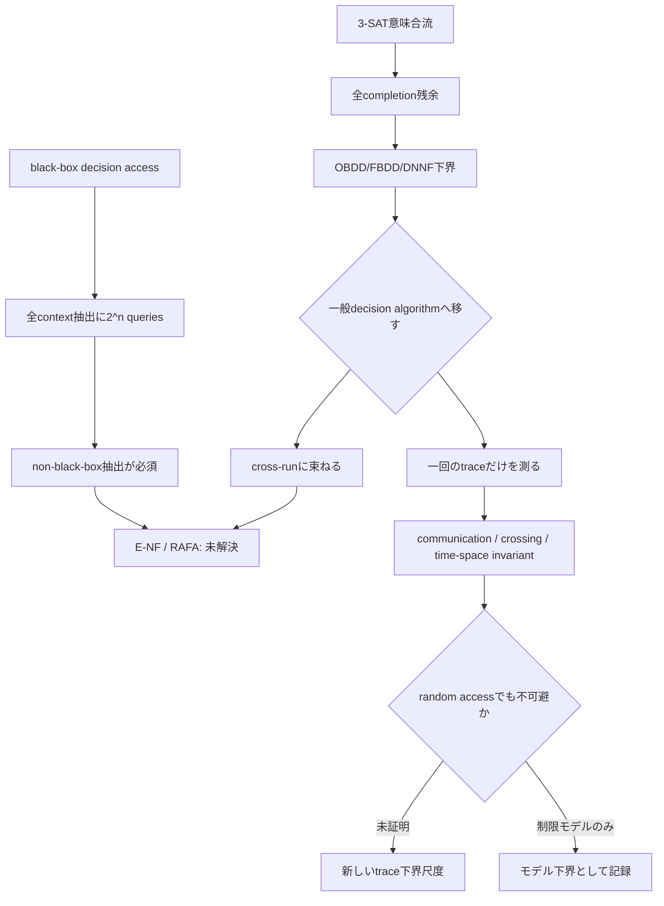

### 24.6 次の具体的作業

1. 一回のrandom-access computationを、入力分割に関する多round communication protocolへ変換する標準simulationを調査する。
2. SAT／MCSPに対する既知communication下界が、round数・space・cell-probe条件のどこまで届くか整理する。
3. 入力アクセス回数またはmemory-cell transferを制限した中間モデルを置き、既知下界と一般Pの間の最小gapを測る。
4. black-box extraction lower boundを、SATの条件付けquery族に即したpromise版へ強化できるか検討する。

---

## 25. 2026-07-23：Search型修復とSelector Coherenceへのメタ拡張

### 25.1 三役監査の設計

本節では、次の三役を独立に走らせ、その後に主張を交換して相互反証した。

1. **方向探索:** 既知研究を検索し、詰まりの原因となる量化・表現・観測境界を一段外側から捉え直す。
2. **実働:** 定義、補題、反例、query lower boundを実際に導出する。
3. **冷徹監査:** 母原理のM1/N/M2/Pを分離し、量化交換、自己認証、normal-form密輸入、新規性誤認を検査する。

母原理M0は証明の前提に用いない。M1は条件付き形式核、Nは橋仮定、M2/Pは運用方針である。同じ基盤モデル、同じノート、同じ会話から出た複数エージェントは相関しており、独立な正しさ確率として乗算しない。今回の外部錨は一次論文の定理文、明示的反例、手検算可能な有限構成である。

### 25.2 一次文献による現在地の修正

#### 25.2.1 オンライン正規化は既知の中核

McKay–Murray–Williamsは、$\operatorname{search\text{-}MCSP}^A[s]$について次を示している。

- $t=100s(n)\log s(n)$ bitずつ処理するblockwise algorithmが存在する。
- multi-outputのStream-Merge function oracleを直接使う表示では、1 blockにつき1 call、全時間$O(2^n)$、space $O(t)$である。
- 一つのBoolean language $\Sigma_3\operatorname{SAT}^A$への通常のqueryへ展開すると、1 blockにつき$O(t)$個のsequential queryを使い、各query長は$\widetilde O(t)$である。最終partial blockを許せば全streamのquery総数は$O(t\lceil2^n/t\rceil)=O(2^n+t)$であり、非自明な$t=O(2^n)$領域では$O(2^n)$となる。worst-case update timeは$\widetilde O(t^2)=\widetilde O(s^2)$、全時間は$2^n\widetilde O(s)$、spaceは$\widetilde O(t)=\widetilde O(s)$である。
- $P=NP$ならPHがPへcollapseするためoracleを除去できる。
- ただしcollapse後に維持される保証はspace、updateとも$\operatorname{poly}(s)$であり、oracle付き表示の$\widetilde O(s)$ space、$\widetilde O(s^2)$ updateという明示指数までは保存されない。
- 従って、あるtime-constructible $s(n)\ge n$ と $A\in PH$について、oracle-free deterministic one-pass search-$\operatorname{MCSP}^A[s]$ solverでspaceとupdateがともに$\operatorname{poly}(s)$のものが一つも存在しないと示せば、$P\ne NP$である。

ここで「$\Sigma_3\operatorname{SAT}^A$ oracleを1個使う」とは、**一つのoracle languageへ多数回callする**という意味である。1 queryだけで全回路記述を得るという意味ではない。MMW Theorem 4.1の

\[
B_n:\{0,1\}^{t_B(n)}\to\{0,1\}^{t_B(n)},
\qquad
t_B(n)=200s(n)\log s(n)
\]

は後者に近いmulti-output function oracleであり、Boolean oracle call数と混同しない。

同論文のstreamingモデルでは、update time $u$はbit間の計算だけでなく最終reportingを$O(u)$時間で行うことも要求する。本節でもMMWへ接続するときは

\[
u=\max\{\text{per-bit update time},\text{final reporting time}\}
\]

とする。

一次資料：

- McKay, Murray, Williams, [Weak Lower Bounds on Resource-Bounded Compression Imply Strong Separations of Complexity Classes](https://people.csail.mit.edu/rrw/MCSP-MKTP-stoc19.pdf), Theorems 1.2–1.3.

同論文のStream-Mergeは、既読prefixに整合する小回路と次blockを受け取り、結合した制約に整合する辞書順先頭の最小回路へ再正規化する。従って、

> 短い状態名は存在するが、オンライン正規化・更新が難しい

というRoute Dの核心は既知構成と同型であり、概念的新規性を主張しない。未解決なのは、特定の正規化器ではなく、すべてのoracle-free streaming solverに対する更新下界である。この下界を証明すれば、同論文のTheorem 1.3により$P\ne NP$を導く。これは十分条件であり、P≠NPとの同値は主張しない。

#### 25.2.2 2025年の一般magnificationは隣接副経路

Atserias–Müllerの一般magnificationは重要だが、結論を区別する必要がある。

- Theorem 9は、十分疎な$Q\in NP$の近似版に対する弱いformula lower boundから、NPの固定多項式formula lower boundを導く。
- Theorems 11/27は、近似MCSPに対する所定のP-uniform circuit lower boundから
  \[
  P\ne NP^{\oplus P}
  \]
  を導く。

一次資料：

- Atserias, Müller, [Simple General Magnification of Circuit Lower Bounds](https://www.cs.upc.edu/~atserias/papers/magnification/magnification.pdf).

いずれも直接の$P\ne NP$ではない。P≠NPへ戻すには別のdownward transferが必要なので、主経路へ混ぜず隣接研究として管理する。

### 25.3 Search-Uniformizer ORRS

#### 定義 25.3.1：全域search relation familyとuniformizer family

入力長の集合$\mathcal I$について、全域search relation familyを

\[
\mathcal R=(R_N)_{N\in\mathcal I}
\]

とする。各$N$について

\[
R_N\subseteq \{0,1\}^N\times\Gamma^{\le L(N)}
\]

とし、各$x$で

\[
R_N(x):=\{y:(x,y)\in R_N\}\ne\varnothing
\]

とする。uniformizer familyとは、

\[
f=(f_N)_{N\in\mathcal I},
\qquad
f_N(x)\in R_N(x)
\]

を全$N,x$で満たす一価関数族である。その集合を$\operatorname{Unif}(\mathcal R)$と書く。

$\operatorname{search\text{-}MCSP}^A[s]$では、$N=2^n$、$s=s(n)$として、family

\[
\mathcal R_{A,s}:=(R^A_{n,s(n)})_{n\ge1}
\]

を考える。truth table $T\in\{0,1\}^{2^n}$に対して

\[
R^A_{n,s(n)}(T)=
\begin{cases}
\{\langle C\rangle: |C|\le s,\ C^A\text{ computes }T\},&T\in\operatorname{MCSP}^A[s],\\
\{\bot\},&T\notin\operatorname{MCSP}^A[s].
\end{cases}
\]

$A$は固定されているため、一つの回路記述は一つのtruth tableだけを計算する。

#### 定義 25.3.2：Uniform Function-ORRS Family

$f\in\operatorname{Unif}(\mathcal R)$に対し、各$N\in\mathcal I$とcut $i$で

\[
\sigma_{N,i}:\{0,1\}^i\to\{0,1\}^{m(N)}
\]

を持つとする。$N$はbinaryで与えられるものとし、**全入力長と全cutで共通する一つの固定RAM/Turing machine**が実装する

\[
\operatorname{Init}(N),\qquad
U(N,i,q,b),\qquad
\operatorname{Rep}(N,q)
\]

が存在して次を満たすとき、uniform function-ORRS familyと呼ぶ。MCSPでは$N$の代わりに$n=\log N$をparameterとして与えてもよい。

1. **一様初期化・更新**
   \[
   \sigma_{N,0}(\epsilon)=\operatorname{Init}(N),
   \qquad
   \sigma_{N,i+1}(ub)=U(N,i,\sigma_{N,i}(u),b).
   \]
2. **最終report**
   \[
   \operatorname{Rep}(N,\sigma_{N,N}(x))=f_N(x).
   \]
3. **関数残余の精密化**
   \[
   \sigma_{N,i}(u)=\sigma_{N,i}(v)
   \Longrightarrow
   \forall z\in\{0,1\}^{N-i},\ f_N(uz)=f_N(vz).
   \]

各$N,i$に別々の非一様な$U_{N,i}$や巨大transition tableを与えることは許さない。$\operatorname{Init}$の計算時間は最初の入力bitを読む前のupdate timeへ含める。

#### 定理 25.3.3：Search-Streaming–Uniformizer–ORRS Equivalence

relation family $\mathcal R$に対する一つの決定的final-output one-pass search solverが、全入力長でspace $m(N)$、update time $t(N)$、reporting time $r(N)$を満たすことと、

\[
\exists f\in\operatorname{Unif}(\mathcal R)
\]

について、単一の$\operatorname{Init}/U/\operatorname{Rep}$が実装する同じ漸近資源のuniform function-ORRS familyが存在することは、有限制御と$O(\log N)$の位置情報を除いて同値である。

#### 証明

solver $M$があれば$f_{M,N}(x):=M(x)$とし、長さ$N$の入力のprefix $u$を読んだ直後の完全な内部構成を$\sigma_{N,i}(u)$とする。同じ固定機械$M$が全$N$で初期化、更新、reportを行うので一様性が保たれる。同じ構成から同じsuffixを読めば同じ最終出力になるため、関数残余の精密化条件が従う。

逆にuniform function-ORRS familyがあれば、固定アルゴリズム$\operatorname{Init}$から始め、$U$を順に適用し、最後に$\operatorname{Rep}$を実行する一つのstreaming solverが得られる。位置情報を明示するなら$O(\log N)$ビットを加える。オンライン出力を許すモデルも、総出力長$L(N)$をbufferすればspace $m(N)+O(L(N))$でfinal-output化でき、最終reporting timeは$r(N)+O(L(N))$となる。search-MCSPでは$L=O(s\log s)$なので、この加算も$\operatorname{poly}(s)$内である。∎

#### 量化上の帰結

search solverの存在は

\[
\exists f\in\operatorname{Unif}(\mathcal R)
\ \exists\text{ efficient uniform function-ORRS family realizing }f
\]

である。従ってsearch lower boundには

\[
\forall f\in\operatorname{Unif}(\mathcal R),\qquad
\nexists\text{ efficient uniform function-ORRS family realizing }f
\]

を示す必要がある。uniformizer family自体は全域relationから集合論的に存在し、排除対象ではない。排除するのは、それを所定資源で実現する一様ORRSである。辞書順最小回路という一つのcanonical uniformizerだけを下げても十分ではない。

一方、decision-MCSPを同じ資源で解けないことを示せれば、search solverの出力が$\bot$か回路かを見ることでdecision solverが得られるため、search solverも排除できる。従ってdecision lower boundは**十分条件**ではあるが、search theoremの仮定との同値ではない。

### 25.4 Sparse Search Residual Exact Count

固定した$n$、$N=2^n$、$s$、$A$について、まずexact countを述べる。幅上界をMMWへ適用するときは$s=s(n)\ge n$を仮定する。

\[
Y_{n,s}^A:=
\{T\in\{0,1\}^{N}:T\text{ is computed by an }A\text{-oracle circuit of size}\le s\}
\]

とする。cut $i$で

\[
\operatorname{Live}_i:=
\{u\in\{0,1\}^i:\exists z,\ uz\in Y_{n,s}^A\},
\qquad
\operatorname{Dead}_i:=\{0,1\}^i\setminus\operatorname{Live}_i.
\]

uniformizer $f$の関数残余同値を

\[
u\equiv_i^f v
\quad\Longleftrightarrow\quad
\forall z\in\{0,1\}^{N-i},\ f(uz)=f(vz)
\]

とし、その同値類数を$K_f(i)$とする。

#### 定理 25.4.1：Sparse Search Residual Exact Count

任意のuniformizer $f$について、

\[
K_f(i)=
|\operatorname{Live}_i|
+\mathbf 1[\operatorname{Dead}_i\ne\varnothing].
\]

#### 証明

異なるlive prefix $u\ne v$を取る。$u$がliveなので、$uz\in Y_{n,s}^A$となるsuffix $z$を選べる。

- $vz\notin Y_{n,s}^A$なら、$f(uz)$は回路記述、$f(vz)=\bot$なので異なる。
- $vz\in Y_{n,s}^A$でも、$uz\ne vz$である。同じ固定oracle回路が異なる二つのtruth tableを計算することはないので、$f(uz)\ne f(vz)$である。

従って異なるlive prefixはすべて異なる関数残余を持つ。dead prefix同士は全suffixで$\bot$を返すので一つの残余へ合流する。live residualとdead residualも回路出力と$\bot$で異なる。∎

#### 系 25.4.2：全uniformizerに共通する幅上界

各live prefixからYES completionを一つ選ぶと、異なるprefixは異なるtruth tableを与えるため、

\[
|\operatorname{Live}_i|
\le |Y_{n,s}^A|.
\]

以下、MMWの設定どおり$s\ge n$とする。一般にはサイズ$s$の$n$入力oracle回路記述数は

\[
2^{O(s\log(n+s))}
\]

であり、$s\ge n$なら$2^{O(s\log s)}$となる。従って、

\[
K_f(i)\le 2^{O(s\log s)}+1,
\qquad
\log K_f(i)=O(s\log s).
\]

この等式と上界は**uniformizerの選び方に依存しない**。従ってsearch版でも、残余同値類数／Myhill–Nerode state countだけから$\operatorname{poly}(s)$を超えるspace下界を得る経路は閉じる。他のspace lower-bound技法すべての不可能性は主張しない。

ただし、各残余へ短い抽象IDを振れることは、一様な更新器を与えない。ID表、transition table、report tableが巨大な非一様adviceを隠し得る。残る問題は幅ではなく、全state encoding／refinementに対する**uniform transition computation**である。

### 25.5 Canonical Uniformizer Trap

特定のcanonical selectorだけを攻撃してもsearch relation全体の下界にならないことを、固定長の反例で示す。

$N=2m$、入力を$ab\in\{0,1\}^m\times\{0,1\}^m$とし、

\[
R_{2m}(ab)=
\begin{cases}
\{0,1\},&a=b,\\
\{1\},&a\ne b.
\end{cases}
\]

これは全域relationである。出力順を$0<1$とすると、辞書順最小uniformizerは

\[
f_{\min}(ab)=0
\quad\Longleftrightarrow\quad
a=b.
\]

中央cut後のprefix $a$に対する残余は、suffix $b=a$の一点だけ0を返す。異なる$a$は異なる残余を持つため$2^m$状態、すなわち少なくとも$m=N/2$ビットが必要である。これは、中央状態をAliceからBobへ送ればdeterministic one-way Equality protocolになることからも従う。

一方、

\[
f_{\mathrm{const}}(ab)\equiv1
\]

も有効なuniformizerであり、$O(1)$状態で計算できる。

従って、

> lex-min／canonical uniformizerの下界  
> $\centernot\Longrightarrow$  
> search relationの全solver下界

である。search-MCSPでは§25.4により全uniformizerの**残余分割**は一致するが、stateの符号化、更新計算、最終回路の選択は一致しない。ここにもresource-preserving canonicalization theoremが必要である。

### 25.6 SAT Restriction-Oracle Promise Lower Bound

§24.2の任意Boolean関数oracle下界を、線形サイズのexistential 3-CNFから生じる投影関数へ強化する。

以下$n\ge3$とし、3-CNFは各節の幅が高々3であることを意味する。ちょうど3 literalを要求する規約では、literalの反復でpaddingする。境界変数$x_1,\dots,x_n$と$s\in\{0,1\}^n$に対し、

\[
\ell_i=
\begin{cases}
x_i,&s_i=0,\\
\neg x_i,&s_i=1,
\end{cases}
\qquad
f_s(x):=\bigvee_{i=1}^n\ell_i=\mathbf 1[x\ne s].
\]

$n\ge4$では補助変数$y_1,\dots,y_{n-3}$を導入し、

\[
\Phi_s(x,y):=
(\ell_1\vee\ell_2\vee y_1)
\wedge
\bigwedge_{j=1}^{n-4}
(\neg y_j\vee\ell_{j+2}\vee y_{j+1})
\wedge
(\neg y_{n-3}\vee\ell_{n-1}\vee\ell_n).
\]

$n=3$では一つの3-clauseを用いる。このchainにより

\[
\exists y\ \Phi_s(x,y)
\quad\Longleftrightarrow\quad
x\ne s.
\]

$\Phi_s$は$n-3$補助変数、$n-2$節を持つ。さらに、同じ変数宣言とpaddingを持つ恒真3-CNF $\Phi_\top$を用意する。

境界変数だけへの部分代入$\rho\in\{0,1,*\}^n$を許すoracleを

\[
O_\Phi(\rho):=\operatorname{SAT}(\Phi\land\rho)
\]

とする。未固定の境界変数と補助変数はexistentialに量化される。

#### 定理 25.6.1

promise

\[
\Phi\in\{\Phi_\top\}\cup\{\Phi_s:s\in\{0,1\}^n\}
\]

だけを知り、$\Phi$の構文を見ず$O_\Phi$へadaptiveにqueryする決定的変換が、抽出終了後には$O_\Phi$を呼ばず単独で評価できるoracle-free表現$D$を出力し、

\[
x\mapsto\exists y\,\Phi(x,y)
\]

を全$x$で正確に答えるには、最悪時$2^n$ queriesが必要である。出力表現のサイズと評価時間を無制限にしても成立するが、oracle handleを$D$に残して評価時にqueryすることは許さない。

#### 証明

$\Phi_\top$を相手にした全応答1の実行を考える。$2^n$未満のqueryでは、完全代入として照会されていない$s$が存在する。

非完全な部分代入$\rho$には少なくとも二つのcompletionがあり、holeは$s$の一点だけなので、$\Phi_s\land\rho$もSATである。完全代入queryも$s$を照会していないため、$\Phi_s$は1を返す。従って$\Phi_\top$と$\Phi_s$の全transcriptは同一で、変換は同じ表現$D$を出す。しかし投影関数は$x=s$で1と0に分かれるため、$D$は両方に正しくなれない。∎

#### 限界

これはrestriction-decision accessだけからoracle-free表現を抽出するblack-box lower boundである。$\Phi_s$の構文が見えればliteralの極性から$s$を線形時間で復元できる。補助変数へのrestriction、任意の新しいformula query、equivalence query、評価時のoracle再利用もモデル外である。従ってSAT時間下界でもP≠NPの証明でもなく、

\[
\text{restriction SAT decision accessだけ}
\centernot\Longrightarrow
\text{exact residual compiler}
\]

をSAT固有のpromise族で示す監査補題である。

### 25.7 通常Communication／Cell-Probe経路の降格

#### 25.7.1 固定cut通信の上限

入力wordをAlice/Bobへ固定分割し、決定的random-access計算を同期simulationする。次に読むaddressは共有configurationから両者が知り、ownerが未共有wordの内容だけを送ればよい。異なる入力wordを$q$個読むなら、word長$w$として

\[
D(f)\le wq.
\]

しかし任意の二者関数$f:\{0,1\}^a\times\{0,1\}^b\to\{0,1\}$には、小さい側の入力を全部送るprotocolがあるため

\[
D(f)\le\min(a,b)+1.
\]

従ってwhole-streamの単一固定partitionに対する通常communication argumentが強制できるのは、最大$O(N)$ bitsの通信に由来するtotal read/probe下界である。$\Omega(N/w)$を得ても、$N$個のstream symbolで割れば平均$\Omega(1/w)$程度の下界しか与えず、bit間の**worst-case per-symbol update time**がsuper-$\operatorname{poly}(s)$であるとは導けない。

一つのtransition関数$(q,b)\mapsto q'$自体を二者入力へ分割する場合も、state長$m=\operatorname{poly}(s)$なら入力全体を送る自明なprotocolが$\operatorname{poly}(s)$ bitsで済む。通常communicationはlocal computation時間を保持しないため、どちらの切り方でも現在の標的を直接捉えない。

#### 25.7.2 Free Local Computation Blindness

通常のcell-probeはlocal computationを無料とする。$m=\operatorname{poly}(s)$ビットのstateなら、全stateを読み、任意に難しい遷移関数を無料で計算し、全stateを書き戻す操作は$O(m/w)$ probesで済む。従ってuniform computation timeこそが障害である本問題では、通常cell-probeは尺度として弱すぎる。

静的data structureからasymmetric communicationへの標準simulation自体は、

- Miltersen et al., [On Data Structures and Asymmetric Communication Complexity](https://www.math.ias.edu/~avi/PUBLICATIONS/MYPAPERS/MILTERSEN/JOURNAL/final.pdf)

により、$s$ cells、word長$b$、$t$ probesから$2t$ round、Aliceの各message $\log s$ bits、Bobの各message $b$ bitsのprotocolを与える。しかしこれは局所計算時間を保持しない。

Pătraşcu–Demaine型information transferも、多数の動的query answerが持つentropyを時間区間間のcell transferへ課金する。静的SATの一実行は最終観測が1bitで、read-only inputを後段で再読できるため、そのままでは同じ階層加算を得られない。

- Pătraşcu, Demaine, [Logarithmic Lower Bounds in the Cell-Probe Model](https://people.csail.mit.edu/mip/papers/loglb/loglb.pdf).

従ってv0.16の作業1–3は、一般Pへの主bridgeではなく、制限モデルの境界確認へ降格する。再採用にはtime-bounded communication、transition functionの一様circuit complexity、またはlocal computationを明示的に課金するモデルが必要である。

### 25.8 残存方向の順位

| 順位 | 方向 | P≠NPへの接続 | 現判定 |
|---|---|---|---|
| 1 | Relation-aware Search-ORRS / uniformly navigable live-prefix refinement | 下界を証明すればMMW Theorem 1.3によりP≠NP。ただし各uniformizer familyの全uniform realizationを排除する必要 | 直接の十分条件・未証明 |
| 2 | Resource-bounded incremental specialization / online witness repair | 任意solverをwitness-bearing stateへ変換できれば1へ還元 | E-NF再発。実験レンズ |
| 3 | Sparse approximate MCSP magnification | 現状はNP formula lower boundまたは$P\ne NP^{\oplus P}$ | 隣接副経路 |

直接路線の量化を概略的に書けば、あるtime-constructible $s(n)\ge n$と$A\in PH$について、$M$をdeterministic oracle-free one-pass RAM、$c,d$を正整数として、

\[
\forall M\ \forall c,d\ \forall n_0\
\exists n\ge n_0\ \exists T
\]

が存在し、$M$は$T$上でsearch relationを誤るか、

\[
\operatorname{space}_M(T)>s(n)^c
\]

または、初期化を最初のupdateへ含めるMMWのモデルに合わせて

\[
\max\{\operatorname{update}_M(T),\operatorname{report}_M(T)\}>s(n)^d
\]

となることを示す必要がある。有限個の例外はhard-codeできるため、$n_0$を量化して漸近的失敗を要求する。

uniform function-ORRS familyの言葉では、正式には

\[
\neg\exists f=(f_n)_{n\ge1}\in\operatorname{Unif}(\mathcal R_{A,s})\
\exists\mathcal S\
\Bigl[
\mathcal S\text{ is a uniform function-ORRS family for }f
\ \land\
\operatorname{space}_{\mathcal S},
\operatorname{update}_{\mathcal S},
\operatorname{report}_{\mathcal S}\in\operatorname{poly}(s)
\Bigr].
\]

ここで$\mathcal S$は全入力長で共通する**単一の固定**$\operatorname{Init}/U/\operatorname{Rep}$を持つ。これは直前のmachine量化のORRSによる説明的な書き換えである。各$n$に別々のtransition adviceを許さない。特定のstate名、canonical quotient、lex-min回路だけの下界ではRefinement Trapに落ちる。

#### 次の実働単位

1. search-ORRS、exact residual count、canonical uniformizer反例を今後の全候補の型検査として使う。
2. 「任意のstreaming solver stateからprefix整合回路を抽出できる」というwitness-carrying normal formを、まず小モデルでkill-testする。成立を前提にしない。
3. 新しいtrace尺度は、既知の一般random-access SAT time–space lower boundを特殊例として再現できるか検査する。
   - Fortnow, Lipton, van Melkebeek, Viglas, [Time-Space Lower Bounds for Satisfiability](https://lance.fortnow.com/papers/files/tst.pdf).
4. 通常communication/cell-probeへは戻らず、uniform transition computationを保存する明示モデルが見つかった場合だけ再開する。

### 25.9 現時点の冷徹な結論

- **確定:** Search-Streaming–Uniformizer–ORRS同値。
- **確定:** search-MCSPの全uniformizerに共通するSparse Search Residual Exact Count。
- **確定:** canonical uniformizerだけの下界ではsearch relation下界にならない反例。
- **確定:** 線形サイズexistential 3-CNF promiseに対する$2^n$ restriction-query black-box下界。
- **撤回:** decision-ORRSをMMWのsearch仮定と同一視し、同値な言い換えとすること。decision lower boundは強い十分条件としては残る。
- **降格:** 通常communication/cell-probeをuniform update-time下界の主道具とすること。
- **既知確認:** オンライン回路正規化という発想自体はMMWのStream-Mergeに実装済み。
- **未証明:** 各uniformizer familyを効率的に実現する全一様state refinementに対するtransition computation下界。
- **総合:** P≠NPの証明は得ていない。肯定的な新bridgeも得ていないが、誤接続を修復し、残余数に基づく空間単独経路をsearch版でも閉じ、残る量化を正確に固定した。

## 26. 2026-07-23：Witness-Carrying Magnificationへのメタ拡張

### 26.1 先に結論

§25.9の最後の二項は修正できる。任意のterminal streaming solverをwitness-carrying stateへ変換するnormal-form theoremは不要である。McKay–Murray–Williams（MMW）の$P=NP$仮定下の構成を1 bitずつ適用すると、彼らの反証法が実際に作る**特定の型のsolver**は、全prefixで整合する小回路をstate内に保持する。

従って、適切な$s,A$について、

\[
\text{効率的なexact witness-carrying systemが存在しない}
\quad\Longrightarrow\quad
P\ne NP
\]

が直接従う。これは「全terminal solverが存在しない」より弱い十分条件である。

ただし、これはP≠NPの証明ではない。新たに証明したのはMMW構成から得られる**条件付き分離基準**であり、肝心のwitness-carrying lower boundは完全に未証明である。また、この定式化が学術的に新しいという確認もない。以下では、定義、証明、genericな限界、既知研究との境界を固定する。

### 26.2 Exact Witness-Carrying System

time-constructibleな一つの関数$s=s(n)\ge n$と、一つの固定言語$A\in PH$を固定する。$N=2^n$とし、$n$ bit入力を辞書順に

\[
x_0,\ldots,x_{N-1}
\]

と並べ、prefixを$u=u_0\cdots u_{i-1}\in\{0,1\}^i$とする。サイズ$s$以下の$A$-oracle circuitの集合を

\[
\mathcal C^A_{n,s}
\]

と書く。prefix $u$に対するversion spaceを

\[
V^A_{n,s}(u):=
\left\{
C\in\mathcal C^A_{n,s}:
\forall j<i,\ C^A(x_j)=u_j
\right\}
\]

と定義する。

#### 定義 26.2.1：uniform exact witness-carrying system

全$n$と全$i$で共通する一つの固定された通常のmachineが

\[
\operatorname{Init}(n,s),\quad
U(n,s,i,q,b),\quad
\operatorname{Dec}(n,s,i,q)
\]

を実装し、到達state

\[
q_0=\operatorname{Init}(n,s),\qquad
q_{i+1}(ub)=U(n,s,i,q_i(u),b)
\]

について次を満たすとき、uniform exact witness-carrying system（exact WC system）と呼ぶ。

1. **live prefix**
   \[
   V^A_{n,s}(u)\ne\varnothing
   \Longrightarrow
   \operatorname{Dec}(n,s,i,q_i(u))\in V^A_{n,s}(u).
   \]
2. **dead prefix**
   \[
   V^A_{n,s}(u)=\varnothing
   \Longrightarrow
   \operatorname{Dec}(n,s,i,q_i(u))=\bot.
   \]
3. **state-only decoding:** decoderはstateと公開parameter $n,s,i$だけを受け取り、過去prefixを再読しない。
4. **一様性:** $n$ごとのtransition tableやadviceを許さない。$A$と$s$はfamily全体で固定する。
5. **資源会計:** persistent state length、初期化を含むtotal working space、1 bitあたりのworst-case update time、任意prefixでのdecode time、最終report timeを別々に数える。回路記述の書出し時間も数え、初期化時間は最初のupdateへ課す。

最終reportは

\[
\operatorname{Rep}(n,s,q_N):=\operatorname{Dec}(n,s,N,q_N)
\]

でよい。dead stateは吸収的に実装できる。意味的にも、dead prefixの全extensionはdeadである。

このexactnessから、別個のresidual-refinement公理は不要になる。同じcut $i$では、同一stateへliveとdeadは合流できず、異なる二つのlive prefix $u\ne v$も合流できない。一つのdecoded circuitが両prefixの相違する位置で二つの値を同時に持てないからである。長さの異なるprefixについては$i$がdecoderへの公開parameterなので、裸のstate $q$だけが同じでも矛盾しない。stateを$(i,q)$と見れば全cutを通じた区別が戻る。dead prefixだけは一つの吸収stateへ合流できる。

dead時の動作を問わず、live prefixでだけ整合回路を要求する版を**live-promise WC**と呼ぶ。exact WCはlive-promise WCの特殊例である。従って、

\[
\text{no live-promise WC}
\Longrightarrow
\text{no exact WC}
\]

である。前者の下界はwitness保持そのものを狙えるが、後者より強く、証明要求も重い。

### 26.3 MMW Witness-Carrying Corollary

#### 定理 26.3.1

任意のtime-constructible $s(n)\ge n$と任意の固定$A\in PH$について、

\[
P=NP
\Longrightarrow
\begin{array}{c}
\text{persistent state length}=O(s\log s),\\
\text{total working space}=\operatorname{poly}(s),\\
\operatorname{update}=\operatorname{poly}(s),\\
\operatorname{decode},\operatorname{report}=O(s\log s)
\end{array}
\]

を満たすuniform exact WC systemが存在する。

#### 証明

stateを

\[
q_i=(i,\operatorname{alive},C_i)
\]

または吸収的なdead flagとする。aliveなら$C_i$はサイズ$s$以下で、現在のprefixに整合する。

次のbit $b$を受け取ったとき、MMWのCircuit-Min-Mergeを次の1 bit特殊化で使う。

- 旧回路$C_i$を既読点$x_0,\ldots,x_{i-1}$で使う。
- 定数$b$の回路を新しい一点$x_i$で使う。
- 両制約に整合するサイズ$s$以下の$A$-oracle circuitのうち、最小サイズかつ辞書順先頭のものを$C_{i+1}$とする。
- そのような回路がなければdeadへ移る。

旧prefixがliveで、新bitを加えたprefixもliveなら、そのprefixを全体へcompletionするサイズ$s$以下の回路がmergeのwitnessになる。従ってmergeは必ず成功し、$C_{i+1}$は新prefixに整合する。新prefixがdeadならmergeは失敗する。一度deadなら全extensionもdeadなので、以後は吸収stateに留まる。初期状態には空prefixと整合する固定小回路を置けばよく、回路符号化上の有限個の小さい$n$の例外は固定machineへhard-codeできる。これでlive/deadに関するexactnessが帰納的に従う。

MMWではCircuit-Min-Mergeのcanonical outputの各bitを$\Sigma_3^A$で計算できる。merge instanceの長さは$O(s\log s)$である。$P=NP$を仮定し、$A\in PH$を固定すると、$A\in P$かつ$\Sigma_3^A=P$となり、この出力bit計算は通常の決定的$\operatorname{poly}(s)$時間・$\operatorname{poly}(s)$作業空間で実装できる。回路記述は$O(s\log s)$ bitsなので、全bitを順に生成しても$\operatorname{poly}(s)$である。

persistent stateは回路記述、位置、flagだけなので$O(s\log s)$ bitsである。ただし、oracle collapse後のmerge deciderが使うtransient workspaceまで$O(s\log s)$とは限らず、total working spaceの保証は$\operatorname{poly}(s)$である。decoderと最終reporterは$C_i$または$\bot$を複写するだけなので$O(s\log s)$時間でよい。一つの固定$A$と$s$に対して同一のmachineを全$n$で使えるため、一様性も満たす。∎

#### MMW本文との正確な関係

MMWのAlgorithm 1は$t=\Theta(s\log s)$ bitをblockとして処理し、block内部では旧回路とbufferを保持する。従って、同Algorithmをそのまま引用して「各bit後に自明なdecoderがある」とは言わない。本定理は、同論文Section 2.1のCircuit-Min-Mergeを各bitで呼ぶ明示的改変である。呼出し回数は増えるが、1 bit間のworst-case時間とspaceは依然$\operatorname{poly}(s)$である。代わりにblock stateからdecode時だけ部分mergeを行う実装も可能だが、上の1 bit版の方が量化が明瞭である。

一次資料：

- McKay, Murray, Williams, [Weak Lower Bounds on Resource-Bounded Compression Imply Strong Separations of Complexity Classes](https://people.csail.mit.edu/rrw/MCSP-MKTP-stoc19.pdf), Sections 2.1, 4 and Theorems 1.2–1.3.

#### 系 26.3.2：Witness-Carrying Separation Criterion

あるtime-constructible $s(n)\ge n$とある固定$A\in PH$について、persistent state、total working space、update、decode、reportがすべて$\operatorname{poly}(s)$である一様な通常のexact WC systemが存在しないなら、

\[
P\ne NP.
\]

これは定理26.3.1の対偶である。$A$-oracle circuitをwitnessとして扱うが、system自身には$A$ oracleを残さない。$P=NP$仮定下では固定$A\in PH$の判定もmergeの$\Sigma_3^A$計算もPへcollapseするためである。

構成側の量化は、概略

\[
\forall s\ \forall A\in PH\
\left[
P=NP\Rightarrow
\exists M_{s,A}\ \exists k\ \exists n_0\ \forall n\ge n_0:\ \mathsf{WC}_{s,A}(M_{s,A},n,k)
\right]
\]

である。$M_{s,A}$は固定した$s,A$に依存してよいが、$n$ごとのadviceを持たず、collapse後には$A$ oracleを使わない。従って下界側で示すべき正確な形は

\[
\exists s\ \exists A\in PH\ \forall M\ \forall k\ \forall n_0\
\exists n\ge n_0
\]

であり、その$n$のある到達prefixでexactnessが破れるか、

\[
\text{state length}>s(n)^k,\quad
\text{working space}>s(n)^k,\quad
\operatorname{update}>s(n)^k,\quad
\operatorname{decode}>s(n)^k,\quad
\operatorname{report}>s(n)^k
\]

のいずれかが起きることを示せばよい。有限個の例外だけでは不十分であり、「十分大きい入力長のどこか」という曖昧な表現ではこの量化を置き換えない。

### 26.4 なぜterminal-to-WC normal formは不要か

exact WC systemは、最後のstateをdecodeすればsearch-MCSPのterminal solverになる。従ってalgorithm classとして

\[
\mathrm{WC}\subseteq\mathrm{Terminal}.
\]

よって命題の強さは

\[
\text{no Terminal}
\Longrightarrow
\text{no WC},
\]

であり、逆は未証明である。「no WC」は排除対象が小さいため、lower-bound仮定としては「no Terminal」より弱い。にもかかわらずP≠NPを導ける理由は、$P=NP$からMMWが作る具体的solverがWC側に既に入っているからである。

したがって、

\[
\text{Terminal solver}
\Longrightarrow
\text{resource-preserving WC solver}
\]

というWitness-Extraction Normal Form（WENF）は主経路から削除する。WENFが必要なのは、WC lower boundを全terminal solverの不在と同値化したい場合だけである。

また、辞書順最小Circuit-Min-Mergeという一つのcanonical functionの困難性だけを、全terminal solverの困難性へ移してはならない。§25.5のCanonical Uniformizer Trapはその推論を反証している。一方、MMWの特定のmerge functionが$\operatorname{poly}(s)$時間でないことを無条件に示せれば、それ自体も$P=NP$と矛盾する。しかし中心標的としては、canonical choiceに依存しない

\[
\text{efficient exact WC selectorが一つもない}
\]

という量化の方が安全である。

### 26.5 Generic WENFへの相対化反例

WENFが単なる一般的streaming原理でないことは、forward permutation oracleで厳密に示せる。

各$m$でpermutation

\[
\pi_m:\{0,1\}^m\to\{0,1\}^m
\]

へのforward queryだけを許す。description $d\in\{0,1\}^m$が表す長さ$2m$のconceptを

\[
T_d:=\pi_m(d)\Vert d
\]

とし、

\[
\mathcal H_m^\pi:=\{T_d:d\in\{0,1\}^m\}
\]

と置く。prefix $u$のversion spaceは

\[
V_m^\pi(u):=\{d:T_d\text{ has prefix }u\}
\]

である。このcompact concept familyが誘導する全域terminal search relationを

\[
R_m^\pi(ab)=
\begin{cases}
\{b\},&a=\pi_m(b),\\
\{\bot\},&a\ne\pi_m(b)
\end{cases}
\qquad
(a,b\in\{0,1\}^m)
\]

とする。ここでWCとは、各prefix $u$で$V_m^\pi(u)$が非空ならそのdescriptionを、空なら$\bot$をstate-onlyで返す、定義26.2.1のgeneric concept-family版を指す。

#### 定理 26.5.1：Relativized Terminal–Witness-Carrying Separation

一つのpermutation oracle family $\pi=(\pi_m)_m$を選び、次を同時に成立させられる。

1. $R^\pi$には$O(m)$ space、一回のforward query、$\operatorname{poly}(m)$ update/report timeのuniform terminal solverがある。
2. $R^\pi$には、oracle query数も含めて$\operatorname{poly}(m)$資源のuniform deterministic live-promise WC systemがない。

#### 証明

terminal solverは$a,b$を保存し、最後に$\pi_m(b)$を一度queryし、結果が$a$なら$b$、異なれば$\bot$を出す。

一方、streamの中央でprefix $a$を見たWC decoderは、live version spaceの唯一のdescription

\[
d=\pi_m^{-1}(a)
\]

を出さなければならない。従って、初期化、最初の$m$ updates、state-only decodeを合成すれば、forward queryだけで$\pi_m$を反転するalgorithmになる。

$M=2^m$点の未知permutationをforward queryで決定的に反転するworst-case query complexityは厳密に$M-1$である。$M-2$回以下のqueryに対して、adversaryは照会点へ互いに異なる非target出力を返せる。少なくとも二つの未照会domain点が残り、target $a$のpreimageをそのどちらに置くpermutation completionも同じtranscriptと整合するので、algorithmは両方に正しくなれない。$M-1$回照会すれば、targetが現れない場合の最後の未照会点がpreimageなので上界も一致する。

uniformなclocked pair $(M,c)$を列挙する。ある長さ$m$で$M$が$m^c$のquery／time／space上限を超えれば、その時点で資源条件を破る。超えなければ、十分大きい未使用の長さで上のpermutation adversaryにより正しさを破る。この標準的なlength-by-length diagonalizationにより、一つのtyped same-length oracle familyが得られる。terminal solverはどの長さでも一回のforward queryで動く。∎

この分離は、一般WENFがrelativizing proofでは成立しないことを示す。しかしこれは人工的なcompact representation familyであり、

- search-MCSPの分離ではない。
- $A\in PH$のactual targetについてWCとterminalが厳密に異なることを示さない。
- nonrelativizingなMCSP固有変換を排除しない。

従って、主経路でWENFを不要とした理由はこのoracle反例ではなく、定理26.3.1の直接構成である。

### 26.6 Partial-MCSP、MFSP、学習・uniformizationとの境界

#### 任意maskのPartial-MCSPはprefix maskではない

prefix $u\in\{0,1\}^i$に整合する小回路の存在は、partial truth table

\[
u*^{N-i}
\]

に対する回路最小化の特殊例である。しかし既知のPartial-MCSP hardnessは、一般にcare positionsが散在する任意maskを使う。

- Ilango 2020は、明示的$T\in\{0,1,?\}^N$に対するPartial-MCSPについて、ETHの下で決定的$N^{o(\log\log N)}$時間algorithmがないことを示す。hard instanceのcare positionsは辞書順prefixに限定されない。
- Hirahara 2022のMCSP* hardnessは、randomized polynomial-time many-one reductionによるNP-hardnessと近似困難性である。決定論的NP完全性でも、prefix-mask版のhardnessでもない。

一次資料：

- Ilango, [Constant Depth Formula and Partial Function Versions of MCSP are Hard](https://eccc.weizmann.ac.il/report/2020/183/).
- Hirahara, [NP-Hardness of Learning Programs and Partial MCSP](https://eccc.weizmann.ac.il/report/2022/119/).

従って、これらからexact WCのonline update lower boundは出ない。移送には少なくとも、任意maskをlex-prefix maskへ変える**サイズ保存・順序保存・一様なreduction**が必要であり、現在そのような橋はない。ordinary MCSPの決定論的NP-hardness自体も依然として既知の障壁である。

#### MFSPは回路MCSPではない

Minimum Formula Size Problemには、De Morgan formulaに特有のETH hardnessと、exactなsearch-to-decision reductionが知られている。しかしそのreductionは$\operatorname{poly}(N)$時間であり、formula-specificかつnonrelativizingである。これは$\operatorname{poly}(s)$ updateのgeneral-circuit WCを与えない。

- Ilango, [The Minimum Formula Size Problem is Hard](https://www.rahulilango.com/papers/MFSP-hard.pdf).

#### 隣接概念の正しい名称

exact WCは学習の言葉では、固定されたexample順序に対し、各prefixでconcept class内の整合仮説を返す

> fixed-order proper consistent version-space selector

に近い。通常のPAC learning、labelを予測してから正解を見るonline mistake model、最終時だけ仮説を返すstreaming learnerとは同一ではない。

sequential uniformization研究も隣接するが、典型的にはfinite transducer、append-only output、causalityを扱う。本研究のstateは過去の回路仮説を全面的に書き換えられるので、そのdecidability resultを直接移せない。

- Filiot et al., [On Equivalence and Uniformisation Problems for Finite Transducers](https://drops.dagstuhl.de/entities/document/10.4230/LIPIcs.ICALP.2016.125).

また、decision-MCSPは容易だがsearch-MCSPはoracle worldで困難になり得るというRen–Santhanamの結果は、decision easinessからlive witness生成を得るgenericなoracle-preserving bridgeを排除する。live-WC下界証明一般が非相対化でなければならない、という結論ではない。§27.2では、そのTheorem 3.4からactual relativized MCSPのlive-promise WC不在が直接従うことを展開する。ただし、terminal solverが存在するworldではないので、定理26.5.1のterminal/WC分離とは別物である。

- Ren, Santhanam, [A Relativization Perspective on Meta-Complexity](https://drops.dagstuhl.de/entities/document/10.4230/LIPIcs.STACS.2022.54).

### 26.7 更新後の経路順位

#### 主経路A：exact WC lower bound

固定した$s,A$について、

\[
\nexists\text{ uniform poly}(s)\text{-resource exact WC}
\]

を示す。定理26.3.1により、これだけでP≠NPが従う。全terminal solverを扱う必要はない。

ただしexact WCは各prefixのlive/deadも判定するため、この下界が単にprefix-decision hardnessへ退化する可能性がある。witness構造そのものを狙うなら、live prefixだけをpromiseしたWCも排除する必要がある。これはより強い標的である。

#### 副経路B：prefix-preserving hardness transfer

任意mask Partial-MCSP/MFSPのhardnessを利用するには、scattered care positionsをlex-prefixへ変え、回路サイズとonline orderを保つreductionが必要である。現時点では未証明で、既知結果をそのまま引用してはならない。

#### 副経路C：uniform transition lower bound

§25.4によりstate数は$2^{O(s\log s)}$に収まる。従って純粋なMyhill–Nerode幅ではなく、

\[
(q_i,b)\mapsto q_{i+1}
\]

を一つの固定machineがworst-case $\operatorname{poly}(s)$時間で実装できないことを示す必要がある。通常communication/cell-probeはlocal computationを失うため、使用するならuniform computation timeを保存する新しいsimulationが要る。

#### 破棄した経路

- 任意terminal solverからWCへの一般normal formを主bridgeとすること。
- MMWのblock algorithmをそのまま各prefix decoderと呼ぶこと。
- canonical selector一つのhardnessを全search solverのhardnessと同一視すること。
- arbitrary-mask Partial-MCSP hardnessをprefix-mask hardnessと呼ぶこと。
- agent間の一致や母原理M0を数学的前提にすること。

### 26.8 次の実働単位

1. exact WCとlive-promise WCを分け、dead detectionだけに依存しない最小hard familyを探す。
2. one-bit Circuit-Min-Mergeの入出力符号化と$\Sigma_3^A$ predicateを完全に展開し、専門家が行単位で検査できる補題へする。
3. PFX-MCSP
   \[
   u*^{N-i}
   \]
   に対する既知hardnessの有無を、arbitrary-mask結果と混同せず調査する。
4. arbitrary maskからprefix maskへのsize/order-preserving reductionを小さな回路クラスでkill-testする。
5. generic oracle separationをsearch-MCSP固有の非相対化障壁へ過大解釈せず、actual targetではtransition-time lower boundの候補だけを残す。
6. C20/C21の新規性を専門家・文献で照合する。照合までは「MMWの直接系」「標準oracle inversionの適用」と表示する。

### 26.9 冷徹な結論

- **確定:** $P=NP$なら、MMW Circuit-Min-Mergeの1 bit版により、各prefixで整合回路または$\bot$を返すuniform exact WC systemが$\operatorname{poly}(s)$資源で存在する。
- **確定:** 従って、ある$s,A$に対するexact WC lower boundはP≠NPの十分条件である。
- **改善:** 全terminal streaming solverを排除する必要はなくなり、lower-bound targetは真に狭くなった。
- **反証:** 一般のresource-preserving terminal-to-WC normal formは、少なくともrelativizing generic theoremとしては成立しない。
- **境界:** arbitrary-mask Partial-MCSP hardness、MFSP search-to-decision、通常の学習・sequential uniformizationは、いずれもprefix WC lower boundを直接与えない。
- **未証明:** $A\in PH$でのunrelativized exact WC／live-promise WC lower bound、prefix-preserving hardness transfer、uniform transition-time lower bound。oracle・暗号仮定下の境界は§27で分離する。
- **新規性:** C20はMMW証明の直接的な再定式化、C21は標準permutation inversion adversaryの適用であり、専門家監査前に新定理とは呼ばない。
- **総合:** P≠NPの証明はまだない。しかし、必要な肯定的bridgeはMMW内に既にあり、残る仕事を「全solver下界」から「every-prefix witness selector下界」へ厳密に縮小できた。

## 27. 2026-07-24：Live-Promise監査とPrefix Rigidityへの絞り込み

### 27.1 C20の行監査：PME predicateと作業空間の修正

§26.3の核心は維持されるが、MMW Theorem 1.3が与えるのはcollapse後の**総作業空間$\operatorname{poly}(s)$**であり、$O(s\log s)$なのはpersistent stateの回路記述、位置、flagである。総作業空間まで$O(s\log s)$とする旧表示は撤回した。

1 bit更新をoff-by-oneなしで書く。prefix長$i<N$、現在回路$C$、次bit $b$に対し、

\[
\begin{aligned}
\operatorname{Ext}_{A,n,s}(D;C,i,b)\iff{}&
D\in\mathcal C^A_{n,s}\\
&{}\land\forall j<i\,[D^A(x_j)=C^A(x_j)]\\
&{}\land D^A(x_i)=b
\end{aligned}
\]

とする。$\prec$を「回路サイズ、次いでencodingの辞書順」とし、

\[
\operatorname{PME}_{A,n,s}(C,i,b)=
\begin{cases}
\min_{\prec}\{D:\operatorname{Ext}(D;C,i,b)\},&\text{存在時},\\
\bot,&\text{非存在時}
\end{cases}
\]

と定める。実装出力はfailureと有効encodingの衝突を避けるため、

\[
(\operatorname{ok},\langle D\rangle)
\]

とする。

$G(D,z)$を「$D$が有効なサイズ$s$以下の回路で、$z=x_j,\ j<i$なら$D^A(z)=C^A(z)$、$z=x_i$なら$D^A(z)=b$」とする。canonical outputの第$k$ bitが1である条件は、無効encodingを明示的に除外した上で、

\[
\exists D\left[
D_k=1\land
\forall z\,G(D,z)\land
\forall E\prec D\ \exists y\,\neg G(E,y)
\right]
\]

と書ける。無効な$E$には専用のfailure witness $y$を許せば、

\[
\exists D\ \forall(z,E)\ \exists y\ R^A
\]

へまとめられるため$\Sigma_3^A$である。存在flagは$\Sigma_2^A\subseteq\Sigma_3^A$であり、instance長と出力長は$O(s\log s)$である。

$C_i$がprefix $u$に整合するとき、

\[
\{D:\operatorname{Ext}(D;C_i,i,b)\}=V^A_{n,s}(ub)
\]

なので、PMEの成功・失敗は新prefixのlive/deadと一致する。これはMMW本文のblockwise Algorithm 1そのものではなく、Section 2.1のCircuit-Min-Mergeを1 bitへ特殊化した即時の改変である。従ってC20はMMWの直接系・再定式化であって、新技法とは表示しない。

### 27.2 C22：Actual Oracle-MCSPでdecisionは容易でもlive-WCは存在しない

Ren–Santhanam Theorem 3.4を$c=2$で固定すると、あるoracle

\[
B=(O,\operatorname{itrMCSP})
\]

が存在し、

\[
\operatorname{MCSP}^B\in\operatorname{DTIME}^B(O(N))
\]

である一方、任意の$N^2$-time deterministic $B$-oracle machine $M$に対して、任意に大きい長さ$N=2^n$で

\[
CC^B(x)\le 8n
\]

なのに、$M(x)$が$x$を計算するサイズ

\[
\frac{N}{4n}
\]

以下の$B$-oracle circuitを出力できないtruth table $x$がある。論文のdiagonalizationでは各machineを無限回列挙するため、反例長を有限例の外へ取れる。

ここで$s(n)=8n$用のuniform deterministic $B$-oracle live-promise WCが、1 bit updateとdecodeを$\operatorname{poly}(s)$時間で行えると仮定する。$x$の$N$ bitsを辞書順に流すと、$CC^B(x)\le8n$なので全prefixがliveであり、最終decodeはサイズ$8n$以下の正しい回路を返す。総時間は

\[
N\operatorname{poly}(8n)+\operatorname{poly}(8n)
=N\operatorname{poly}(\log N)\le N^2
\]

である。有限個の小さい長さはhard-codeし、全計算を$N^2$でclockできる。十分大きい$n$では

\[
8n\le\frac{N}{4n},
\]

なのでTheorem 3.4に矛盾する。

従って、actual relativized MCSPについて

\[
\boxed{
\operatorname{MCSP}^B\text{ decisionは線形時間}
\quad\land\quad
s(n)=8n\text{のpoly}(s)\text{-time live-WCは不存在}
}
\]

となる。これはdead detectionを一度も使わない。従って「decisionからlive witness selectorを作るgeneric relativizing bridge」を排除する。ただし、

- terminal search自体もこのworldで困難なので、terminal/WC分離ではない。
- $B$は構成された任意oracleであって$PH$内とは限らない。
- unrelativized WC下界もP≠NPも導かない。
- 新定理ではなくRen–Santhanam Theorem 3.4の直接系である。

一次資料：

- Ren, Santhanam, [A Relativization Perspective on Meta-Complexity](https://eccc.weizmann.ac.il/report/2021/089/download), Theorem 3.4.

### 27.3 C25：Cryptographic Prefix-Selector Barrier

標準fan-in 2 Boolean circuitについて、ある絶対定数$a$が存在し、$n\le s$なら

\[
|\mathcal C_{n,s}|\le2^{a s\log_2 s}
\]

である。次を置く。

\[
L=\left\lceil(a+2)s\log_2s\right\rceil\le2^n.
\]

一つのuniform deterministic algorithm $W$が、長さ$L$の辞書順prefix $z$を処理し、それがサイズ$s$以下の回路へcompletion可能なら、最終decodeでそのような回路を返すとする。dead入力でも既知の$\operatorname{poly}(s)$時間で停止するか、その時間でclockできるものとする。every-prefix live-WCはこの条件を満たす。

bit-output PRF family $\{F_{\lambda,k}\}$が

\[
F_{\lambda,k}\in\mathcal C_{n(\lambda),s(\lambda)},\qquad
s(\lambda)=\operatorname{poly}(\lambda)
\]

を全keyで満たすと仮定する。oracle $H$の最初の$L$点での値を$W$へ流し、decoded circuit $C$が有効なサイズ$s$以下の回路で、同じ$L$点すべてに一致する場合だけacceptする。

PRF側では$F_{\lambda,k}$自身がcompletionなのでaccept確率は1である。真にrandomなfunction $R$ではunion boundにより、

\[
\begin{aligned}
\Pr[\operatorname{accept}]
&\le
\Pr[\exists C\in\mathcal C_{n,s}\ \forall j<L,\ C(x_j)=R(x_j)]\\
&\le
|\mathcal C_{n,s}|2^{-L}
\le2^{-2s\log s}.
\end{aligned}
\]

dead prefix上で$W$が任意の値を返しても、最後の明示検査がsoundnessを保つ。query数は$L=O(s\log s)$、時間は

\[
L\operatorname{poly}(s)+O(Ls)=\operatorname{poly}(s)=\operatorname{poly}(\lambda)
\]

なのでPPT distinguisherである。

従って、**同じ$(n(\lambda),s(\lambda))$に収まる安全なPRFとefficient live-WCは両立しない**。HILLとGGMによる

\[
\mathrm{OWF}\Longrightarrow\mathrm{PRG}\Longrightarrow\mathrm{PRF}
\]

から、OWFが存在するなら、その構成のevaluation circuitを支配する**ある**polynomial size bound $s$についてlive-WCは存在しない。ただし、一つの任意に選んだ小さい$s(n)=n^c$用WCだけから全OWFを否定してはならず、superpolynomial $s$では$\operatorname{poly}(s)$時間をPPTと呼べない。$A$-oracle circuitへ拡張する場合も、少なくとも$A$をefficientに評価できる必要がある。

一次資料：

- Håstad, Impagliazzo, Levin, Luby, [A Pseudorandom Generator from any One-way Function](https://epubs.siam.org/doi/10.1137/S0097539793244708).
- Goldreich, Goldwasser, Micali, [How to Construct Random Functions](https://www.wisdom.weizmann.ac.il/~/oded/ggm.html).

この補題は既知のMCSP–pseudorandomness論法を短いprefixとlive searchへ適用した直接的変形であり、新規性は主張しない。

### 27.4 C23：Slack-Shattering Lemma

prefix $u$に整合する回路$C$と、未読の相異なる$k$点の集合$S$を取る。任意のtarget labeling $\alpha:S\to\{0,1\}$に対し、各$z\in S$のpoint indicator

\[
\delta_z(x)=\bigwedge_{j=1}^n
\begin{cases}
x_j,&z_j=1,\\
\neg x_j,&z_j=0
\end{cases}
\]

を作る。target 0のindicatorのORを$D_0$、target 1のORを$D_1$とし、

\[
C'=(C\land\neg D_0)\lor D_1
\]

と置く。$S$外では$D_0=D_1=0$なので$C'=C$、各$z\in S$では$C'(z)=\alpha(z)$である。

fan-in 2の$\{\mathrm{AND},\mathrm{OR},\mathrm{NOT}\}$、free fan-out、NOTも1 gateとする標準規約では、全$\neg x_j$を共有することで

\[
|C'|-|C|\le kn+n+2.
\]

従って、

\[
|C|\le s-(kn+n+2)
\Longrightarrow
\{(D(z))_{z\in S}:D\in V_{n,s}(u)\}=\{0,1\}^k.
\]

$k=1$では専用構成により追加$2n+1$ gatesで足りる。一般の基底では主表示を安全に$O(kn)$とする。このpatchはordinary gatesだけを使うので、AND/OR/NOTを含む$A$-oracle circuitにも成立する。

この補題が示すのは、十分なsize slackがあるversion spaceでは、未読点のlabelを強制できず、任意の$k$点をshatterできることだけである。selectorの計算容易性は従わず、global semanticsやcanonical circuit syntaxからの下界も排除しない。役割は、unique-completion／forced-next-bit gadgetを狙うなら少なくとも

\[
s-|C|<\Theta(n)
\]

のtight-budget領域へ入る必要がある、と固定することである。初等的なpoint patchingであり、新規性は主張しない。

### 27.5 C24：Mask-to-Prefix Permutation Counting Barrier

$N=2^n$、辞書順の先頭$N/2$点を$P_{N/2}$とする。$n$入力$n$出力、$r$ internal gatesのmulti-output circuitが表すpermutation $\pi$の個数は、output sourceの指定も数えると高々

\[
2^{O((r+n)\log(r+n))}
\]

である。従って、このようなpermutationが作る集合$\pi(P_{N/2})$も同数以下しかない。一方、half-maskは

\[
\binom{N}{N/2}=2^{N-O(\log N)}
\]

個ある。よって、すべてのarbitrary half-maskを同じdomain上のstandalone input permutationだけでprefixへ移すには、

\[
(r+n)\log(r+n)=\Omega(N)
\]

が必要である。通常の$r\le N$の範囲では$r=\Omega(N/\log N)=\Omega(N/n)$となり、特に$r=\operatorname{poly}(n)$は不可能である。

これはpermutation-only transferだけの情報論的障壁である。domain blowup、gadget、非単射embedding、mask oracle、特定reductionが生むstructured maskは排除しない。また「$\operatorname{poly}(s)$は常に不可能」とは言わず、

\[
\operatorname{poly}(s)\log(\operatorname{poly}(s)+n)=o(N)
\]

のparameter領域に限る。初等的なcountingであり、新規性は主張しない。

### 27.6 C26：Address付きWCならPartial-MCSP hardnessが直結する

updateが次bitだけでなく任意のaddress-label pair $(x,b)$を受け取るlive-promise WCを考える。partial truth tableのdefined点を任意順に流し、最後のdecoded circuitを全defined点で検査すれば、Partial-MCSPを決定できる。

- YESなら同じ小回路が全途中集合に整合するので、全updateがlive promise内にある。
- NOならfinal outputが何であっても明示検査で棄却できる。

Ilango Theorem 11のhard familyでは、$m=6r$入力、size threshold

\[
s=m-1=6r-1
\]

であり、ETHの下で長さ$N=2^m$のpartial truth tableに対するdeterministic $N^{o(\log\log N)}$時間algorithmは存在しない。address付きWCのupdate/decodeが$\operatorname{poly}(m)$なら、入力走査を含む総時間は

\[
N\operatorname{poly}(m)
=N\operatorname{poly}(\log N)
=N^{1+o(1)}
\subseteq N^{o(\log\log N)},
\]

となり矛盾する。

従って既知Partial-MCSP hardnessから固定lex順WCへ移る際に失われる本質は、

\[
\text{address付き任意順}\longrightarrow
\text{addressless固定lex順}
\]

である。care positionsを先頭へ送るpermutation回路のサイズを$\ell$とすると、YES側の回路は合成で$s+\ell$へ増え、prefix側の回路を元へ戻すと最大$s+2\ell$になる。Ilangoのthresholdはexactでadditive gapがないため、単純なreorderではNO soundnessを保てない。C24はさらに、arbitrary mask全体を小さなstandalone permutationで覆う案をcountingで排除する。

一次資料：

- Ilango, [Constant Depth Formula and Partial Function Versions of MCSP are Hard](https://eccc.weizmann.ac.il/report/2020/183/download), Theorem 11.

今回の対象検索では、arbitrary-mask hardnessをそのまま置き換えるlex-prefix MCSP hardnessの一次結果は見つからなかった。ただし、これは非存在証明ではない。

### 27.7 更新後の研究経路

1. **主標的：tight-budget prefix rigidity。** C23により、$\Theta(n)$規模のslackがある一遷移はpoint patchingで自由化される。従って$s=m-1$型の境界で全変数依存性やgate eliminationから構文を強制し、lex-prefix上の不要点が全候補で一致するgadgetを探す。
2. **decision-to-live bridgeだけはoracle-preservingにできない。** C22により、decision-MCSPからlive-WCを作るgeneric relativizing変換はactual oracle-MCSPで失敗する。これはlive-WC下界証明そのものが非相対化でなければならない、という主張ではない。候補bridgeはRen–Santhanam oracleを常設kill-testに通す。
3. **prefix-natural propertyを中間問題にする。** C25により、短い$L=\Theta(s\log s)$ prefixのproper witness searchだけで、そのsize boundに収まるPRFを破れる。暗号仮定下の下界と、無条件なP≠NP十分条件C20の間にある量化差を明示して研究する。
4. **mask移送はstructured gadgetに限定する。** C24が殺すのはarbitrary maskを同一domainの小permutationだけで運ぶ案である。domain blowup、gap付きreduction、Ilango mask固有の構造だけを残す。
5. **純space／残余数には戻らない。** 無制限時間なら現在の整合回路をstateに持ち、全サイズ$s$回路を列挙して次stateを探せるため、persistent stateは$O(s\log s)$で足りる。必要なのはuniform transition computationの時間下界である。

### 27.8 冷徹な結論

- **修正済み:** C20のpersistent stateは$O(s\log s)$、total working spaceは$\operatorname{poly}(s)$。旧版の総space $O(s\log s)$は過大主張だった。
- **確定・既知系:** C22により、actual oracle-MCSPでもdecision容易性とlive witness生成は分離する。これはdead detection由来ではない。
- **条件付き:** C25により、対応するsize boundのPRF存在はefficient live-WCを排除する。
- **構造障壁:** C23はslackのあるunique-prefix gadgetを、C24はgeneric permutation-only mask移送を閉じる。
- **未証明:** $A\in PH$、特に$A=\varnothing$でのunrelativized exact/live-WC lower boundとtight-budget prefix rigidity。
- **新規性:** C22は既知定理の直接系、C23/C24は初等的補題、C25/C26は既知論法・既知hardnessの直接的変形として扱い、どれも新定理とは公称しない。
- **総合:** P≠NPの証明は得ていない。今回の進展は、hardnessがdead detectionでもstate幅でもなく、固定順序・tight budget・witness constructionの交点にあることを特定した点にある。

## 28. 2026-07-24：Locality型監査と逐次Oracle-Saturation

### 28.1 Fable 5提案の一次資料監査

Fable 5の提案は、探索方向としては有用だった。ただし、次の修正が必要である。

1. MMW Theorem 1.2が使うのは、一つのBoolean oracle language $\Sigma_3\operatorname{SAT}^A$への多数のqueryである。各query長は$\widetilde O(s)$、1 block当たりのquery数は$\widetilde O(s)$、whole streamでは$O(N+t)$ calls、特に非自明な$t=O(N)$領域では$O(N)$ callsである。「1 oracle」は「1 call」を意味しない。紙面p.5の$100s\log n$ queriesという表示は、output長$100s\log s$およびSection 4の$O(t)$と不整合であり、$\log n$は誤植として扱う。
2. oracle付きMMW algorithmのworst-case updateは$\widetilde O(s^2)$、spaceは$\widetilde O(s)$である。ただし$P=NP$でoracleを除去した後の保証は両方とも$\operatorname{poly}(s)$だけである。
3. Pichの *Localizability of the approximation method* はCCC 2024論文ではない。preprintは2022年、最終版は*Computational Complexity* 33, Article 12、2024年9月である。
4. Pich論文中に固有名としての“localizability checklist”はない。以下の監査表は本ノートで派生させる。
5. CHMY 2021はCheraghchi–Hirahara–Myrisiotis–YoshidaのSTACS 2021論文である。「MMW後に進展ゼロ」はMCSP全体については誤りである。正確には、今回調べた一次資料中では、標準MCSPの十分小さいsize thresholdに対するdeterministic one-pass search/live-WCというMMW-critical領域の無条件下界を確認できなかった、までしか言えない。

一次資料：

- McKay, Murray, Williams, [Weak Lower Bounds on Resource-Bounded Compression Imply Strong Separations of Complexity Classes](https://people.csail.mit.edu/rrw/MCSP-MKTP-stoc19.pdf), Theorems 1.2–1.3 and 4.1.
- Chen, Hirahara, Oliveira, Pich, Rajgopal, Santhanam, [Beyond Natural Proofs: Hardness Magnification and Locality](https://arxiv.org/pdf/1911.08297), Definition 11 and Proposition 63.
- Pich, [Localizability of the approximation method](https://link.springer.com/article/10.1007/s00037-024-00257-0).
- Cheraghchi, Hirahara, Myrisiotis, Yoshida, [One-Tape Turing Machine and Branching Program Lower Bounds for MCSP](https://drops.dagstuhl.de/entities/document/10.4230/LIPIcs.STACS.2021.23).

### 28.2 C27：Sequential PME Oracle-Saturation Lemma

固定した任意のoracle $A$、$s(n)\ge n$について考える。十分大きい固定定数$c$を選び、サイズ$s$以下の$A$-oracle circuitを、明示的に計算可能な固定長

\[
L=L(n,s):=
c(s+n+1)\left\lceil\log_2(s+n+2)\right\rceil
=O(s\log s)
\]

bitsでpaddingして符号化する。§27.1の

\[
\operatorname{PME}_{A,n,s}(C,i,b)
\]

の出力を、候補がある場合は

\[
(1,\operatorname{pad}(\langle D\rangle)),
\]

ない場合は

\[
(0,0^L)
\]

と固定する。malformed query、範囲外のindexには0を返すものとして、単一のBoolean language

\[
O^A_{\mathrm{PME}}
=
\left\{
\langle n,s,C,i,b,k\rangle:
\operatorname{PME}_{A,n,s}(C,i,b)\text{ の第}k\text{ bitが1}
\right\}
\]

を定義する。これは$n,s$ごとのadviceではなく、固定した$A$に対する全parameterを一つに束ねた一言語である。

#### 補題 28.2.1

任意の固定$A$とtime-constructible $s(n)\ge n$について、定義26.2.1のupdaterだけを$O^A_{\mathrm{PME}}$で拡張したuniform exact WC systemが無条件に存在し、次を満たす。

\[
\begin{aligned}
\text{persistent state}&=O(s\log s),\\
\text{Boolean queries per update}&=O(s\log s),\\
\text{query length}&=O(s\log s),\\
\text{oracle rounds within one update}&=1,\\
\text{total update time/space}&=\operatorname{poly}(s),\\
\text{decode/report}&=O(s\log s).
\end{aligned}
\]

#### 証明

初期stateには空prefixと整合する有効な定数0回路を置く。有限個のencoding例外は固定machineへhard-codeする。live state $C_i$と次bit $b$を受け取ると、$(1,\langle D\rangle)$または$(0,0^L)$の全出力bitを、$O(L)$個のBoolean queryで求める。全queryは公開parameter $n,s,i$、旧state $C_i$、新bit $b$、出力位置$k$だけから作れるため、一update内では非適応な1 batchである。ここで1 roundとは、全queryを回答を見る前に固定するtruth-table/batch accessの意味であり、標準oracle TM上では同じ非適応queryを逐次発行してよい。

$C_i$がprefix $u$に整合するとき、

\[
\left\{
D:
\operatorname{Ext}_{A,n,s}(D;C_i,i,b)
\right\}
=V^A_{n,s}(ub).
\]

従ってok bitが1であることと新prefix $ub$がliveであることは同値であり、okなら返された$D$が$ub$に整合する。okが0なら吸収的dead stateへ移る。帰納的に全prefixで

\[
\operatorname{ok}\iff\text{prefix is live}
\]

となり、decoderはokなら保持回路、deadなら$\bot$を返せばよい。明示的query-writing timeは$O(L^2)$である。queryを一つずつ生成するならtransient spaceは$O(L)$、1 batch全体を保持するなら$O(L^2)$になり得るため、persistent state以外は安全側に$\operatorname{poly}(s)$と表示する。∎

同じ内容を返すvariable-length multi-output string functionを

\[
B^A_{\mathrm{PME}}(\langle n,s,C,i,b\rangle)
:=
(\operatorname{ok},\operatorname{pad}(\langle D\rangle))
\]

と定義し、そのoutput長を$L(n,s)+1$とする。このfunction oracleを許すなら1 callで同じ更新ができる。標準Boolean oracle表示では$O(L)$ callsが必要であり、この二つを混同しない。

#### 帰結：下界法の停止条件

この補題は通常計算でWCを作ったのではない。PMEの意味を丸ごと入れた、特別に選んだfull-update semantic oracleをupdaterだけへ与えたものである。witness classは$A$-oracle circuitのままであり、$A\oplus O^A_{\mathrm{PME}}$-oracle circuitをwitnessにする通常の対称的relativizationではない。従って、次の型の議論はC20の下界を証明できない。

> $O(s\log s)$-bitのupdate instance全体を読む任意oracleを、1 update当たり$O(s\log s)$回、1 roundで使わせても同じ下界証明が成立する。

そのような下界法は補題28.2.1の明示的oracle-WCと矛盾する。成功する議論は少なくとも、

- query localityまたはquery量を上の飽和点より真に小さく制限する、
- PME oracleの意味を利用できない構造的制約を置く、または
- arbitrary-oracle updateと通常の$\operatorname{poly}(s)$-time updateを区別する計算的性質を本質的に使う

必要がある。これは**下界ではなく、下界法を排除する初等的な型補題**である。学術的新規性は主張しない。

### 28.3 CHOPRS/PichをWCへ直接移植できない理由

CHOPRSの

\[
[q,\ell,a]-\mathcal C
\]

は、full input上のBoolean decision/promise problemを計算する非一様oracle circuitを対象とする。$q$はoracle gate総数、$\ell$は各gateのfan-in、$a$は入力から出力までのpathが通るoracle gate数である。Proposition 63はMMWから

\[
\operatorname{MCSP}[s(n)]
\in
\left[
O\!\left(\frac{N}{\operatorname{poly}(s)}\right),
\operatorname{poly}(s),
O\!\left(\frac{n}{\log s}\right)
\right]
-\operatorname{Circuit}\!\left[\frac{N}{\operatorname{poly}(s)}\right]
\]

というdecision用oracle upper boundを抽出する。

一方、WCはuniform online search transducerである。live-promise WCの保証対象はreachableなlive statesだけであり、exact WCはreachableなdead prefixでも$\bot$を保証する。一stepのupdateだけを見れば入力長自体が$L=O(s\log s)$なので、arity $L$のoracleは「局所入力に対してfull-arity」である。全$N$ stepを素朴にunrollすれば、補題28.2.1のoracle gate数は$O(NL)$、path adaptivityは$O(N)$になる。これは上のCHOPRS parameterとも、Pichが扱う固定Boolean関数のapproximation-method下界とも一致しない。

さらにPichの直接対象は、legitimate approximation modelに対する$\rho$または$\rho_d$下界であり、projectivity、oracle数$k$、arity $m$に応じた損失条件を伴う。全回路下界法へ適用できる万能なnon-localizability testではない。

従って、

\[
\text{Pichのlocalizability定理}
\Longrightarrow
\text{WC候補証明の形式的な不適合}
\]

とは言えない。正しい関係は次である。

1. CHOPRS/Pichはfull-input decision circuit lower-bound methodのlocality barrierである。
2. C22はactual oracle-MCSPでdecision easinessからlive witness generationを得るoracle-preserving bridgeを反証する。
3. C27はonline WCで、local computationの計算量を無視する状態数・情報量だけの議論を排除する。

特にC22は「live-WC下界証明は非相対化でなければならない」とは示さない。Ren–Santhanamのoracle worldではno-live-WC自体が真だからである。C22が殺すのはdecision-to-liveのgeneric oracle-preserving変換だけである。

### 28.4 隣接三結果の移植判定

#### CHMY 2021

CHMY Theorem 16は、任意の

\[
\frac12<\mu'<\mu<1
\]

について、$s=N^\mu$のexact decision-MCSPに、$N^{o(1)}$長の任意oracle queryを許しても

\[
N^{2(\mu'-o(1))}
\]

のone-tape randomized time lower boundを与える。$N^{1.99}$を得るには$\mu'>0.995$、従って$\mu>0.995$が必要である。MMW one-tape magnification corollary側の十分小さい定数指数$\mu_1$とsize parameterが一致しない。

また、CHMYはYESとNOを区別するdecision gapを使う。total exact WCなら意味論上はNOで$\bot$を返すためdecisionへ接続できるが、CHMYのone-tape time lower boundへ接続するには、全$N$ updatesを同じone-tape modelで資源保存的にsimulateできることを別途示し、総時間を会計しなければならない。一般RAM/streaming WCからその変換は自動ではない。live-promise WCはさらにNO上無保証であり、one-way streamを読み終えた後に出力回路を全truth tableで再検査できない。従ってCHMYは現行live-WC下界ではない。

#### Atserias–Müller 2025

Theorem 11は、本ノートの$N=2^n$表示では、$s(n)\le N^{o(1)}$、相対距離$N^{-\epsilon}$の近似MCSPに対する

\[
P\text{-uniform-SIZE}\left[N^{1+\epsilon+o(1)}\right]
\]

下界から

\[
P\ne NP^{\oplus P}
\]

を導く。これは重要なuniform magnificationだが、$P\ne NP^{\oplus P}$は$P\ne NP$より弱い。$P=NP$だけから$\oplus P=P$は従わないので、P≠NPへの中間証明としては直結しない。また対象はapproximate decision circuitであり、prefix witness synthesisではない。

詳細なTheorem 27は、任意の$\delta,\epsilon>0$に対してある$\gamma>0$が存在し、

\[
s(n)\le N^\gamma,\qquad
N^{-\epsilon}\text{-}\operatorname{MCSP}[s]
\notin
P\text{-uniform-SIZE}\left[N^{1+\epsilon+\delta}\right]
\]

なら同じ結論を与える。NO側の絶対Hamming距離は$N^{1-\epsilon}$以上である。

一次資料：

- Atserias, Müller, [Simple general magnification of circuit lower bounds](https://arxiv.org/pdf/2503.24061), Theorems 11 and 27.

#### Hirahara–Ilango 2025

Hirahara–Ilangoは、次の三仮定の下でconstant-factor approximation of standard MCSPをdeterministic quasipolynomial-time nonadaptive reductionによりNP-hardにする。

1. SATに対するsubexponentially secure NIWI。
2. $\mathrm{coNP}\not\subseteq\mathrm{i.o.NSIZE}(2^{n^\epsilon})$。
3. $P^{NP}/poly\not\subseteq\mathrm{i.o.SIZE}(\delta2^n/n)$。

しかし仮定2だけで既に$P\ne NP$が従う。実際、$P=NP$なら$\mathrm{coNP}=P$であり、coNPの各言語は全長でpoly-size deterministic、従ってnondeterministic circuitを持つ。これは十分大きい$n$で$2^{n^\epsilon}$以下なので仮定2に反する。従ってこの結果を無条件P≠NP証明へ使うのは循環的である。

NIWI totalizationが与えるのはfull truth tableのglobal circuit-complexity gapであり、任意のlex-prefix cutでのrigidityではない。さらに同reductionは意図的にnon-Levinで、小回路から元witnessを抽出する保証を持たない。live-WCに必要なwitness-bindingとは逆方向である。

一次資料：

- Hirahara, Ilango, [NP-hardness of the Minimum Circuit Size Problem from Well-Studied Assumptions](https://www.rahulilango.com/papers/MCSP-Proceedings-2025.pdf), Theorem I.1.

### 28.5 更新後の具体的標的

三つの隣接結果とC23/C27を合わせると、prefix witness-bindingが最も具体的な未証明方向である。ただし現段階では**定理でなくschema**であり、hard-bit endgameとNP-witness endgameを分けて量化する必要がある。

#### NP-witness endgameの必要項目

NP relation $R(x,z)$と$L_R=\{x:\exists z\,R(x,z)\}$に対し、少なくとも次を同時に指定する。

1. witness $z$を知らず、instance $x$と公開乱数$r$だけから$(n,s,k,u_{x,r})$を作るuniform generator。
2. $x\in L_R$なら$u_{x,r}$がsize-$s$ circuitへcompletion可能であるというcompleteness。
3. $u_{x,r}$に整合する**任意の**size-$s$ circuit $C$から、$R(x,z)=1$を満たす$z$を得るuniform extractor $E(x,r,C)$。
4. generator、$k$回のstreaming、extractor、verificationの時間をすべて会計した$\operatorname{poly}(|x|,s)$ bound。endgameでpolynomial-time decisionを得るなら$k$と$s$自身も$|x|$の多項式で抑える。乱択なら成功確率と量化順序。

#### Hard-bit endgameの必要項目

分布$\mathcal D$、hard bit $h(z)$、$h(z)$を使わずにprefixを作るgenerator、任意の整合回路から$h(z)$を予測するextractor、得られるadvantageと既知hardnessへの矛盾を明示する。単に$T_z$をwitness $z$から構成できるだけでは循環を避けられない。

C23が与えるtightness条件もscopeを限定する。1個の未読点のlabelをpoint patchingで自由化するには、ある整合回路$C$に

\[
s-|C|\ge 2n+1
\]

のslackがあれば足りる。$m$点の同時shatteringなら§27.4のboundは$mn+n+2$である。従って**next-bit forcingをpoint patchingから守る設計**では、全関連回路についてこれら未満のslackを確保する必要がある。これはwitness-binding一般の必要条件とは主張しない。

以上に加え、arbitrary maskを後から移送せず最初からlex-prefixへhardnessを置き、canonical/minimum circuitでなく任意の小回路をbindingし、$O^A_{\mathrm{PME}}$置換後も成立すると主張する情報論だけに依存しないことが必要である。これを証明したわけではない。C27によって、今後の実働は「state数を数える」から「通常計算ではPME型更新を実現できない理由を、固定順・tight budget・witness-bindingで示す」へさらに絞られた。

### 28.6 冷徹な結論

- **新たに証明:** C27 Sequential PME Oracle-Saturation Lemma。任意の固定$A$について、PME semanticsを実装する特定の補助oracle $O^A_{\mathrm{PME}}$があればexact WCは無条件に存在する。
- **棄却:** Pich論文をWCへ直接適用し、“localizability checklist不適合”を形式的必要条件とすること。
- **修正:** C22による制約はdecision-to-live bridgeのoracle-preservationに限る。live-WC下界証明自体への一般命題ではない。
- **隣接結果:** CHMYはsize parameterとdecision/live型、Atserias–Müllerは結論とapproximation型、Hirahara–Ilangoは仮定の循環性とnon-Levin性のため、現行主経路へ直結しない。
- **未証明:** prefix witness-binding、tight-budget rigidity、通常の$\operatorname{poly}(s)$ update lower bound、P≠NP。
- **新規性:** C27は初等的なsemantic-oracle constructionであり、先行研究・専門家照合前に新定理とは呼ばない。

## 29. 2026-07-24：大胆探索後の固定PH監査とProof-Analysis経路

### 29.1 結論を先に

random-oracle query extractionを固定$A\in PH$へ移すため、次の二案を意図的に大胆に試した。

1. keyed SAT queryの構文からkeyを抽出する。
2. random-oracleでgoodな全sliceを、辞書順最小のPH-definable tableとして固定する。

どちらも、一般論としてでなく**検討した直接実装について**厳密な停止理由が得られた。一方で、proof complexity側には「任意の短い対象からSAT witnessを抽出する」という欲しかったreverse bindingが既に存在する。従って主賭け筋を次へ変更する。

\[
\boxed{
\text{small completion circuit}
\longrightarrow
\text{short Resolution refutation of }\operatorname{Ref}_s(\varphi)
\longrightarrow
\text{SAT witness}
}
\]

最後の矢印は既知定理であり、最初の**回路→証明compiler**だけが未証明である。これはP≠NPの証明ではないが、random oracleの固定化より構造化された標的である。

### 29.2 C28：keyed SATのstabilizerとquery-forcing failure

公開profile族$G_i:\{0,1\}^p\to\{0,1\}$とkey $k$から

\[
t_k(i,c)=G_i(c\oplus k)
\]

を作る。共通stabilizer

\[
H=\{\Delta:\forall i,a,\ G_i(a)=G_i(a\oplus\Delta)\}
\]

について、

\[
\Delta\in H
\quad\Longrightarrow\quad
t_{k\oplus\Delta}=t_k.
\]

従って$H\ne\{0\}$なら、target tableやその任意の回路だけから元のkeyをcoset内で識別することは不可能である。

しかし、$H=\{0\}$でもquery forcingは従わない。例えば

\[
F(x_0,x_1,x_2)=\neg x_0\land x_1,\qquad
G(a_0,a_1)=\exists x_2 F(a_0,a_1,x_2)
=\neg a_0\land a_1
\]

はtrivial stabilizerを持つが、$k=01$では

\[
t_{01}(c)=c_0\land c_1.
\]

これは1個の通常AND gateで計算でき、SAT queryを一度も発行しない。楽観的にcanonical keyed SAT query全体を1 macro gateと数えても同サイズであり、query encodingのNOT gateを数える標準会計ではquery-free回路の方が小さい。最小point版でも$F_0(x)=x$、$k=1$に対し1個のNOT gateが$\neg c$を計算する。

機械監査では3変数全256関数を列挙し、2-bit existential-prefix stabilizerの分布

\[
\{1:120,\ 2:54,\ 4:82\}
\]

を得た。3節以下の2,952 CNF、246個の相異なる意味関数では

\[
\{1:112,\ 2:54,\ 4:80\}.
\]

scriptはquery templateを総当たりSAT評価と照合し、bounded exact synthesisで上の反例を再現する。

- 実験仕様と再現手順: [`experiments/README.md`](experiments/README.md)
- 数学的結論とraw log一覧: [`experiments/FINDINGS.md`](experiments/FINDINGS.md)

この停止結果はSAT利用一般を排除しない。残るSAT案には、少なくとも

1. trivial common stabilizer、
2. exact size budget内の**全回路**に対するkey-revealing lower bound、
3. CNF書換え、Tseitin変換、query aggregationに耐えるsemantic normal form

が必要である。canonical queryにkeyが書かれているという構文事実だけでは足りない。

### 29.3 SAT self-reductionのサイズ監査

「SAT oracleがあれば自己還元でwitnessを得られるから、任意のSAT-oracle completionも危険」という粗い反論も、そのままでは強すぎる。Ilangoのoracle circuit sizeは、AND/OR gate数だけでなく**oracle gateへ入る全input wire数**を数える。長さ$M$の式を$w$回queryするgeneric self-reductionは少なくとも$\Omega(wM)$のsizeを持ち得る一方、Ilango型NO thresholdは$\Theta(n)$である。

従って自己還元completionがthreshold以下かをgate-by-gateで示さない限り、localizabilityの余地は残る。C28が排除するのはkeyed queryの構文依存抽出であり、「fixed SAT oracleでの全prefix bindingが不可能」という一般命題ではない。

- Ilango, [NP-Hardness of Approximating Meta-Complexity: A Cryptographic Approach](https://eccc.weizmann.ac.il/report/2023/165/revision/1/download), Definition 10およびLemmas 26–30。

制限下の正の観察もある。query scheduleがanswer-oblivious/nonadaptiveで、**回路全体**のoracle gate数$q=O(\log n)$、かつ全queryが公開decoder族$\Gamma$に属するなら、$2^q=\operatorname{poly}(n)$個のforced transcriptを列挙してcanonical key候補を回収できる。各入力ごと$q=O(\log n)$だけでは、全truth-table入力を跨ぐbranch組合せが$2^{qL}$となり不十分である。

### 29.4 C29：Full-Table PH Padding–Secrecy Trilemma

logical oracle sliceが$D$個のBoolean pointを持つとする。次を同時に課す直接案を考える。

1. size-$s$ adversaryが全pointを列挙できないというlazy-sampling secrecy:
   \[
   D>s.
   \]
2. goodな$D$-bit全表の辞書順最小値をPH predicateの明示witnessとして量化するためのpadding:
   \[
   p\ge D.
   \]
3. query length $p$の全wireをsizeに数える回路がそのoracle gateを使えるため:
   \[
   p\le s.
   \]

すると

\[
D>s\ge p\ge D
\]

で矛盾する。よって**全表をそのままPH witnessへ入れるcanonicalization**は成立しない。

Ren–Santhanamのoracle diagonalizationを単純にpaddingする案にも同じ問題がある。stageごとに長さ$2^{\Theta(\ell)}$のhard tableを有限探索で選ぶため、そのsliceをP/PHでdecideできるほどpaddingすると、query wire長がC22の小回路thresholdを超える。これは同論文のoracleをPHへ入れられないという一般定理ではなく、単純paddingの失敗である。

- Ren and Santhanam, [Hardness of MCSP for Multi-Output Boolean Functions](https://eccc.weizmann.ac.il/report/2021/089/download), Theorem 3.4。

残る可能性は、全表を量化せずsuccinct seedから局所評価でき、かつ同じoracleへのsmall self-reductionに耐えるsliceである。必要なのは単なるworst-case circuit hardnessでなく、概ね

\[
C^A\text{ computes the target}
\Longrightarrow
\text{the }A\text{-query behavior of }C\text{ reveals a source witness}
\]

という**query-resistant anti-autoreducibility**である。

2026年7月のRen–Williamsは$E^{prMA}/_1$に対してnear-maximum $2^n/n$ circuit lower boundを得ており、range avoidanceはsuccinct hard object生成の候補技術である。しかしworst-case hard functionは、同じoracleを使うsmall self-reductionへの抵抗を意味しない。duplicate rowsを持つ高複雑度表のように、hardでも自己還元可能な対象はある。この差を埋める定理はまだない。

- Ren and Williams, [Range Avoidance for Near-Maximum Circuit Lower Bounds](https://arxiv.org/abs/2607.09963)。

### 29.5 C30：Proof Analysisによるreverse binding

Arteche–Atserias–de Rezende–Khaniki Theorem 1.1は、$\varphi$が$n$変数、$\operatorname{poly}(n)$節のCNF、$r\ge n^3$であるとき、

\[
\pi:\operatorname{Res}\vdash\neg\operatorname{Ref}_r(\varphi)
\]

を入力として、$\varphi$の充足割当てを

\[
\operatorname{poly}(n,r,|\pi|)
\]

時間で抽出するdeterministic algorithmを与える。言い換えると、$\operatorname{Ref}_r(\varphi)$の**任意の短いResolution refutation**はSAT witnessを漏らす。逆向きにも、充足割当てからPudlákのshort refutationを構成できるため、proof-worldではtwo-way Levin bindingが成立している。

- Arteche, Atserias, de Rezende, Khaniki, [The Proof Analysis Problem](https://arxiv.org/abs/2506.16956), Theorem 1.1。

これを本研究へ移植する条件を正確に分離する。$\varphi$からfull truth table $f_\varphi$とthreshold $S$を作り、

1. $\varphi\in SAT\Rightarrow CC(f_\varphi)\le S$、
2. $f_\varphi$を計算する任意のsize-$S$回路$C$から、$\operatorname{Ref}_r(\varphi)$のshort Resolution refutation$\pi_C$をpolytimeで構成できる

と仮定する。1-bit selector lift

\[
u_\varphi(0,z)=f_\varphi(z)
\]

に整合する任意のsize-$S$ completion $D$を$D(0,\cdot)$へ制限し、$C$、$\pi_C$、SAT witnessの順に得る。従ってproper lex-prefix上のreverse bindingが成立する。

未証明なのは条件2のcompilerである。Fleming–Grosser–Pitassi–Robereはimplicit Resolutionと$G_1$のpolynomial equivalenceを示しており、回路によるsuccinct proof表現がproof complexityの自然な対象であることを補強する。しかしimplicit proofは指数長のResolution proofを回路圧縮でき、既知PAP extractorは明示proof長にpolytimeである。そのまま展開すれば指数化する。従って必要なのは次のどちらかである。

1. small completion circuitから**明示的に短い**Resolution refutationを作る。
2. PAP extractorをimplicit Resolution circuit上で局所実行し、展開を避ける。

- Fleming, Grosser, Pitassi, Robere, [Provable Reductions in TFNP](https://arxiv.org/abs/2606.27931)。

これはrandom oracleのquery syntaxより有望な理由が明確である。Proof Analysisのextractorは、特定のcanonical proofだけでなく任意のshort Resolution proofに量化している。つまりC18/C28型の「別表現ならwitnessが消える」問題を、proof class内では既に克服している。

### 29.6 MUX total Simple-Extension副経路

Carmosino–Dang–Jackmanのtotal $f$-Simple-Extensionは、$f_n$をあるkey sliceとして含み、全入力がessentialで、

\[
CC(g)=CC(f_n)+m
\]

を満たすtotal extension $g$を問う。XORではこの問題がPに入る。MUXは、既知の最小回路下界$2(n-1)$と上界$2n+O(\sqrt n)$が近く、構造が未確定であるため最有力候補とされる。

- Carmosino, Dang, Jackman, [Simple Circuit Extensions for XOR in PTIME](https://arxiv.org/abs/2511.16903)。

total MUX extensionにreverse witnessまたはkey recoveryを付けられれば、1-bit selector liftによりproper prefix bindingへ自動移送できる。ただし現時点で、MUX total Simple-ExtensionのNP-hardness、Levin hardness、任意のoptimal circuitからのkey抽出はいずれも未証明である。主経路ではなく、有限$n$の構造探索を行う第二候補とする。

最初の非自明parameterはexact exhaustive auditを行った。Redkinの$\{\mathrm{AND},\mathrm{OR},\mathrm{NOT}\}$ total-gate basisで、1 address-bit MUXに対して

\[
CC(\operatorname{MUX}_1)=4.
\]

topological optimum circuitは6個、inputを固定したgate-isomorphism classは2個である。新しいessential変数$y$を1個加え、一方の$y$-sliceが$\operatorname{MUX}_1$である510個のnondegenerate total extensionを全列挙すると、

\[
CC(g)=5
\]

を満たすsimple extensionはちょうど16個であり、16個すべてがoptimal MUX回路への1個のAND/OR graftで生成された。graft graphは36 isomorphism classesで、最大node fanoutは全て2だった。

これは最小parameterではreverse構造抽出が容易そうだという正の信号である。ただし2 address bits以上でsubcircuit reuseが始まる領域には何も証明しない。

またexact thresholdではselector lift自体にもrigidityがある。$CC(g)=s$かつ$U(0,z)=g(z)$をsize-$s$以下の$D$がcompletionするなら、$D(0,\cdot)$は$g$のminimum circuitである。De Morgan basisで正規化後の$D$がselectorを本質的に使えば、$selector=0$ restrictionで少なくとも1 gateが消え、size-$<s$の$g$回路になって矛盾する。従ってminimum-circuit reverse extractorはhalf-prefixへ損失なく移送できる。ただしsize slackがあればこの結論は崩れる。

- 再現script: [`experiments/mux_simple_extension_audit.py`](experiments/mux_simple_extension_audit.py)
- exact log: [`experiments/results_mux1_redkin.txt`](experiments/results_mux1_redkin.txt)

### 29.7 更新後の賭け順位とstop rule

| 順位 | 高配当の仮説 | 当たったとき | 直近のstop rule |
|---|---|---|---|
| 1 | PAP回路→Resolution compiler | arbitrary-small-circuit reverse binding | compiler出力がimplicit proofだけで、PAP実行が展開時間を要する |
| 2 | succinct query-resistant $A\in PH$ slice | ROM extractionの固定oracle化 | C29の$p\ge D$へ戻る、またはsame-oracle self-reductionが残る |
| 3 | MUX total Simple-Extensionのreverse witness | total-tableからprefix bindingへ直結 | optimal circuit間でkey非一意、またはkey-free同サイズ回路 |
| 4 | length-firewalled SAT namespace | 非canonical queryを総当たり消去 | canonical SAT restrictionがIlango-goodでない、wire budget超過 |

大胆さは候補生成時に使い、risk hedgeは次の順で後置する。

1. exact parameter ledger。
2. 2–4 bit exhaustive counterexample search。
3. C22 relativization test。
4. C27 semantic-PME saturation test。
5. 一次文献と専門家による新規性監査。

### 29.8 冷徹な結論

- **新たに証明:** C28のstabilizer lemmaとquery-free明示反例、C29のfull-table PH padding–secrecy trilemma、C30の条件付きPAP–prefix composition。
- **重要な既知定理の発見:** Resolution proof worldでは、任意のshort proofからSAT witnessを抽出できるreverse bindingが既に成立。
- **主方向の変更:** random-oracle全表のPH canonicalizationから、small circuit→short Resolution proof compilerへ。
- **維持する大胆案:** succinct anti-autoreducible PH slice、MUX total Simple-Extension。
- **未証明:** compiler、fixed-$PH$ query-resistant slice、MUX reverse witness、通常の$\operatorname{poly}(s)$ update lower bound、P≠NP。
- **新規性:** C28–C30はいずれも先行研究・専門家照合前であり、C30は既知結果の直接合成。新規性確認済み命題はゼロ。

## 30. 2026-07-31：Implicit-PAP停止判定とPartial Monotone MCSP監査

### 30.1 結論を先に

今回の更新は二点で現行routeを変更する。

1. C30の候補だった「arbitrary implicit Resolution proofを展開せずPAP解析する」一般形は、技術的な未解決足場ではない。Arteche–Atserias–de Rezende–Khaniki Corollary 5.6とimplicit Resolution $\equiv G_1$を合成すると、そのようなtotal polynomial-time extractorは$P=NP$を含意する。C31として停止判定する。
2. Cavalar–de Rezende–Gray–Santhanam TR26-128は、proof complexityからpartial monotone circuit-size gapへ至る具体的な新pipelineを与える。しかしC30に必要なreverse compilerはなく、さらに公開版のTheorem 3.5／Corollaries 3.6–3.7には、Appendix Bと整合しない明白なwidth指数エラーがある。rETHの主分岐は局所修正で生き残る可能性が高いが、現版の定理鎖を無修正で確定事項として使わない。

P≠NP、C20のunrestricted WC lower bound、proper lex-prefix bindingはいずれも未証明のままである。

### 30.2 C31：Generic Implicit-PAP Extraction Collapse

> **v0.25量化訂正:** この命題の条件付き導出は維持する。しかし「extractorの存在⇒P=NP」は、そのextractorの無条件不存在や反証ではない。関連する旧「停止」「反証」の表示は、容易な中間補題として扱えないという研究上の停止判定に限定する。新C38を参照。

$Q$をExtended Fregeをp-simulateする命題証明系、$s(n)$を任意の多項式とする。validな

\[
(\varphi,\pi,1^{s(n)}),
\qquad
\pi:Q\vdash\neg\operatorname{Ref}_{s(n)}(\varphi)
\]

を入力とし、全入力で入力長の多項式時間内に停止し、$\varphi$が充足可能なら充足割当てを返すalgorithm $\operatorname{Ext}$を仮定する。proofをCook–Reckhow verifierで検査した後に$\operatorname{Ext}$を走らせ、返された$\alpha$について$\varphi(\alpha)=1$を検査すれば、

\[
\mathsf{PAP}_Q[s]\in P.
\]

Arteche–Atserias–de Rezende–Khaniki Corollary 5.6は、EFをp-simulateする全$Q$と全多項式$s(n)$について$\mathsf{PAP}_Q[s]$がpolynomial-time many-one Levin reductionでNP-completeであることを示す。従って

\[
\operatorname{Ext}\text{ exists}\Longrightarrow P=NP.
\]

Fleming–Grosser–Pitassi–Robere Theorem 1.1によりimplicit Resolution、$[EF,\mathrm{Resolution}]$、$G_1$はpolynomially equivalentであり、$G_1$はEFをp-simulateする。従ってC30の「generic implicit proofを局所解析する」分岐に上の停止判定がそのまま適用される。

- Arteche, Atserias, de Rezende, Khaniki, [The Proof Analysis Problem](https://arxiv.org/abs/2506.16956), Theorem 1.1、Corollary 5.6。
- Fleming, Grosser, Pitassi, Robere, [Provable Reductions in TFNP](https://arxiv.org/abs/2606.27931), Theorem 1.1。

残るC30は次の二形だけである。

1. completion circuitから**明示的poly-size Resolution refutation**を生成する。
2. generic $G_1$ proof全体ではなく、completion compilerの**局所認識可能なrestricted image**だけを解析する。

後者についても、Corollary 5.6のhard PAP instanceがrestricted imageへ埋め込めるなら同じ停止判定を受ける。

### 30.3 TR26-128のexact parameter

2026年7月26日に公開されたCavalar–de Rezende–Gray–SanthanamのTheorem 1.2は、任意の$c>1$についてrETHの下で、$O(n^c\log n)$個の$n$-bit labeled examples、全入力長$N$に対し、

\[
\begin{aligned}
\mathrm{YES}:&\quad \text{size }n\text{ のmonotone formulaと整合},\\
\mathrm{NO}:&\quad \text{size }n^c\text{ の全monotone circuitと不整合}
\end{aligned}
\]

を$N^{o(\log N)}$時間で区別できない、と主張する。Corollary 4.9 item 4のparameterは、入力dimensionを$d$と書き直すと

\[
s_1=d,\qquad s_2=d^c,\qquad
m=\Theta(s_2\log s_2),\qquad
N=\Theta(dm)=\Theta(d^{c+1}\log d).
\]

従って

\[
s_1=\widetilde\Theta(N^{1/(c+1)}),
\qquad
s_2=\widetilde\Theta(N^{c/(c+1)}),
\]

gapは$\widetilde\Theta(N^{(c-1)/(c+1)})$である。NO promiseは単なる不整合より強く、size-$s_2$未満の回路がほぼ半数のexampleで誤るdistributional gapからsamplingされる。

Theorem 2.4のliftingは、unsatisfiable $k$-CNF $H$ on $q$ variablesとgadget parameter$M$から$\operatorname{poly}(|H|M^k)$時間でdistribution $\mathcal D_{H,M}$を作り、

\[
\begin{aligned}
CC_{\mathrm{mon}}
&\le M^{O(\operatorname{ResWidth}(H))}\operatorname{Res}(H),\\
FC_{\mathrm{mon}}
&\le M^{O(\operatorname{ResDepth}(H))}
\end{aligned}
\]

のseparatorを与える。逆に$\ell\le\operatorname{ResWidth}(H)$かつ

\[
\gamma\ge \frac{c_0\ell\log(Mq)}{M}
\]

なら、accuracy $1/2+\gamma$の任意のmonotone circuitは

\[
\left(\frac{M}{c_0\ell\log(Mq)}\right)^{\ell-1}
\]

以上のsizeを要する。

- Cavalar, de Rezende, Gray, Santhanam, [ETH-Hardness of Learning Monotone Circuits and Approximating Their Size](https://eccc.weizmann.ac.il/report/2026/128/download), Theorems 1.2、2.4、4.8、Corollary 4.9。

### 30.4 公開版のwidth指数エラー

> **v0.25監査注記:** 本節は当時の版への監査記録である。width≤変数数を使って矛盾を出す際は、対象のRef式がUNSATであることを別に確認する必要がある。この確認を欠く旧「記載どおり反証」の一括分類は撤回し、「現行三版の記載とAppendixの推論に未解消の不整合／主結果は保留」へ訂正する。現行ECCC/arXiv/正式CCC版の証明鎖を再照合した範囲は§32および今回のTR26-128追補を優先し、headline全体の否定へ拡張しない。

TR26-128のTheorem 3.5 item 4は

\[
\operatorname{ResWidth}(\operatorname{Ref}^{G}_{d}(F))
\ge 2^{\Omega(r(c-1)/n)}
\]

と記載し、Corollary 3.7は変数数

\[
V=2^{O(n/d)}n^{O(1)}
\]

のformulaに対して

\[
\operatorname{ResWidth}(\operatorname{Ref}^{G}_{d}(F))
\ge 2^{\,2^{\Omega(n/d)}}
\]

と記載する。後者はResolution width $\le V$という自明な上界に反し、文字通りには偽である。

Appendix Bで実際に示されるのは

\[
\operatorname{ResWidth}(\operatorname{rPHP}(G))
\ge \frac{(c-1)r}{2}
\]

とdepth-$O(n)$ reduction

\[
\operatorname{rPHP}(G)\le_{O(n)}\operatorname{Ref}^{G}_{d}(F).
\]

Lemma B.3を適用して得られるのは

\[
\boxed{
\operatorname{ResWidth}(\operatorname{Ref}^{G}_{d}(F))
\ge\Omega\!\left(\frac{r(c-1)}{n}\right)
}
\]

であり、外側の指数は生じない。従って自然な修正版は、Theorem 3.5で$\Omega(r(c-1)/n)$、complete graphを使うCorollary 3.6で$\Omega(t/n)$、random expanderを使うCorollary 3.7で$2^{\Omega(n/d)}/\operatorname{poly}(n)$型である。

randomized rETH branchesのTheorems 4.5–4.6で使う$\ell$はこの修正版widthより十分小さく、Theorems 1.1–1.2とCorollary 4.9は局所修正で成立する可能性が高い。一方、deterministic junta Theorem 4.3では表示されたparameterで必要な$\ell=\Theta(n^2/\log^2n)$に対し、Appendix Bから得られるcomplete-graph widthは$\Omega(n)$程度であり、現版の導出は支持されない。従って本台帳では次の状態に置く。

- 公開版Theorem 3.5／Corollaries 3.6–3.7：**記載どおりは反証**。
- rETH partial monotone MCSP headline：**局所修正で生存する可能性が高いが、改訂または独立した完全再証明までは暫定**。
- deterministic ETH junta branch：**現行証明では未確立**。

### 30.5 C24／C26／C30への照合

| 台帳 | 今回の判定 |
|---|---|
| C20 | 変更なし。monotone addressed partial gapからunrestricted fixed-order streaming WCは出ない。 |
| C23 | $m=\Theta(s_2\log s_2)$をprefix化した場合、generic interpolation completionが$O(m/\log m)=\Theta(s_2)$となるtight corridorが再出現する。 |
| C24 | 維持。$m$-point maskのpermutation encodingには$(r+d)\log(r+d)=\Omega(\log\binom{2^d}{m})=\Omega(md)$が必要で、$m=\Theta(d^c\log d)$では$r=\Omega(d^{c+1})>s_2=d^c$。 |
| C26 | rETH headlineが修復されれば、budget $S=\lfloor d^c\rfloor-1$の**monotone addressed gap-WC**不在が条件付きで従う。$m$ updatesと最終検証は$\operatorname{poly}(N)$であり、$N^{\Omega(\log N)}$下界に反する。ただし公開版のproof-chain defectのため暫定。 |
| C30 | forward側の実例を与えるがreverse側は与えない。Theorem 2.4はproof$\to$monotone circuit、Theorem 3.5のYES側はassignment$\to$shallow proofである。任意のsmall circuit$\to$explicit proofはない。 |

TR26-128自身もfeasible interpolationのconverseは未知と明記する。さらにC30との間には、

1. modified $\operatorname{Ref}^{G}_{d}(F)$とPAPのstandard $\operatorname{Ref}_r(\varphi)$、
2. scattered examplesとproper lex-prefix、
3. monotone circuitとunrestricted completion、
4. approximate correlation gapとarbitrary exact completion

の型不一致がある。従って「Lifting-Inversion Compiler」

\[
\text{arbitrary small monotone separator}
\Longrightarrow
\text{explicit low-width/short Resolution proof}
\]

は有力な大胆仮説だが、TR26-128の系ではなく未証明命題である。

### 30.6 母定理による四分割監査

母定理M0は未証明の複合仮説であり、以下の数学的導出には使用しない。今回は「反証済みbridgeを後続推論へ密輸しない」という監査規則としてのみ作用する。

#### 確定した補題

- C31：generic implicit-PAP total extractorが存在すれば$P=NP$。
- C30の限定形：明示的poly-size Resolution compilerが仮定できれば、1-bit liftとPAP Theorem 1.1からSAT witnessを抽出できる。
- TR26-128のAppendix Bから直接得られるwidthは$\Omega(r(c-1)/n)$であり、Theorem 3.5記載の指数形ではない。
- C24のsparse-mask permutation costはTR26-128 parameterでもNO thresholdを超える。

#### 反証された橋

- arbitrary implicit Resolution proofを展開せずgeneric PAP extractionする路線。
- TR26-128のliftingがsmall circuit$\to$short Resolution compilerを与えるという読み。
- TR26-128のscattered partial examplesをbudget-preserving permutationだけでproper lex-prefixへ移す路線。
- TR26-128 Theorem 3.5／Corollaries 3.6–3.7のwidth下界を記載どおり使用すること。

#### 未証明命題

- C30の明示的small-circuit$\to$short-Resolution compiler。
- restricted compiler imageに限ったimplicit-PAP extraction。
- modified $\operatorname{Ref}^{G}_{d}$に対するPAP型assignment extraction。
- TR26-128のrETH headline theorem chainの完全な修正版証明。
- scattered samplesからproper lex-prefixへのbudget-preserving transfer。
- C20の通常unrestricted exact/live-WC lower bound。

#### 次の実験

1. TR26-128のrandomized rETH branchesを、修正width
   \[
   \Omega(r(c-1)/n)
   \]
   だけで行ごとに再導出し、Theorems 4.5–4.6からCorollary 4.9 item 4まで独立監査する。
2. compiler生成implicit proofの像$\mathcal I$を形式化し、PAP Corollary 5.6のhard instancesが$\mathcal I$へ埋め込めるか最初に攻撃する。
3. Lifting-Inversion Compilerをgenericには仮定せず、proof transcriptまたは局所検証可能なcanonical certificateをcompletion側へ埋め込んだrestricted imageで試す。
4. TR26-128のsample address族にgeneric mask以上の構造があるか調べ、$o(d^c)$sizeのprefix mapまたはcompletionが可能か有限parameterで反例探索する。

## 31. Predictor-Impossibility型P≠NP主張の監査（2026-08-14）

Altmanのpreprint *A Predictor-Impossibility Theorem and Applications* は、stage machine $P_i$のclocked language $L(P_i)$に対して

\[
\mathcal C_i=(D_i\setminus\{z_i\})\setminus L(P_i)
\]

を置き、aggregate language $\mathit{MIS}$が$NP\setminus P$に属すると主張する。珍しい主張であることを棄却理由にはせず、定義と量化だけを監査した。

### 31.1 成立する限定命題

各$i$について

\[
L(P_i)\ne\mathcal C_i
\]

は、集合が同じdomain上の自己補集合と一致しないという初等的事実である。論文のPseudo-Complement LemmaとTheorem 1はこの限定された意味では正しい。

### 31.2 反証1：same-indexからcross-indexへの飛躍

standard acceptable numberingでは、clocked simulationと$s$-$m$-$n$定理によりcomputableな$h$を作れて、

\[
L(P_{h(i)})=\mathcal C_i
\]

が全$i$で成立する。PITTが否定するのは$L(P_i)=\mathcal C_i$であり、$L(P_{h(i)})=\mathcal C_i$ではない。

一方、論文のBridge Theoremが$\mathit{MIS}\in P$から構成するpredictor $G(i)$は、入力$i$から**別machine description**を生成するcross-index familyである。従って

\[
\forall i\;L(G(i))=\mathcal C_i
\]

はPITTと両立する。実際、そのような$G$は$\mathit{MIS}$の仮定なしに上のclocked complement constructorとして存在する。Theorem 3からTheorem 4への矛盾は生じない。

### 31.3 反証2：sentinelがaggregate domain外

論文は

\[
D_i=\{0,1\}^{n_i},\qquad z_i=\#^{n_i}
\]

と定義する。しかしvalid aggregate $U_i=(u_1,\ldots,u_m)$は全componentについて$u_j\in D_i$を要求する。従って$z_i\notin D_i$であり、Slice Theoremの入力

\[
(u,z_i,\ldots,z_i)
\]

はvalid aggregateではない。Theorem 2は$\mathit{MIS}$をその定義域外で評価している。alphabetを$\{0,1,\#\}$へ拡張する局所修正は考えられるが、現行定義のSlice Theoremは成立せず、そのままBridge Theoremの前提にできない。

### 31.4 反証3：paddingがMISをPへ入れる

valid aggregateを論文どおりexplicit tupleと読むと

\[
q_i=mn_i,\qquad m=\Omega(n_i^{i-k})
\]

である。$m$個のcomponentを順に走査し、各$P_i(u_j)$を$n_i^i$ steps simulateすれば、MISを決定論的に

\[
O(mn_i^i)=O(q_i n_i^{i-1})\subseteq O(q_i^{k+1})
\]

時間で判定できる。最後の包含はfixed $k$と$i\ge k$に対する$i-1\le k(i-k+1)$から従い、有限個の小さい$i$は定数処理できる。したがって記載されたinput modelでは

\[
\boxed{\mathit{MIS}\in P}.
\]

論文のNP verifierがmembership $\mathcal C_i(u_j)$をclocked simulationで検証できるのと同じ理由で、明示された全componentを決定論的に検査できる。succinct aggregateへ読み替えるなら$q_i=mn_i$、Slice Theorem、witness access modelをすべて再定義する必要があり、現行定理の修正にはならない。

- Altman, [A Predictor-Impossibility Theorem and Applications](https://arxiv.org/html/2608.05613), Theorems 1--6。

### 31.5 今週の隣接一次資料との照合

Garlík--Gryaznov--Ren--Tzameretの*Weak Rank Principle*は、任意の$f:\{0,1\}^n\to\{0,1\}$と$s\ge n^5$について、Boolean circuit lower-bound formula $lb_\oplus(f,s)$の任意の$PCR_{\mathbb F_2}$ refutationに

\[
2^{\Omega((s^{\alpha/5}/n)^{1/3})}
\]

sizeが必要であるとする（Theorem 8.9）。これは「ある弱いproof systemがcircuit lower-bound statementを短く証明できない」というproof-complexity下界であり、$f$自身のunrestricted circuit lower boundでも、small completionからwitnessを抽出するreverse compilerでもない。従ってC20--C31へのparameter matchはない。

Wu--Liのdepth-4 Majority下界

\[
\operatorname{size}_{\mathrm{depth}\,4}(\mathrm{MAJ}_n)\ge 2^{n^{1/3-o(1)}}
\]

もrestricted circuit resultであり、通常MCSPまたはMMWのunrestricted online lower boundへは直結しない。TR26-128には2026年8月14日時点でrevisionがなく、前節のwidth statement errorは未修正である。

- Garlík et al., [The Weak Rank Principle: Lower Bounds and Applications](https://arxiv.org/abs/2608.08760), Theorem 8.9。
- Wu and Li, [A Top-Down Depth-Four Circuit Lower Bound for Majority](https://arxiv.org/abs/2608.09070), Theorem 1.1。
- Cavalar et al., [ECCC TR26-128](https://eccc.weizmann.ac.il/report/2026/128/)。

### 31.6 母定理による四分割監査

母定理M0は未証明の複合仮説であり、以下の反証には使用していない。今回はsame-indexとcross-indexを混同しないこと、反証済みbridgeを後続推論へ戻さないことだけを監査規則として採用する。

### 確定した補題

- Altman Theorem 1の限定形：各$i$で$L(P_i)\ne\mathcal C_i$。
- C32 index-slip：上のsame-index不一致はuniform cross-index complement familyを排除せず、そのfamilyはclocked simulationから実際に構成できる。
- C32 sentinel-type mismatch：現行定義ではSlice入力$(u,z_i,\ldots,z_i)$がvalid aggregateではない。
- C32 padding collapse：論文記載のexplicit aggregateとgrowth条件では$\mathit{MIS}\in P$。
- Weak Rank Principle Theorem 8.9とdepth-4 Majority Theorem 1.1は正確なscopeでは新しいrestricted lower boundsだが、現行MCSP routeとのparameter matchはない。

### 反証された橋

- $L(P_i)\ne\mathcal C_i$から「uniform $G$ with $L(G(i))=\mathcal C_i$は存在しない」への推論。
- $z_i=\#^{n_i}$をbinary domain $D_i=\{0,1\}^{n_i}$のvalid componentとして使うSlice Theorem 2。
- $\mathit{MIS}\in P$からPITT contradictionを得るBridge Theorem 3の読み。
- aggregate paddingでNP verificationだけを安くし、deterministic full scanは安くならないという読み。
- Altman Theorems 4と6、すなわち記載されたMISによる$P\ne NP$結論。

### 未証明命題

- C20の通常unrestricted exact/live-WC lower bound。
- C30の明示的small-circuit$\to$short-Resolution compiler。
- restricted compiler imageに限ったimplicit-PAP extraction。
- proper lex-prefixへのbudget-preserving witness binding。
- 母定理M0そのもの。今回の数学的反証の前提ではない。

### 次の実験

1. 今後のstage diagonalization案に、same-index／cross-index型検査を最初のunit testとして適用する。
2. paddingでNP membershipを示す案には、全witness候補の決定論的列挙時間を同じinput-length尺度で必ず計算する。
3. constant-depth Frege版PAPの本文公開を継続監視し、C31のEF-hardness境界が弱いproof system側で動くか定理文を取得してから判定する。
4. C30は弱いproof systemのlower-bound formulasへ拡散せず、明示的Resolution proofまたは局所認識可能なrestricted compiler imageに限定して探索する。

### 2026-08-14 / v0.24

- C32へ第三の独立反証sentinel type mismatchを追加。
- binary domain $D_i$と非binary sentinel $z_i$の不一致により、Slice Theorem 2の入力がvalid aggregateでないことを固定。
- index-slipとpadding-collapseの反証は維持。C20--C31への変更はない。

### 2026-08-14 / v0.23

- C32 PITT Index-Slip, Sentinel-Type, and Padding-Collapse Auditを追加。
- Altmanのclaimed $P\ne NP$ proofを事前分布で棄却せず、PITTの成立部分とBridgeの型誤りを分離。
- cross-index complement constructorと$O(q_i^{k+1})$ deterministic MIS deciderを明示し、Theorems 3--6の結論を反証。
- Weak Rank Principle、depth-4 Majority lower bound、TR26-128 revision statusをC20--C31へ照合し、parameter matchなしと判定。
- 母定理M0は証明前提にせず、反証済みbridgeを再利用しない監査規則としてのみ使用。
- P≠NP未証明、新規性確認済み命題ゼロの表示を維持。

### 2026-07-31 / v0.22

- C31 Generic Implicit-PAP Extraction Collapseを追加し、generic implicit Resolution解析路線を停止。
- TR26-128のpartial monotone MCSP gapをC24／C26／C30へparameter照合。
- Theorem 3.5／Corollaries 3.6–3.7のwidth指数エラーをAppendix Bから反証。
- rETH headlineを「局所修正で生存可能性大だが暫定」、deterministic junta branchを「現行証明では未確立」と判定。
- C30の残存形を、明示的poly-size proofまたはrestricted compiler imageへ限定。
- 母定理M0を証明前提にせず、四分割監査だけに使用。
- P≠NP未証明、新規性確認済み命題ゼロの表示を維持。

### 2026-07-24 / v0.21

- random oracle→fixed PHの大胆案を、keyed SAT、full-table canonicalization、succinct PH slice、proof complexityへ分解。
- C28 SAT Key Stabilizer and Query-Forcing Failure Lemmaを追加し、有限探索script・raw logで監査。
- C29 Full-Table PH Padding–Secrecy Trilemmaを追加し、単純padding路線を停止。
- Arteche et al. Theorem 1.1の任意short Resolution proofからのassignment extractionを現行routeへ接続。
- C30 PAP–Prefix Compiler Bridgeを追加し、主未証明点をsmall circuit→short Resolution refutation compilerへ局在化。
- implicit Resolution $\equiv G_1$をsuccinct-proof隣接路線として登録し、指数展開問題を明示。
- MUX total $f$-Simple-Extensionを第二の有限探索路線として登録。
- $\operatorname{MUX}_1$のoptimal circuitと1-variable total simple extensionをexact列挙し、全16 extensionがone-gate graftで尽くされることを確認。
- P≠NP未証明、新規性確認済み命題ゼロの表示を維持。

### 2026-07-24 / v0.20

- MMW Theorem 1.2のBoolean query数、query長、block/whole-stream資源、function oracleとの違いを一次資料どおり修正。
- Pichの書誌と適用scope、CHOPRSの$(q,\ell,a)$型、WCへの非移植性を監査。
- C27 Sequential PME Oracle-Saturation Lemmaを追加。
- C22の含意をdecision-to-live bridgeへ限定して過大解釈を修正。
- CHMY、Atserias–Müller、Hirahara–Ilangoをparameter、promise、仮定、witness型で相互監査。
- 次標的をprefix witness-bindingへ固定。
- P≠NP未証明、新規性確認済み命題ゼロの表示を維持。

### 2026-07-24 / v0.19

- C20を行監査し、off-by-one、failure encoding、machine量化、persistent stateとtotal working spaceの混同を修正。
- one-bit Prefix-Min-Extension predicateと$\Sigma_3^A$ bit計算を明示。
- Ren–Santhanam Theorem 3.4からactual oracle-MCSPのlive-promise WC不在を導出。
- PRF識別、slack-shattering、mask-to-prefix counting、address付きPartial-MCSPの各境界を追加。
- arbitrary-maskからfixed lex-prefixへの単純reorderをsoundnessとcountingの両面で棄却。
- 主標的をtight-budget prefix rigidityとuniform transition lower boundへ絞り込んだ。
- P≠NP未証明、新規性確認済み命題ゼロの表示を維持。

### 2026-07-23 / v0.18

- exact witness-carrying systemを、一様性、state-only decoder、dead exactness、全資源会計まで含めて定義。
- MMW Circuit-Min-Mergeを1 bitずつ適用し、$P=NP$から$\operatorname{poly}(s)$資源のexact WCが得られることを証明。
- exact WC不在だけでP≠NPが従う直接の対偶を固定し、terminal-to-WC normal formを主bridgeから削除。
- MMW Algorithm 1のblock版そのものと、今回の1 bit Circuit-Min-Merge改変を区別。
- forward permutation oracleにより、generic terminal solverとWCの相対化分離を証明。
- Partial-MCSP、MFSP、学習、sequential uniformizationの適用範囲を監査し、prefix maskへの未証明な移送を禁止。
- 母原理M0は前提にせず、三役の一致も独立確率として扱わない。
- 状態は「条件付き分離基準を証明、WC lower boundは全面的に未証明、新規性未確認」。

### 2026-07-23 / v0.17

- 三役の独立調査と相互監査を実施し、母原理は証明前提でなく監査方針としてのみ使用。
- decision-ORRSとsearch-MCSP hardness magnificationの型不一致を発見し、search-uniformizer ORRSへ修正。decision下界は十分条件だが同値ではないと整理。
- 全uniformizerについてsearch residual幅がlive prefix数とdead class一つに正確に一致することを証明。
- canonical uniformizer一つの下界がrelation下界を与えない明示反例を追加。
- existential 3-CNF promiseに対するrestriction-query black-box下界を$2^n$へ強化。
- 通常communication/cell-probeはlocal computationを無料化するため主経路から降格。
- オンライン正規化の既知性をMMW Stream-Mergeで確認し、新規性ラベルを修正。
- Atserias–Müller 2025を直接P≠NPでない隣接magnificationとして分離。

### 2026-07-11 / v0.16

- 分岐表現の全completion同時保持と、一般判定器の独立実行の差をCross-Run Coherence Gapとして定式化。
- 任意Boolean関数の完全表現をblack-box decision oracleから抽出するには$2^n$ queryが必要と証明。
- このquery下界はSAT時間下界ではなく、E-NFがnon-black-boxでなければならないことだけを示すと限定。
- configuration、crossing sequence、communication cut、branching-program tradeoff、pebbling、proof reuseを比較監査。
- 一般random-access計算へ残る候補をmulti-round communication／memory-transfer不変量へ絞り込み。

## 32. 2026 09 05：再始動監査・辞書順修復・endgameの向き

### 32.0 旧章の型・資源に関する追加訂正

- §1–2：出力関数に内部変数の存在量化がある場合、終値もその投影関数で統一する。
- §2：残余数との一致はlayered状態数またはcut上の到達残余ポインタ数（terminalを含む）について述べる。変数を飛ばすreduced OBDDのラベル層ノード数とは区別する。
- §5：Condの反復を多項式時間と呼ぶには、全中間サイズに元入力長の共通多項式上界を要求する。
- §8.2：SSMSのforgetを無料マクロにしない。出力が合法SDDとして明示され、その全サイズと構築コストを計上する形に限定する。
- §7：HWB自体の非圧縮SDDと、一般化HWBでのcompressed SDD/OBDD分離を区別する。
- §15.3：必要なら文脈合成後の一般式を多項式Tseitin/Cook–Levin変換して3-SAT判定器へ渡す。
- §19.12/§25.2.1：Modaneseはupdate uとreporting rを別資源で定義する。u*=max(u,r)とまとめるのは本ノート側の会計であり、原定義ではない。双方poly(s)なら今回の含意は変わらない。
- C20/C22/C23/C26：ゲート数、配線数、NOT無料／課金の規約をexact thresholdで交換しない。今回のC35–37はNOT課金のAND/OR基底に固定した。

以下は今回の再始動報告を本ノートの現在地として収録したもの。補足コード・JSON・文献メモは研究パックのルートにある。

作成日：2026 09 05  
状態：継続研究。P vs NP は未解決。本資料は解決の主張ではない。  
基礎資料：研究ノート v0.24、候補台帳 v0.16（ともに最終記載日 2026 08 14）。  
今回の更新：研究ノート v0.25、候補台帳 v0.17。

### 1. 今回、何が進んだか

過去の研究は、単に「3-SAT の分岐を圧縮できるか」という段階には留まっていなかった。最新版は、MCSP の逐次的な回路証人の保持、入力接頭辞への整合性、証明解析を使う証人抽出へ進んでいた。今回、その現在地を回収し、過去の主経路を時系列で分離した。

成果は次の四点である。

1. **論理の修正。** 「反証した」と「それを証明すること自体が未解決問題と同等」を区別した。Bridge-0、generic implicit-PAP、SAT 証人抽出の向きに訂正を加えた。
2. **一次文献の更新。** 2026 年の TDD、構造化回路による証明系、algebrization 障壁などを既存の論理地図へ接続した。新しい表現形式が、そのまま一般計算の下界を与えるわけではないことも確認した。
3. **構成的な補題の改善。** 辞書順の次の値を変更するための追加回路サイズを、旧 C23 の一般的な点変更より強く評価した。連続区間の変更にも線形の上界を得た。
4. **再現可能な検査。** 真理値表全数検査と、有限サイズの一般 DAG 回路の全数列挙を行った。新しい次ビット補題の二方向の境界が、それぞれ達成される小例も見つかった。

今回得た補題は初等的構成と既知結果の直接合成であり、学術的新規性は未確認である。通常計算に対する超多項式下界、P≠NP、P=NP のどれも証明していない。

### 2. 研究史と現行経路

| 段階 | 着想 | 残ったもの／止まった理由 |
|---|---|---|
| 意味的分岐圧縮 | 未来の振舞いが同じ探索履歴を合流する | 固定順・一回読みでは残余関数と OBDD の理論に対応。HWB や単調 CNF が、表現の難しさと一般計算の難しさを分離する。 |
| CCP・E-NF | 一般 P アルゴリズムから、下界を示せる表現へ正規化する | 一般 P 関数を表せないクラスへの無条件変換は失敗。SAT∈P を前提とする含意は、別途の未解決命題。 |
| MCSP 残余数 | 回路の小さい真理値表を逐次読み、状態数で下げる | YES 語が疎で、残余状態名は O(s log s) ビットで足りる。MREC は反証された。 |
| Search・WC | 各 live prefix に整合する小回路を保持・更新する | MMW の P=NP 仮定下の構成が使える。未証明なのは、通常の一様更新計算に対する下界。 |
| Prefix binding・PAP | 任意の小 completion 回路から元の SAT 証人を抽出する | 有力な還元・特徴づけの候補。ただし compiler 完成だけでは無条件の WC 下界にならない。 |

#### 最小限の定義

n 変数の真理値表は、整数順と一致する辞書順で x₀,…,x₂ⁿ₋₁ と並べる。長さ i の接頭辞を u とする。回路サイズの閾値を s として、

\[
V_{n,s}(u)=\{C:|C|\le s,\ \forall j<i,\ C(x_j)=u_j\}
\]

を、u に整合する小回路の集合とする。V が空でなければ live、空なら dead と呼ぶ。

WC（witness-carrying system）は、過去の入力を再読せず状態を更新し、その状態から live 時には V 内の回路を取り出せる仕組みである。exact WC は dead 時も正しく失敗を返す。live-promise WC は live 時の正しさだけを要求するが、資源条件は別に明記する。

MMW の構成を一ビットずつ用いる旧 C20 は、固定した A∈PH と適切な s(n)≥n に対して、

\[
P=NP\Longrightarrow
\text{poly}(s)\text{ 資源の一様 exact WC が存在}
\]

を与える。保持する回路記述は O(s log s) ビットだが、更新中の総作業空間まで同じ上界とは言わない。通常計算における総作業空間・更新時間は poly(s) である。[MMW：Theorems 1.2–1.3, §2.1](https://people.csail.mit.edu/rrw/MCSP-MKTP-stoc19.pdf)

### 3. 今回の重要な訂正

#### C33：Bridge-0 の条件文を反例と区別する

H を SAT∈P、Q を「全 3-CNF に、共通の多項式上界のサイズで全解集合を表す OBDD が存在する」とする。ここで 3-CNF は各節が高々 3 リテラルの式を指す。Q は既知の単調 2-CNF の下界により偽である。古典論理では、

\[
(H\Rightarrow Q)\ \Longleftrightarrow\ \neg H
\]

となる。したがって、この条件文の無条件反証を得たわけではない。この橋を証明できれば P≠NP が従い、橋を偽だと証明できれば逆に P=NP が従ってしまう。

反証済みとして維持するのは「P 時間で評価できる関数なら多項式サイズ OBDD を持つ」という一般原理である。SAT 判定器から全解表現を得るという説明の飛躍を指摘することと、SAT∈P を前件とする条件文を偽と決めることは異なる。[Bova–Slivovsky：Theorem 7](https://arxiv.org/abs/1411.5494)

**資源の型も必要。** Q を「多項式ビットの任意 CNF 表現がある」と読み替えると、元の CNF 自体が候補になり、Q が偽という議論は成立しなくなる。

#### C34：NEXP の回路下界は P=NP と矛盾しないどころか、その帰結でもある

既知の easy-witness 定理は、

\[
NEXP\subseteq P/poly\Longrightarrow NEXP=MA
\]

を与える。P=NP なら PH=P、MA⊆PH より MA=P。ここに NEXP⊆P/poly を加えると NEXP=P となり、時間階層定理に矛盾する。したがって、

\[
\boxed{P=NP\Longrightarrow NEXP\not\subseteq P/poly.}
\]

これ自体は既知結果の直接合成である。NEXP⊄P/poly を得ただけで「P=NP に矛盾した」としてはならない。[Impagliazzo–Kabanets–Wigderson：§4.1](https://www2.cs.sfu.ca/~kabanets/papers/exp_journal.pdf)、[MA の PH 包含](https://www.wisdom.weizmann.ac.il/~oded/R1/bpp-ph.pdf)

さらに、

\[
\forall k\ \exists L_k\in NP:\ L_k\notin SIZE(n^k)
\]

と

\[
\exists L\in NP\ \forall k:\ L\notin SIZE(n^k)
\]

は違う。前者の言語は k ごとに変わってよい。Murray–Williams の定量的な NP 下界を、後者の NP⊄P/poly へ量化交換しない。[Murray–Williams：Theorem 1.1](https://people.csail.mit.edu/rrw/easy-witness-nqp.pdf)

#### C38：証人抽出の完成と、P≠NP の証明は別の到達点

H=P=NP、W=同じ固定モデル・閾値関数における効率的な WC の存在、と置く。旧資料の NP-witness endgame は、次を目指している。

- SAT 式 φ だけから、n、閾値 s、prefix 長がすべて poly(|φ|) で、構築時間も poly(|φ|) の prefix を生成する。
- φ が SAT なら、所定サイズの completion が存在する。
- **任意の**そのサイズ内の completion 回路から、SAT 証人を poly(|φ|) 時間で抽出する。
- 入力回数、初期化、更新、取り出し、出力検証まで多項式時間に収める。

これが完成すれば、通常計算で実装された W を用いて SAT が解ける。つまり、

\[
W\Rightarrow H
\]

が得られる。しかし MMW は既に H⇒W を与えるので、同じ条件の下で得られるのは W⇔H という特徴づけである。矛盾は発生しない。

PAP compiler は、この還元を成立させる研究として価値がある。ただし compiler の完成を「WC 不存在の証明」と呼ぶことはできない。無条件の分離には、W を排除する別の正当な下界が必要である。

同様に旧 C31 の「generic implicit-PAP extractor が存在すれば P=NP」は条件付き結果として維持するが、extractor の無条件不存在を証明したとは扱わない。[Proof Analysis Problem：Theorem 1.1, Corollary 5.6](https://arxiv.org/abs/2506.16956)、[Provable Reductions in TFNP](https://arxiv.org/abs/2606.27931)

### 4. 先行研究の追加と再配置

ここでの「新しい」は、本研究への今回の追加・再照合を意味する。過去の研究時点より後に初めて発表されたものだけを指すわけではない。

| 一次資料 | 確認した内容 | 本研究への使い方 |
|---|---|---|
| [A Canonical Generalization of OBDD, SAT 2026](https://drops.dagstuhl.de/entities/document/10.4230/LIPIcs.SAT.2026.10) | TDD の canonical 最小化、Apply、幅を使ったコンパイル。正式版 Theorem 21 では HWB に指数サイズ下界。 | 操作が扱いやすくなっても、一般 P 関数を多項式サイズで表現できるとは限らない。旧 SSMS のモデル比較へ追加。 |
| [Proof Systems Based on Structured Circuits, SAT 2026](https://drops.dagstuhl.de/entities/document/10.4230/LIPIcs.SAT.2026.6) | 表現下界を、弱化なしの制限された反駁過程へ移す Theorem 13。構成された不充足式には多項式 Resolution 反駁もある。 | 最終出力が小さい場合にも過程下界を調べられる。ただし別の証明方式を排除していない。 |
| [On the Role of Canonicity in Knowledge Compilation, AAAI 2015](https://ojs.aaai.org/index.php/AAAI/article/view/9423/9282) | reduced SDD の正規化や更新での指数的なサイズ増大。固定 vtree と出力形式の条件付き。 | 「存在／更新」の隔たりを示す既知の具体例として扱う。 |
| [Complexity Classes of Equivalence Problems Revisited](https://arxiv.org/abs/0907.4775) | 完全不変量、代表元、辞書順最初の代表の差。 | canonical selector 一個の困難性から全 selector の困難性へ飛ばない。 |
| [On Oracles and Algorithmic Methods for Proving Lower Bounds：2024 訂正版](https://eccc.weizmann.ac.il/report/2024/113/) | 会議版の一定理に対する著者の erratum。 | アルゴリズムから下界への経路を、一律に非相対化と分類しない。定理と版を指定する。 |
| [New Algebrization Barriers…, ITCS 2026](https://arxiv.org/abs/2511.14038) | Missing-String の通信複雑性からの新しい障壁。 | range-avoidance を採用する場合の照合先。WC 全般を排除する定理ではない。 |

他に、知識コンパイルの Map、treewidth と DNNF、前処理とオンライン問い合わせ、HWB/SDD 分離を一次論文で照合した。詳細は同梱の literature_compilation.md と barriers_transfer.md にある。

**既存論文に対する過去の批判も再監査した。** TR26-128 について、ECCC、arXiv v1、正式 CCC 2026 版の該当記載と Appendix の推論を照合した。監査上、記載された外側指数は、提示された幅の不等式の合成からは導かれない。一方、旧 §30 の「幅は変数数以下だから即反証」という議論には、生成された Ref 式の UNSAT 性の確認が欠けていた。今回は「記載と導出に未解消の不整合」と分類し、定理そのものや主結果全体を反証したとは扱わない。詳細と適用範囲は同梱の tr26_128_width_recheck.md を参照する。[正式 CCC 2026 版](https://drops.dagstuhl.de/entities/document/10.4230/LIPIcs.CCC.2026.40)、[full version Appendix B](https://arxiv.org/html/2607.12331v1#A2)

### 5. C35：辞書順の次の一ビットは、少ないゲートで変更できる

#### 命題と証明

基底を fan-in 2 の AND/OR、NOT は 1 ゲート、fan-out は無料とする。n≥1、1≤i<2ⁿ、長さ i の prefix u に整合する任意の回路 C を取る。i の二進表示における 1 の数を w=popcount(i) と置く。

\[
a_i(z)=\bigwedge_{\ell:\operatorname{bit}_\ell(i)=1}z_\ell.
\]

a_i(z)=1 なら入力 z の 1 ビット集合は i の 1 ビット集合を含むので、整数として z≥i である。したがって、

\[
a_i(x_j)=0\ (j<i),\qquad a_i(x_i)=1.
\]

そこで、

\[
C^{(1)}=C\lor a_i,\qquad
C^{(0)}=C\land\neg a_i
\]

とする。どちらも既読 prefix を完全に保存し、次の値をそれぞれ 1、0 にできる。a_i の構築には w−1 AND、接続にそれぞれ 1 ゲートまたは NOT と AND の 2 ゲートを使うので、

\[
|C^{(1)}|\le|C|+w,\qquad
|C^{(0)}|\le|C|+w+1.
\]

これは全長に対する記号的証明である。未読の他の点の値は変わってよい。旧 C23 の「指定した点以外をすべて保存する」構成より、この条件が弱いことが改善を可能にする。

#### 強制ビットへの帰結

\[
\tau(u)=\min\{|C|:C\text{ が }u\text{ に整合}\}
\]

とする。Vₙ,ₛ(u) が非空で、

\[
\begin{aligned}
\text{次の値が全回路で 0}&\Rightarrow s-\tau(u)<w,\\
\text{次の値が全回路で 1}&\Rightarrow s-\tau(u)<w+1.
\end{aligned}
\]

従って s−τ(u)≥w+1 なら、両方の次の値が実現する。

| 切断位置 i | 必要な追加予算の安全上界（両値） |
|---|---|
| i=2ʳ | 2 ゲート |
| i=2ʳ−1 | r+1 ゲート |
| 一般 i | popcount(i)+1≤⌊log₂ i⌋+2 |

i=0 は空の接頭辞なので別処理する。定数入力を許さなくても、任意の入力変数 z を用いて z∧¬z と z∨¬z でそれぞれ 2 ゲートの定数回路が作れる。

**この命題が示さないこと。** 最小回路 τ(u) を効率的に求める方法ではない。変更を繰り返してもサイズを s 以下に保つ方法でもない。WC の更新時間下界や上界を解決していない。用途は、次ビット強制を利用する候補構成の検査である。

#### 小さな鋭い例

2 入力、順序 00,01,10,11、閾値 s=3 とする。定数は無料、NOT は 1 ゲートという全数列挙モデルで、次の例が得られた。

| prefix u | τ(u) | 最小の整合回路 | 強制される次値 | 反対の値にした関数 |
|---|---:|---|---:|---|
| 011 | 1 | OR | 1 | XOR、最小 4 ゲート |
| 100 | 2 | NOR | 0 | XNOR、最小 4 ゲート |

この切断では w=2。前者の余裕は 2=w、後者は 1=w−1 で、二方向の厳密不等式の境界がそれぞれ達成される。任意の n,i で常に鋭いとまでは主張しない。

### 6. C36・C37：連続区間と自明な接頭辞補完

#### C36：連続する k 点の変更

n≥1、1≤k≤2ⁿ とし、未読の連続区間 I=[a,a+k) を取る。任意のラベル α:I→{0,1} に対し、区間外で C を完全に保存し、区間内を α に置換する回路を、

\[
|C_\alpha|\le |C|+3k+3n-3
\]

で構成できる。基底は C35 と同じ。定数入力は不要。

**証明の要点。** 区間の二進 prefix trie を共有して各点の indicator を作る。深さ d の使用 prefix 数を N_d、T=Σ_{d=2}^n N_d とすると、全入力否定に n、共有 indicator に T、ラベル別 OR と接続に高々 k+1 の追加ゲートで足りる。連続性により各深さの片子ノードは高々二つで、T≤2k+2n−4。よって表示の上界を得る。n=k=1 も直接構成で含まれる。完全なゲート会計は同梱の ordered_patch.md を参照する。

旧 C23 の任意の散在した k 点に対する O(kn) 上界を、連続区間という仮定の下で O(k+n) に改善したものである。初等的な trie 共有であり、新規性は主張しない。

#### C37：自明な補完を許す閾値では、抽出器自体が SAT を解いてしまう

明示的な長さ k≥1 の prefix u には、残りをすべて 0 とする completion 回路を、

\[
B(n,k)=3k+3n-3
\]

以下のゲート数で、u から多項式時間で構成できる。全 0 の場合は 2 ゲートでよい。この上界は最適とは主張しない。

次の候補還元を考える。

1. φ から n,k,s,uφ を poly(|φ|) 時間で生成し、n,k,s も poly(|φ|) である。
2. s≥B(n,k)。
3. 全入力で多項式時間に停止する E があり、φ が SAT なら、uφ に整合する**任意の**サイズ s 以下の回路から SAT 証人を返す。

このとき E が存在すれば P=NP。証明は、uφ の自明な completion を作って E に渡し、返された割当てを検証するだけである。WC は必要ない。

これは還元の不可能性を無条件に示す命題ではない。「その範囲の閾値では、予定していた難しさを completion に埋め込めておらず、抽出器が本丸を引き受けている」という条件付き監査結果である。s<B(n,k) でも、より小さい自明構成がある可能性をさらに調べる必要がある。

### 7. 計算検査と再現範囲

| 検査 | 範囲 | 結果 |
|---|---|---|
| 次ビット変更 | n=1〜4 の全 Boolean 関数、全非空 proper cut、両方の変更値 | 1,969,768 変更ケースで一致 |
| 連続区間変更 | n=1〜4 の全区間・全ラベル・全入力、元回路の出力の両値 | 263,172 回路、8,403,968 評価行で一致 |
| 区間変更の追加検査 | n=5,6,8,10 の境界例・固定 seed による標本 | 1,754 回路で一致 |
| 有限回路の正確列挙 | n=2・size≤4、n=3・size≤5、n=4・size≤4 | それぞれ 16、203、886 関数。調べた全 live prefix で C35 の不等式に違反なし |

正確列挙では、各段階で利用可能な真理値表集合を状態とし、AND/OR/NOT の出力を追加する BFS を行った。既にある wire と意味が等しい冗長なゲートは、任意の最小回路から除けるので省略できる。式木だけの列挙ではなく DAG の共有を許す。

n=2 では全 16 関数を覆った。n=3,4 は表示したサイズ上限内を完全に覆ったものであり、全 Boolean 関数を覆ったわけではない。

検査コードは標準 Python のみを使う。同梱ファイル：

- verify_nextbit_patch.py と nextbit_patch_verification.json
- verify_ordered_patch.py と ordered_patch_experiment.json
- tiny_wc_synthesis.py と tiny_wc_synthesis_n2/n3/n4.json
- verify_tiny_wc_synthesis.py と tiny_wc_verification.json
- 各担当の証明・先行文献監査メモ

有限回路台帳では全 7,493 live prefix・閾値組を保存した。n=2,3 の size≤3 については、重複・冗長ゲートを許す別の構文列挙とも比較し、最小サイズ分布が一致した。全 1,105 個の保存回路も再評価した。

有限検査は記号的証明の補助であり、漸近的な下界の証拠や新規性確認には使わない。複数担当も同じモデル系列と道具を共有するので、完全に独立した検証者とは扱わない。Lean 等による形式検証は今回は実施していない。

### 8. 次の実働単位

現時点では、状態数だけの下界や未証明の正規形を出し直すことより、**tight budget の prefix completion に残る構造**を調べる方が具体的である。

| 優先 | 作業 | 成功として認めるもの | 止める条件 |
|---|---|---|---|
| 1 | C35 の強制ビットが成立する tight 例を解析し、入力長にわたる族へ拡張する | 明示した基底・閾値・cut に対する構造補題 | 有限例の成長をそのまま超多項式下界と呼び始める |
| 2 | prefix generator と completion→証人抽出器を一組に固定する | 全 completion を対象にした正しい還元・特徴づけ | C37 の自明 completion、canonical 一個だけの検証、総入力時間の未会計 |
| 3 | PAP compiler を限定された認識可能な像で試す | 出力が明示 poly-size proof、または解析時間が保証された限定像 | 一般 implicit proof を無料で展開・解析する |
| 4 | 無条件 WC 下界の候補を定式化する | MMW の対偶と同じ量化・資源で、独立した困難性へ接続する | SAT が難しいことを前提にして P≠NP を結論する循環 |

次の命題カードには、入力長 |φ|、n、N=2ⁿ、prefix 長 k、閾値 s、最小補完サイズ τ、ゲート基底、oracle、全域停止条件、すべての多項式の依存先を同時に記す。

この段階では、PAP compiler を「P≠NP を解く直前の一つの補題」と表現しない。還元の完成と無条件分離を、二つの別目標として管理する。

### 確定した補題

- 旧 C20 の P=NP 仮定下の WC 構成は、一次本文と資源条件を照合して維持した。
- C33：既知に偽の後件 Q に対する (H⇒Q)↔¬H。Bridge-0 の判定を訂正した。
- C34：既知結果から P=NP⇒NEXP⊄P/poly。
- C35：辞書順の次ビット変更に追加 popcount(i) または popcount(i)+1 ゲート。
- C36：連続区間の任意変更に追加 3k+3n−3 ゲート以下。
- C37：表示した閾値・全 completion 抽出・全域多項式停止の条件下で P=NP。
- C38：prefix witness binding と WC の合成が与える含意は W⇒P=NP。単独で ¬W を与えない。

### 反証された橋

- P で評価できる関数なら小さい OBDD を持つ、という一般原理。
- MCSP の残余クラス数が、poly(s) を超える空間下界を強制するという MREC。
- 特定の canonical selector の下界から、任意の selector の下界への無条件移行。
- 「SAT 証人を WC から抽出できれば、それだけで WC の無条件下界が出る」という推論。

Bridge-0 という条件文そのものと、C31 の extractor の存在命題は、ここへ無条件反証として戻さない。過去の誤ラベルは履歴として残し、C33/C38 の訂正を優先する。

### 未証明命題

- P=NP、P≠NP のいずれも未証明。
- 所定の s,A について、すべての一様 WC 実装を排除する通常計算での poly(s) 資源下界。
- prefix witness binding、全小回路を対象とする PAP compiler、および必要な無条件 endgame。
- 母定理 M0 は未証明の複合仮説。本資料の数学的証明の前提には使っていない。
- 今回の初等補題の学術的新規性。人間の専門家による独立照合も未実施。

### 次の実験

有限回路台帳に現れた n=2 の鋭い二例から、固定した cut 族と閾値での prefix completion の構造を解析する。候補の最初の検査は C35 の少数ゲート変更と C37 の自明補完である。これらを通過した候補だけについて、全 completion からの証人抽出を検討する。

計算を大きくするだけで下界へ外挿せず、次は一つの入力長に閉じない構造命題を証明または反証する。
